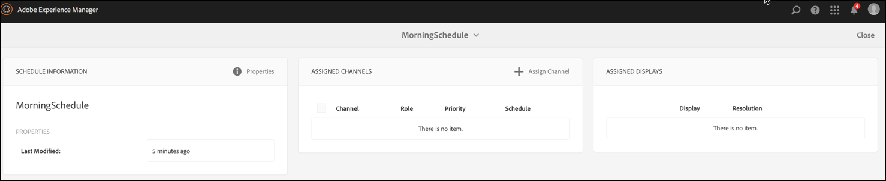
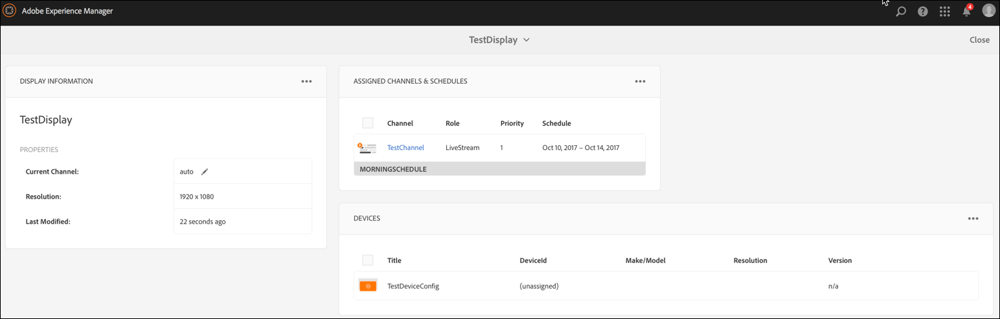
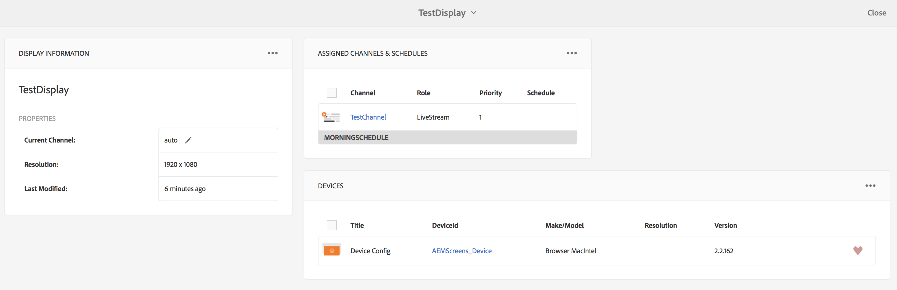

# 踢球指南 {#kickstart-guide}

本节是AEM Screens的启动，并说明如何实现基本操作。 它会指导您通过内容／资产设置基本的数字标牌体验并发布到Screens播放器。

## 在5分钟内创建数字标牌体验 {#creating-a-digital-signage-experience-in-minutes}

通过以下步骤，您可以为Screens创建示例项目并将内容发布到Screens播放器。

要下载 **AEM Screens播**&#x200B;放器，请 [单击此处](https://download.macromedia.com/screens/)。

有关Chrome OS Player的实施，请参 [阅Chrome管理控制台](implementing-chrome-os-player.md) ，以了解更多信息。

有关在设备上安装和配置Screens播放器的信息，请参 [阅安装和配置Screens](configuring-screens-introduction.md) ，以了解更多详细信息。

>[!NOTE]
>**OSGI设置**
>您需要启用空推荐人才能允许设备向服务器发布数据。 例如，如果禁用了空推荐人属性，则设备将无法发布屏幕截图。 目前，其中一些功能仅在OSGI配置中启用了Apache Sling推荐人过滤器允许空时才可用。 仪表板可能会显示警告，指出安全设置可能会阻止某些功能正常工作。
>
>
>请按照以下步骤启用Apache ***Sling推荐人过滤器允许空***:

## 允许空推荐人请求 {#allow-empty-referrer-requests}

1. 通过AEM **实例** —>锤子图标—>操作—> Web Console **，导航到** Adobe Experience Manager **Web Console** Configuration。

   

1. **Adobe Experience ManagerWeb控制台配置** 打开。 搜索吊带推荐人。

   要搜索sling推荐人属性， **请按Command** +F( **Mac)****和** Control+F(Windows ****)。

1. 选中“ **允许空** ”选项，如下图所示。

   

1. 单击 **“保存** ”以启用Apache Sling推荐人过滤器“允许为空”。

## 教程 {#tutorial}

1. **创建新项目**

   1. 选择 Adobe Experience Manager 链接（左上方），然后选择&#x200B;**屏幕**。或者，您也可以直接导航到 `https://localhost:4502/screens.html/content/screens](https://localhost:4502/screens.html/content/screens`。

   1. 单击 **创建** ，以创建新的Screens项目（请参阅下图）。
   1. Select **Screens** from the **Create Screens Project** wizard and click **Next**.

   1. Enter the title as *Test_Project*  and click **Create**.

   

   创建项目后，它会将您带回Screens项目控制台。 现在，您可以选择自己的项目。在项目中，有五种文件夹，即 **应用程序**、 **渠道****、**&#x200B;设备 **、位******&#x200B;置、和计划，如下图所示。

   >[!NOTE]
   >
   >计划仅在您安装了AEM 6.3 Sites Feature Pack 1时可用。 要获取此功能包，您必须联系 Adobe 支持人员并申请访问权限。您获得权限后，就可以从“包共享”下载它。

   

   有关更 [多详细信息，请参阅](creating-a-screens-project.md) “创建和管理屏幕”项目。

1. **创建新渠道**

   项目就位后，您需要创建新渠道来管理内容。

   请按照以下步骤为项目创建新渠道:

   1. Navigate to the *Test_Project* you created and select the **Channels** folder.

   1. Click **Create** from the action bar (see the figure below). 此时将打开一个向导。
   1. Choose the **Sequence Channel** and click **Next**.

   1. Enter the **Name** and **Title** as *TestChannel* and click **Create**.

   

   将 *创建TestChannel* 并将其添加到您的渠道文件夹，如下图所示。

   

   有关创 [建和管理渠道](managing-channels.md) 的更多详细信息，请参阅渠道管理。

1. **向渠道添加内容**

   渠道就位后，您需要向渠道添加内容，Screens播放器将显示这些内容。

   请按照以下步骤将内容添加到项&#x200B;*目渠道*(TestChannel):

   1. Navigate to the *Test_Project* you created and select the **Channels** folder.

   1. Click **Edit** from the action bar (see the figure below). The editor for the *TestChannel* opens.

   1. 单击操作栏左侧用于切换侧面板的图标以打开资产和组件。
   1. 将您希望添加的组件拖放到渠道中。

   

   在此示例中，编辑器显示添加到渠道的图像。

   

1. **创建新位置**

   渠道到位后，您需要创建位置。

   ***位置*** ，将您的各种数字标牌体验划分为不同的区域，并根据不同屏幕的位置包含显示屏的配置。

   请按照以下步骤为项目创建新位置：

   1. Navigate to the *Test_Project* you created and select the **Locations** folder.

   1. 单 **击操** 作栏中加号图标旁边的“创建”（请参阅下图）。 此时将打开一个向导。
   1. Select **Location** from the wizard and click **Next**.

   1. Enter the **Name** and **Title** for your location (enter the title as *TestLocation*) and click **Create**.

   

   将创 *建TestLocation* 并将其添加到您的 **Locations** 文件夹。

   

1. **为TestLocation创建新显&#x200B;*示***

   创建位置后，您需要为位置创建新显示屏。

   ***显示*** ，代表在一个或多个屏幕上运行的数字体验。

   1. 导航到要创建显示屏(Test_*Project —*>位置 **—** > TestLocation) *的位置，如上图所示，并* 选择TestLocation **。

   1. 单击操作栏中的&#x200B;**创建**。
   1. Select **Display** from the **Create** wizard and click **Next**.

   1. 为显 **示位** 置输 **入名称** 和标题(输入TestDisplay *作为标*&#x200B;题)。

   1. Under the **Display** tab, choose the details of the Layout.

      1. Choose the **Resolution** as **Full HD**.

      1. Choose the **Number of Devices Horizontally** as 1.
      1. Choose the **Number of Devices Vertically** as 1.
   1. 单击&#x200B;**创建**。

   新显示屏(*TestDisplay*)将添加到您 *的位置TestLocation*，如下图所示。

   

1. **添加计划**

   通过 AEM Screens 中的&#x200B;*计划*，您可以将渠道组织到可重用的组中，这样您就不必为每个要显示内容的显示屏逐个重复其分配。

   >[!NOTE]
   >
   >仅当您安装了AEM 6.3 Sites Feature Pack 1时，此Screens功能才可用。 要获取此功能包，您必须联系 Adobe 支持人员并申请访问权限。您获得权限后，就可以从“包共享”下载它。

   1. 从Test_Project — **** >计划导航到计划文 **件夹**。

   1. 单击操作栏中的&#x200B;**创建**。此时将打开一个向导。
   1. 从“ **创建** ”向导 **页面中** 选择计划。

   1. 在属性 **页面中** , **将名** 称和标 *题输* 入为MorningSchedule。

   1. 单击 **创建** ,计划将添加到 **计划文** 件夹，如下图所示。

   

   此外，选择计划(*MorningSchedule*)，并单 **击操作栏中的** 仪表板，以视图计划仪表板。 您可以使用视图视图/更改计划的属性、分配渠道和分配的仪表板显示。

   

   请参 [阅创建和管理计划](managing-schedules.md) ，以获取有关计划的详细信息。

1. **分配渠道**

   1. Navigate to the display from *Test_Project* --> **Locations** --> *TestLocation* --> *TestDisplay*.

   1. Select *TestDisplay* and tap/click **Assign Channel **from the action bar, *Or*,

   1. Click **Dashboard** and select **+Assign Channel** at the top right from **ASSIGNED CHANNELS &amp; SCHEDULES** panel, as shown in the figure below. **渠道分配** (Adobe Assignment)对话框打开。

   1. Select **Reference Channel** by **path**

   1. Enter the **Channel Role** as *LiveStream*.

   1. 在渠道中 **选择** “渠道路&#x200B;*径* ”( *Test_Project* —>渠道 *—*****>测试通道”)。

   1. Select the **Priority** for this channel as *1*.

   1. Choose the **Supported Events** as **Initial Load** and **Idle Screen**.

   1. 输入 **计划** ，并选择有效日期 **的起始日期** , **有效日期**。

   1. 单击&#x200B;**保存**。

   渠道会创建并添加到面板。

   

   要进一步了解 **渠道分配** 对话框及与其关联的属性，请参 [阅分配渠道](channel-assignment.md)。

1. **向计划添加渠道**

   1. Navigate to the display from *Test_Project* --> **Locations** --> *TestLocation* --> *TestDisplay*.

   1. Click **Dashboard** and select **+Assign Schedule** at the top right from **ASSIGNED CHANNELS &amp; SCHEDULES** panel, as shown in the figure above. **计划分配** (Adobe Assignment)对话框打开。

   1. 选择创建计划的路径( *此处* Test_Project —> **计划***—>* MorningSchedule)。

   1. 单击 **保存** ，将计划添加到渠道。

   

1. **注册设备**

   您需要使用AEM仪表板注册设备。

   >[!NOTE]
   >
   >您可以使用您下载的AEM Screens应用程序或Web浏览器打开Screens播放器。

   要视图挂起的设备：

   1. 启动一个单独的浏览器窗口。
   1. Go to Screens player using the *web browser* `https://localhost:4502/content/mobileapps/cq-screens-player/firmware.html` or launch the AEM Screens app. 在打开设备时，您会注意到设备的状态为未注册。
   1. From the AEM dashboard, navigate to *Test_Project* --> **Devices**

   1. Click **Device Manager** from the action bar.
   1. 单击 **“设备注册** ”，您将看到挂起的设备，如下图所示。

   

   Select the device you want to register and click **Register Device**.

   

   您将需要从 Web 浏览器或 AEM Screens 播放器中验证代码。

   Click **Validate** to navigate to **Device Registration** screen.

   

   Enter **Title** and click **Register** and the device will be registered.

   单击 **完成** ，以完成设备注册步骤。

   

   单击 **完成** ，将返回显示未分配和已分配设备的设备页面。

   

   >[!NOTE]
   >
   >您添加的设备在“已分配 **”状态下** 显 **示为“** 未分配”。

1. **将设备分配给显示**

   注册设备后，您需要将设备分配给显示屏。

   按照以下步骤分配设备：

   1. 选择要分配的设备。
   1. Click **Assign Device** from the action bar.
   1. 选择渠道的显示路径 `/content/screens/Test_Project/***Locations***/TestLocation/TestDisplay.`

   1. Click **Assign**.
   1. Click **Finish** to complete the process, and now the device is assigned.

   

   此时将打开显示仪表板，您将看到与分配的渠道和计划相关的所有信息以及设备配置详细信息。

   

### Viewing the content in Screens Player {#viewing-the-content-in-screens-player}

添加上述配置后，播放器应自动显示设备上显示屏的默认渠道，例如图像(在此方案中，序列渠道和内容在Screens播放器中Web浏览器中可见)。

请参 [阅AEM Screens](working-with-screens-player.md) Player以获取有关AEM Screens播放器的更多详细信息。
