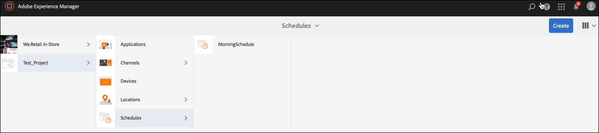

# 启动指南 {#kickstart-guide}

此部分是AEM Screens的入门指南，并说明如何实现基本操作。 它指导您通过内容／资产设置基本的数字标牌体验并发布到Screens播放器。 要深入了解用于Screens开发的所有组件，请查看页面末尾的资源。

## 在5分钟内创建数字标牌体验 {#creating-a-digital-signage-experience-in-minutes}

通过以下步骤，您可以为Screens创建示例项目并将内容发布到Screens播放器。

1. 要下载 **AEM Screens播放器**，请单 [击此处](https://download.macromedia.com/screens/)。

   AEM Screens也可在 **Google Play中使用**。

   有关Chrome OS Player的实施，请参阅 [Chrome管理控制台](implementing-chrome-os-player.md) ，以了解更多信息。

   有关更 [多详细信息，请参阅安装和配置屏幕](configuring-screens-introduction.md) 。

   >[!NOTE]
   >
   >**OSGI设置**
   >
   >
   >您需要启用空引用以允许设备向服务器发布数据。 例如，如果禁用空参照属性，则设备无法将屏幕截图发回。 目前，其中某些功能仅在OSGI配置中启用了Apache Sling引用过滤器允许空时可用。 功能板可能显示警告，指出安全设置可能会阻止某些功能正常工作。
   >
   >
   >请按照以下步骤启用 ***Apache Sling引用过滤器允许空***:
   >
   >
   >
   >    1. 导航到 **Adobe Experience Manager Web Console配置**，即 `https://localhost:4502/system/console/configMgr/org.apache.sling.security.impl.ReferrerFilter`。
   >    1. 选中 **allow.empty选项** 。
   >    1. 单击&#x200B;**保存**。

1. **创建新项目**

   1. 选择 Adobe Experience Manager 链接（左上方），然后选择&#x200B;**屏幕**。或者，您也可以直接导航到 `https://localhost:4502/screens.html/content/screens](https://localhost:4502/screens.html/content/screens`。

   1. 单击 **创建** ，以创建新的Screens项目（请参阅下图）。
   1. Select **Screens** from the **Create Screens Project** wizard and click **Next**.

   1. Enter the title as *Test_Project*  and click **Create**.
   

   创建项目后，它会将您带回Screens项目控制台。 现在，您可以选择自己的项目。在项目中，有五种文件夹，即 **Applications****Channels**、Devices **** Locations、 ******** LocationsSchedules和Schedules，如下图所示。

   >[!NOTE]
   >
   >计划仅在您安装了AEM 6.3 Sites Feature Pack 1时可用。 要获取此功能包，您必须联系 Adobe 支持人员并申请访问权限。您获得权限后，就可以从“包共享”下载它。

   

   有关更 [多详细信息，请参阅创建和管理Screens](creating-a-screens-project.md) 项目。

1. **创建新渠道**

   项目就位后，您需要创建一个新渠道来管理内容。

   请按照以下步骤为项目创建新渠道：

   1. Navigate to the *Test_Project* you created and select the **Channels** folder.

   1. Click **Create** from the action bar (see the figure below). 此时将打开一个向导。
   1. Choose the **Sequence Channel** and click **Next**.

   1. Enter the **Name** and **Title** as *TestChannel* and click **Create**.
   

   将 *创建TestChannel* ，并将其添加到您的渠道文件夹，如下图所示。

   

   有关创 [建和管理渠道的更多详细信息](managing-channels.md) ，请参阅渠道管理。

1. **将内容添加到渠道**

   渠道就位后，您需要向渠道中添加Screens播放器将显示的内容。

   请按照以下步骤将内容添加到项目中&#x200B;*的渠道*(TestChannel):

   1. Navigate to the *Test_Project* you created and select the **Channels** folder.

   1. Click **Edit** from the action bar (see the figure below). The editor for the *TestChannel* opens.

   1. 单击操作栏左侧用于切换侧面板的图标以打开资产和组件。
   1. 将您希望添加的组件拖放到渠道中。
   

   在此示例中，编辑器显示了添加到渠道的图像。

   

1. **创建新位置**

   渠道就位后，您需要创建位置。

   ***位置*** ，将您的各种数字标牌体验划分为多个部分，并根据不同屏幕的位置包含显示屏的配置。

   请按照以下步骤为项目创建新位置：

   1. Navigate to the *Test_Project* you created and select the **Locations** folder.

   1. 单 **击操作栏** 中加号图标旁边的创建（请参阅下图）。 此时将打开一个向导。
   1. Select **Location** from the wizard and click **Next**.

   1. Enter the **Name** and **Title** for your location (enter the title as *TestLocation*) and click **Create**.
   

   将创 *建TestLocation* ，并将其添加到您的 **Locations** 文件夹。

   

1. **为TestLocation创建新显&#x200B;*示***

   创建位置后，您需要为位置创建新显示屏。

   ***显示屏*** ，代表在一个或多个屏幕上运行的数字体验。

   1. 导航到要创建显示屏(*Test_* Project —&gt; **Locations** —&gt; *TestLocation)* 的位置（如上图所示），并选择 ** TestLocation。

   1. 单击操作栏中的&#x200B;**创建**。
   1. Select **Display** from the **Create** wizard and click **Next**.

   1. 为显 **示位置输入名称** 和标题 **(输入TestDisplay作为标** 题 **)。

   1. Under the **Display** tab, choose the details of the Layout.

      1. Choose the **Resolution** as **Full HD**.

      1. Choose the **Number of Devices Horizontally** as 1.
      1. Choose the **Number of Devices Vertically** as 1.
   1. 单击&#x200B;**创建**。
   新的显示屏(*TestDisplay*)将添加到您的 *TestLocation位置*，如下图所示。

   

1. **添加计划**

   通过 AEM Screens 中的&#x200B;*计划*，您可以将渠道组织到可重用的组中，这样您就不必为每个要显示内容的显示屏逐个重复其分配。

   >[!NOTE]
   >
   >仅当您安装了AEM 6.3 Sites Feature Pack 1时，此Screens功能才可用。 要获取此功能包，您必须联系 Adobe 支持人员并申请访问权限。您获得权限后，就可以从“包共享”下载它。

   1. 从Test_Project —&gt; **Schedules** ，导航到“计划”文 **件夹**。

   1. 单击操作栏中的&#x200B;**创建**。此时将打开一个向导。
   1. 从创 **建向导页** ，选择 **计划** 。

   1. 在属性 **页面中** ，将名称 **和标题** 输入为MorningSchedule ** 。

   1. 单 **击创建** ，计划将添加到“计 **划** ”文件夹，如下图所示。
   

   此外，选择计划(*MorningSchedule*)，然后单击操 **作栏中的功能板** ，以查看计划功能板。 您可以使用功能板查看／更改计划的属性、分配渠道和查看分配的显示。

   

   请参 [阅创建和管理计划](managing-schedules.md) ，以获取有关计划的详细信息。

1. **分配渠道**

   1. Navigate to the display from *Test_Project* --&gt; **Locations** --&gt; *TestLocation* --&gt; *TestDisplay*.

   1. Select *TestDisplay* and tap/click **Assign Channel **from the action bar, *Or*,

   1. Click **Dashboard** and select **+Assign Channel** at the top right from **ASSIGNED CHANNELS &amp; SCHEDULES** panel, as shown in the figure below. **“渠道分配** ”对话框打开。

   1. Select **Reference Channel** by **path**

   1. Enter the **Channel Role** as *LiveStream*.

   1. 在Channel中 **选择Channel** Path *(* Test_Project *—&gt; Channels* — ******&gt; Test ChannelChannel)。

   1. Select the **Priority** for this channel as *1*.

   1. Choose the **Supported Events** as **Initial Load** and **Idle Screen**.

   1. 输入 **计划** ，然后选择活动日期(从活 **动日期开始** )和活 **动日期（直到）**。

   1. 单击&#x200B;**保存**。
   此时将创建渠道并将其添加到面板。

   

   要进一步了解“渠 **道分配** ”对话框及其关联的属性，请参阅 [分配渠道](channel-assignment.md)。

1. **将计划添加到渠道**

   1. Navigate to the display from *Test_Project* --&gt; **Locations** --&gt; *TestLocation* --&gt; *TestDisplay*.

   1. Click **Dashboard** and select **+Assign Schedule** at the top right from **ASSIGNED CHANNELS &amp; SCHEDULES** panel, as shown in the figure above. **“计划分配** ”对话框打开。

   1. 选择创建计划的路径(此处， *Test_Project* —&gt;计划 **—&gt;上午计** 划 **)。

   1. 单击 **保存** ，将计划添加到渠道。
   

1. **注册设备**

   您需要使用AEM功能板注册设备。

   >[!NOTE]
   >
   >您可以使用您下载的AEM Screens应用程序或使用Web浏览器打开Screens播放器。

   要查看待处理设备，请执行以下操作：

   1. 启动一个单独的浏览器窗口。
   1. Go to Screens player using the *web browser* `https://localhost:4502/content/mobileapps/cq-screens-player/firmware.html` or launch the AEM Screens app. 在打开设备时，您会注意到设备的状态为未注册。
   1. From the AEM dashboard, navigate to *Test_Project* --&gt; **Devices**

   1. Click **Device Manager** from the action bar.
   1. 单击 **“设备注册** ”，您将看到待处理设备，如下图所示。
   

   Select the device you want to register and click **Register Device**.

   

   您将需要从 Web 浏览器或 AEM Screens 播放器中验证代码。

   Click **Validate** to navigate to **Device Registration** screen.

   

   Enter **Title** and click **Register** and the device will be registered.

   单击 **完成** ，以完成设备注册步骤。

   

   单击 **完成** ，将返回到显示未分配和已分配设备的设备页面。

   

   >[!NOTE]
   >
   >您添加的设备在“已分配”状 **态下显示为** “未 **分配** ”。

1. **将设备指定到显示**

   注册设备后，您需要将设备分配给显示屏。

   按照以下步骤分配设备：

   1. 选择要分配的设备。
   1. Click **Assign Device** from the action bar.
   1. 选择渠道的显示路径 `/content/screens/Test_Project/***Locations***/TestLocation/TestDisplay.`

   1. Click **Assign**.
   1. Click **Finish** to complete the process, and now the device is assigned.
   

   显示功能板将打开，您将看到与已分配渠道和计划相关的所有信息以及设备配置详细信息。

   

### Viewing the content in Screens Player {#viewing-the-content-in-screens-player}

添加上述配置后，播放器应自动显示设备上显示的默认渠道，例如图像（在此方案中，序列渠道和内容在Screens Player for web浏览器中可见）。

请参 [阅AEM Screens播放器](working-with-screens-player.md) ，获取有关AEM Screens播放器的更多详细信息。
