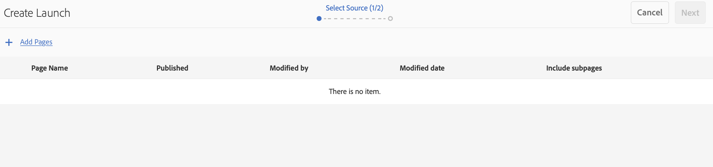
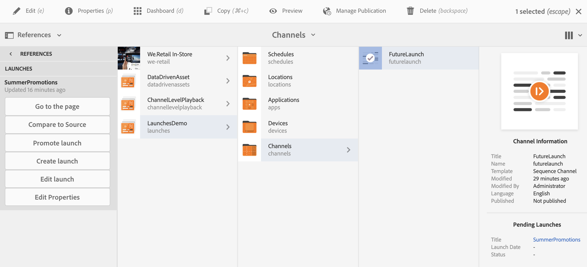

# 启动项 {#launches}

内容作者可以创建渠道的未来版本(称为 **Launch** )，并进一步设置此启动的发布日期，使内容能够在设备或播放器中实时显示。

在启动项的帮助下，作者可以预览启动项中的每个渠道，并且应能够启动审核请求。 批准者组将收到通知，并可以批准或拒绝请求。 到达活动日期后，内容将在设备中播放。

例如，如果作者要创建c1、c2（渠道）的未来版本，则会创建启动项并设置起始日期（例如，11月10日上午8:00）。 内容中的任何进一步更新都将发出以供审阅。 批准后，在实时日期（11月10日上午8:00），此启动项将在设备或播放器上播放内容。

## 要求 {#requirements}

在AEM Screens项目中开始实施启动项之前，请确保您了解宽限期的概念及其相关性。

下节将介绍宽限期，并进一步说明如何开箱即用配置宽限期。 您还可以下载示例测试配置以了解其用法。

### 了解宽限期 {#understanding-grace-period}

以下设置允许管理员配置启动项 ***中所需的宽限期***。

**宽限期**，包括：

* 启动项的提升
* 发布资源以发布实例
* 设备从发布实例下载内容所花费的时间以及服务器和播放器的任何时间差异

例如，假设服务器在PST中，设备在EST中，最大时间差为3小时，这种情况下，假定从作者开始发布到发布需要10分钟，播放器通常可以在10-15分钟内下载资源。 然后，宽限期=时间差（3小时）+提升启动时间（1分钟）+发布启动时间（10分钟）+在播放器（10-15分钟）下载时间+缓冲时间（要安全，例如30分钟）= 3小时56分钟= 14160秒。 因此，当我们计划任何实时启动时，促销将提前在此偏移量开始。 在上述等式中，大多数项目不需要花费很多时间，一旦我们知道服务器和任何播放器的最大时间差，我们就可以对此偏移量使用一个适当的猜测。

### 配置开箱即用的宽限期 {#configuring-out-of-the-box-grace-period}

开箱即用时，启动项的宽限期将设置为24小时，这意味着，当我们在 */content/screens下为资源的任何启动项设置起始日期时*，促销将以此偏移开始。 例如，如果liveDate设置为11月24日，上午9:00，宽限期为24小时，则促销作业将于上午11月23日09:00开始。

### 下载配置 {#downloading-configurations}

下载以下测试配置：

[获取文件](assets/launches_event_handlerconfig-10.zip)

>[!NOTE]
>
>上述配置在此测试配置中的宽限期为600秒。

#### 更新配置 {#updating-the-configurations}

如果要更改上述配置，请按照以下说明操作：

* 创建 ***sling:OsgiConfig/ nt:file in /apps/system/config*** ，名称为 **com.adobe.cq.wcm.launches.impl.LaunchesEventHandler.config** 和内容

   *launches.eventhandler.updatelastmodification=B"false"launches.eventhandler.launch.promotion.graceperiod=["/content/screens(/)。*):600"]launches.eventhandler.threadpool.maxsize=I"5"launches.eventhandler.threadpool.priority="MIN"*

* `launches.eventhandler.launch.promotion.graceperiod=["/content/screens(/.&#42;):600"`，允许您在路径／内容／屏幕中设置600秒 *的宽限期*。

这意味着，当您在 */content/screens下为资源的任何启动项设置起始日期时*，促销将以此偏移开始。 例如，如果实时日期设置为11月24日，上午9:00，宽限期为600秒，则促销作业将于11月24日上午8:50开始。

## 使用启动项 {#using-launches}

请按照以下部分在AEM Screens项目中实施启动项。 本节涵盖下列主题：

1. **创建启动项**
1. **编辑启动项以设置实时日期和范围**

### 创建启动项 {#creating-a-launch}

请按照以下步骤对您的AEM Screens项目实施将来的发布功能：

1. 导航到AEM Screens项目中的渠道，例如 **LaunchesDemo** —&gt; **Channels** —&gt; **FutureLaunch**，如下所示。

   >[!CAUTION]
   >
   >您必须从AEM Screens项目中的预先存在的渠道创建启动项。

   

1. 选择渠道 **FutureLaunch** ，然后单击 **创建**。 从下 **拉菜单中选择** “启动项”。

   

1. 此时将 **打开创建启动** 项向导。 单 **击+添加页面** ，以选择要为其创建启动项的AEM Screens渠道。

   

1. 导航到渠道，然后单击 **选择**。

   

1. 选择页面后，单击“下 **一步** ”，在“创建启动项”向导中进 **一步移动** 。

   

1. 将启 **动项标题输入****SummerPromotions******，您无需设置启动日期，如下图所示。 单击&#x200B;**创建**。

   >[!NOTE]
   >
   >*启用或选中* “继 **承源页面Live Data** ”选项后，可以在启动项中将渠道创建为Live Copy。 如果在原始渠道中进行了任何更改，则这些更改会自动应用于启动渠道。
   >
   >
   >*禁用或取消选* 中“继承源页面实时数据 **** ”允许复制渠道，而不会在启动项中产生任何实时关系。 因此，如果对原始渠道进行了任何更改，则这些更改不会应用于启动渠道。

   

   >[!NOTE]
   >
   >您可以在此步骤中设置实时启动日期，也可以在稍后编辑启动项的属性时设置它，直到该启动项已创建。

1. 您将看到已创建启动项。 您可以单击“打 **开** ”以在编辑器中查看页面，或单击“完成 **** ”以导航回您的项目。

   

   单击 **完成** ，可导航回您的 **LaunchesDemo项目** 。

   

### 编辑启动项属性以设置实时日期和范围 {#editing-the-launch-properties-to-set-the-live-date-and-scope}

创建启动项后，您需要编辑启动项属性，以将启动项的起始日期设置为范围。

请按照以下步骤编辑启动项属性：

1. 导航到渠道(**FutureLaunch**)并选择渠道，如下图所示。 从左侧边 **栏打开** “参照”边栏。

   >[!NOTE]
   >
   >从左边 **栏中选择** “内容树”选项以打开您创建的启动项。

   

1. 导航到启 **动项** ，然后选择您创建的启&#x200B;**动项(SummerPromotions**)。 单击 **编辑属性**。

   

1. 将打开启 **动SummerPromotions** 对话框。 填充以下字段：

   * 选择启 **动日期**
   * 检查 **生产就绪**
   * 从范 **围中选择提升已批准的页** 面 **。**
   >[!NOTE]
   >
   >了解“自动提升”下 **的“启动项”条目**:

   >* **启动日期**，指实时日期，即根据播放器的时区，内容在Screens播放器中播放的日期／时间。
   >
   >
   >    * **生产就绪**，允许提升渠道，并表示启动项已准备好使用。

   * **范围**，指在启动过程中可提升的渠道。

   以下三个选项可用于设置范围：
   1. **提升完整启动项**:启动项的所有渠道都会在设置的起始日期提升。
   1. **提升修改的页面**:将仅提升已编辑的启动项资源。 建议在不需要启动项审阅时使用此选项。 它允许提升启动渠道中的修改。
   1. **提升已批准的页面**:只有经过批准的页面才会在设置的起始日期提升。
   

   >[!CAUTION]
   启动升级遵循播放器／设备的时区，而不是服务器的时区。

1. 单击 **保存并关闭** ，导航回 **FutureLaunch渠道** 。

   

