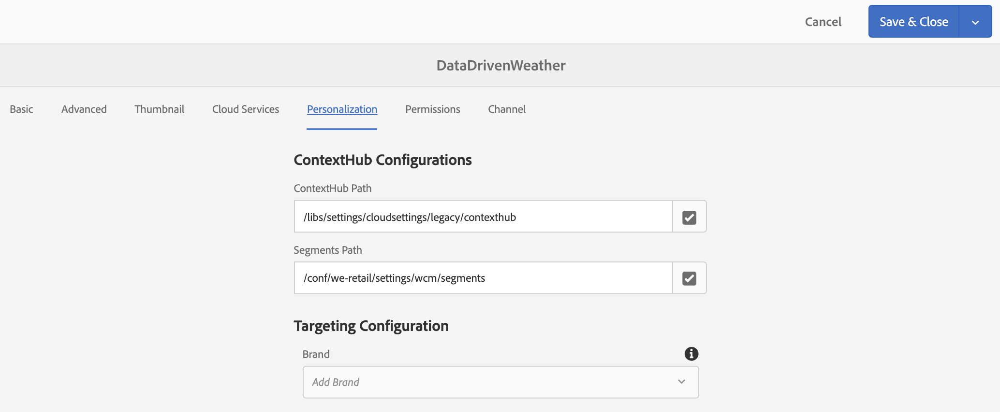

# 行程中心温度激活{#travel-center-temperature-activation}

以下用例演示了如何使用基于Google Sheets中填充的值的旅行中心本地温度激活。

## 描述 {#description}

对于此用例，如果您的Google Sheets的值小于50，则将显示含有热饮的图像，如果该值大于或等于50，则将显示含有冷饮的图像。 如果存在其他值或没有值，播放器将显示默认图像。

## 先决条件{#preconditions}

在开始实施旅行中心本地温度激活之前，您必须了解如何设置AEM Screens项目中的&#x200B;***受众存储***、***分段***&#x200B;和&#x200B;***为渠道***&#x200B;启用定位。

有关详细信息，请参阅AEM Screens](configuring-context-hub.md)中的[配置ContextHub。

## 基本流{#basic-flow}

请按照以下步骤实施“Travel Center Local Tempure(旅行中心本地温度激活)”使用案例：

1. **填充Google工作表**

   1. 导航到ContextHubDemo Google工作表。
   1. 添加一列，其中&#x200B;**Heading1**&#x200B;具有相应温度值。

   

1. **根据要求在受众中配置区段**

   1. 导航到受众中的区段(请参阅&#x200B;***步骤2:在&#x200B;**[在AEM Screens](configuring-context-hub.md)**页面中配置ContextHub中设置受众分段***，了解更多详细信息)。

   1. 选择&#x200B;**工作表A1 1**&#x200B;并单击&#x200B;**编辑**。

   1. 选择比较属性，然后单击配置图标以编辑属性。
   1. 从&#x200B;**属性名称**&#x200B;的下拉菜单中选择&#x200B;**googlesheets/value/1/0**

   1. 从下拉菜单中选择&#x200B;**运算符**&#x200B;作为&#x200B;**greater-than-or-equal**

   1. 将&#x200B;**Value**&#x200B;输入为&#x200B;**50**

   1. 同样，选择&#x200B;**工作表A1 2**&#x200B;并单击&#x200B;**编辑**。

   1. 选择&#x200B;**比较属性 — 值**，然后单击配置图标以编辑属性。
   1. 从&#x200B;**属性名称**&#x200B;的下拉菜单中选择&#x200B;**googlesheets/value/1/0**

   1. 从下拉菜单中选择&#x200B;**运算符**&#x200B;作为&#x200B;**less-than**

   1. 将&#x200B;**Value**&#x200B;输入为&#x200B;**50**

1. 导航并选择渠道()，然后单击操作栏中的&#x200B;**编辑**。 在下面的示例中，**DataDrivenWeather**&#x200B;使用顺序渠道来展示该功能。

   >[!NOTE]
   >
   >您的渠道应已拥有默认映像，且应按照AEM Screens](configuring-context-hub.md)中的[配置ContextHub中所述预配置受众。

   

   >[!CAUTION]
   >
   >您应该已使用渠道&#x200B;**属性** —> **个性化**&#x200B;选项卡设置&#x200B;**ContextHub** **配置**。

   

1. 从编辑器中选择&#x200B;**定位**，然后从下拉菜单中选择&#x200B;**品牌**&#x200B;和&#x200B;**活动**，然后单击&#x200B;**开始定位**。

   

1. **检查预览**

   1. 单击&#x200B;**预览。** 此外，打开您的Google工作表并更新其值。
   1. 将该值更改为小于50，您应该能够视图夏季饮品的图像。 如果Google Sheet中的值大于或等于50，则应能视图热饮图像。

   

