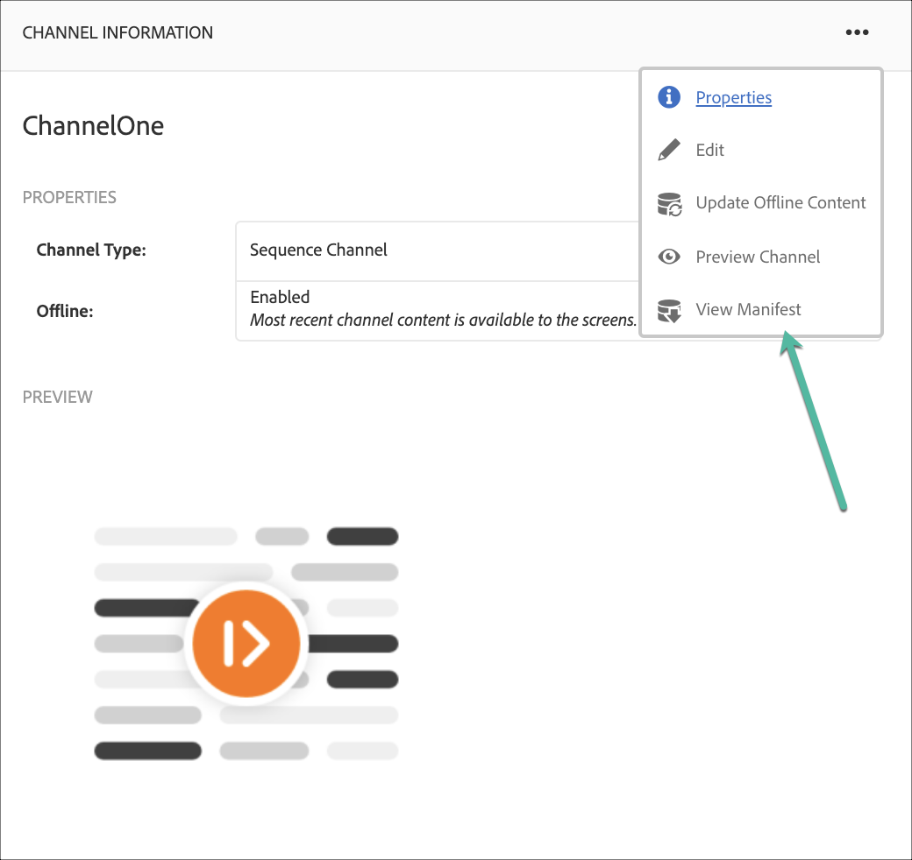
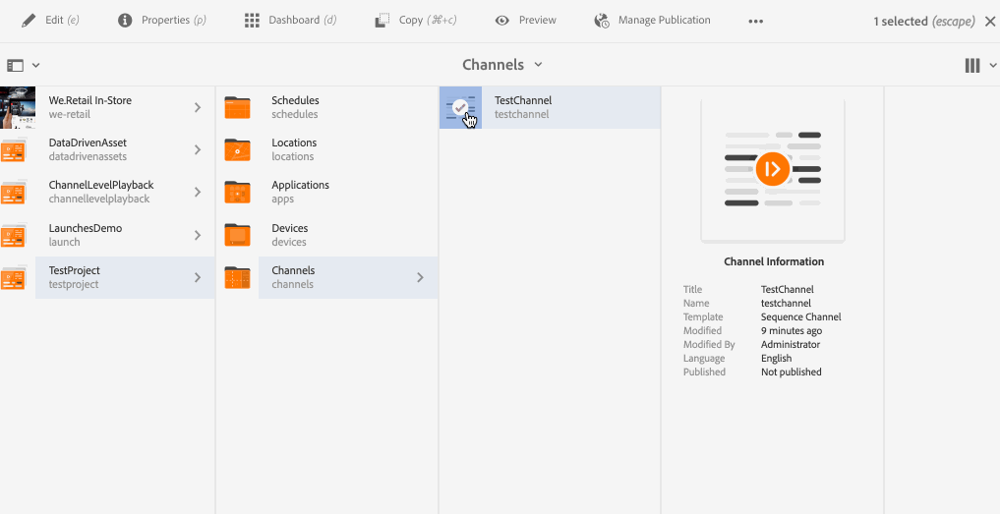

# 创建和管理渠道 {#creating-and-managing-channels}

渠道可显示一系列内容（图像和视频），还可显示网站或单页应用程序。

本页显示如何为AEM Screens创建和管理渠道。

**先决条件**：

* [配置和部署Screens](configuring-screens-introduction.md)
* [创建和管理Screens项目](creating-a-screens-project.md)

## 创建新渠道 {#creating-a-new-channel}

为AEM Screens创建项目后，请按照以下步骤为您的项目创建渠道：

1. 单击Adobe Experience Manager链接（左上方），然后单击Screens。 或者，您可以直接导航到`https://localhost:4502/screens.html/content/screens`。

1. 导航到您的Screens项目，然后单击&#x200B;**渠道**&#x200B;文件夹。

1. 单击操作栏中的&#x200B;**创建**。

   

1. 从&#x200B;**创建**&#x200B;向导中单击&#x200B;**序列频道**&#x200B;模板，然后单击&#x200B;**下一步**。

   

1. 输入标题为&#x200B;**ScreensChannel**，然后单击&#x200B;**创建**。

   

1. 序列频道现已添加到您的&#x200B;**频道**&#x200B;文件夹。

### 渠道类型 {#channel-types}

使用该向导时，可以使用以下模板选项，例如：

| **模板选项** | **描述** |
|---|---|
| 渠道文件夹 | 创建用于存储渠道集合的文件夹。 |
| 序列渠道 | 创建一个按顺序播放组件的渠道（在幻灯片放映中逐一播放）。 |
| 应用程序渠道 | 在Screens播放器中展示您的自定义Web应用程序。 |
| 1x1 分屏渠道 | 在单个区域中查看组件。 |
| 1x2 分屏渠道 | 在两个区域（水平拆分）中查看资源。 |
| 2X1分屏渠道 | 查看两个区域中的资源（垂直拆分）。 |
| 2x2 分屏渠道 | 在四个区域（在矩阵中水平拆分和垂直拆分）中查看资源。 |
| 2x3 分屏渠道 | 查看两个区域（水平拆分）中的资产，其中一个区域大于另一个区域。 |
| 左或右L栏分屏渠道 | 内容作者可以在适当大小的区域中查看不同类型的资产。 |

>[!NOTE]
>
>分屏渠道将显示分成多个区域，以便您能够并排同时播放多种体验。 体验可以是静态资源/文本或嵌入序列。

>[!IMPORTANT]
>
>创建内容并将其添加到渠道后，下一步是创建一个位置，然后创建一个显示。 此外，将该频道分配给显示器。 请参阅本节末尾的以下资源。

## 使用渠道 {#working-with-channels}

您可以编辑、查看属性和功能板，复制、预览和删除渠道。

### 向渠道添加/编辑内容 {#adding-editing-content-to-a-channel}

要在渠道中添加或编辑内容，请执行以下步骤：

1. 单击要编辑的通道（如上图所示）。
1. 单击操作栏左上角的&#x200B;**编辑**，以便编辑渠道属性。 编辑器将打开，允许您向要发布的渠道添加资产/组件。

>[!NOTE]
>您可以将组件添加到渠道。 有关更多详细信息，请参阅&#x200B;**[将组件添加到渠道](adding-components-to-a-channel.md)**。

**正在将视频上传到频道**

请按照以下步骤将视频上传到您的渠道：

1. 单击要上传视频的频道。
1. 单击操作栏中的&#x200B;**编辑**。
1. 在编辑器中，单击Assets下的&#x200B;**视频**，然后拖放所需的视频。

>[!NOTE]
>如果您在渠道中上传视频时遇到问题，请参阅[视频疑难解答](troubleshoot-videos.md)。

### 查看或编辑渠道属性 {#viewing-properties}

1. 单击要编辑的渠道。
1. 单击操作栏中的&#x200B;**属性**，以便查看/编辑渠道属性。 您可以通过下面的选项卡更改选项。

### 查看仪表板 {#viewing-dashboard}

1. 单击要编辑的渠道。
1. 单击操作栏中的&#x200B;**仪表板**。

### 渠道信息 {#channel-information}

“渠道信息”面板描述渠道属性，以及渠道的预览。 此外，它还为您提供有关渠道是离线还是在线的信息。

单击&#x200B;**渠道信息**&#x200B;操作栏中的(**...**)，以便查看渠道的属性、编辑内容或更新缓存（脱机内容）。

#### 查看清单 {#view-manifest}

您可以从渠道仪表板查看清单。

>[!IMPORTANT]
>此选项仅在AEM 6.4 Feature Pack 8或AEM 6.5 Feature Pack 4中可用。

请按照以下步骤操作，以便您可以从渠道功能板启用此选项：

1. **将渠道设置为脱机**
   1. 单击频道，然后单击操作栏中的&#x200B;**属性**
   1. 导航到&#x200B;**渠道**&#x200B;选项卡，并确保取消选中&#x200B;**开发人员模式（强制渠道联机）**&#x200B;选项
   1. 单击&#x200B;**保存并关闭**
1. **更新脱机内容**
   1. 单击渠道，然后单击操作栏中的&#x200B;**仪表板**
   1. 导航到&#x200B;**渠道信息**&#x200B;面板，然后单击&#x200B;*...*
   1. 单击&#x200B;**更新脱机内容**

您应该会看到&#x200B;**渠道信息**&#x200B;面板中的&#x200B;**查看清单**&#x200B;选项。

### 线上和线下渠道 {#online-and-offline-channels}

>[!NOTE]
>默认情况下，在创建渠道时，该渠道为“脱机”。

创建渠道时，可以将其定义为在线或离线渠道。

***联机频道***&#x200B;显示实时环境中的更新内容，而&#x200B;***脱机频道***&#x200B;显示缓存的内容。

请按照以下步骤使渠道联机：

1. 以&#x200B;**TestProject** > **渠道** > **TestChannel**&#x200B;的形式导航到该渠道。

   单击渠道。

   

   单击操作栏中的&#x200B;**仪表板**，以查看播放器的状态。 **渠道信息**&#x200B;面板提供有关渠道是在线还是离线的信息。

   

1. 在操作栏中单击&#x200B;**属性**，然后导航到&#x200B;**渠道**&#x200B;选项卡，如下所示：

   

1. 检查&#x200B;**开发人员** **模式（强制频道联机）**&#x200B;以使频道联机。

   单击&#x200B;**保存并关闭**&#x200B;以保存您的选项。

   

   导航回渠道仪表板，现在&#x200B;**渠道信息**&#x200B;面板可显示播放器的联机状态。

   

>[!NOTE]
>要将渠道再次配置为脱机，请从&#x200B;**属性**&#x200B;选项卡中取消选中“开发人员模式”选项(如步骤(3)中所示)。 然后，在&#x200B;**渠道信息**&#x200B;面板中单击&#x200B;**更新离线内容**，如下图所示。

#### 从设备仪表板进行自动更新与手动更新 {#automatic-versus-manual-updates-from-the-device-dashboard}

下表总结了与设备仪表板中的自动更新和手动更新关联的事件。

<table>
 <tbody>
  <tr>
   <td><strong>事件</strong></td>
   <td><strong>设备自动更新</strong></td>
   <td><strong>设备手动更新</strong></td>
  </tr>
  <tr>
   <td>在线渠道中的更改</td>
   <td>内容已自动更新</td>
   <td>
在“设备：推送配置”上更新了内容
 
或者，
 
在<strong><i>设备上更新了内容：重新启动</i></strong>
 </td>
  </tr>
  <tr>
   <td>更改了离线渠道，但未触发渠道“推送内容”（不重新创建离线包）</td>
   <td>无内容更新</td>
   <td>无内容更新</td>
  </tr>
  <tr>
   <td>触发脱机渠道和渠道“推送内容”中的更改（新的脱机包）</td>
   <td>内容已自动更新</td>
   <td>
在<strong><i>设备：推送配置</i></strong>上更新了内容
 
或者，
 
在<strong><i>设备上更新了内容：重新启动</i></strong>
 </td>
  </tr>
  <tr>
   <td>
配置中的更改

    <ul>
     <li>显示（强制通道）</li>
     <li>设备</li>
     <li>渠道分配（新渠道、已删除渠道）</li>
     <li>渠道分配（角色、事件、计划）</li>
    </ul> </td>
   <td>配置会自动更新</td>
   <td>
已在<strong><i>设备：推送配置</i></strong>上更新配置
 
或者，
 
已在<strong><i>设备上更新配置：重新启动</i></strong>
 </td>
  </tr>
 </tbody>
</table>

### 已指定显示 {#assigned-displays}

**分配的显示区**&#x200B;面板显示与渠道关联的显示区。 它提供已分配显示的快照以及分辨率。

关联的显示列在&#x200B;**分配的显示**&#x200B;面板中，如下所示：

>[!NOTE]
>要了解如何在位置中创建显示，请参阅：
>
>* [创建和管理位置](managing-locations.md)
>* [创建和管理显示区](managing-displays.md)
>

此外，单击&#x200B;**已分配的显示区**&#x200B;面板中的显示区，以查看显示区信息，如下所示：

### 后续步骤 {#the-next-steps}

创建渠道并在渠道中添加/编辑内容后的下一个步骤是了解如何创建位置和显示。 此外，还为该显示器分配一个渠道。

有关后续步骤，请参阅以下资源：

* [创建和管理渠道](managing-channels.md)
* [创建和管理位置](managing-locations.md)
* [创建和管理显示区](managing-displays.md)
