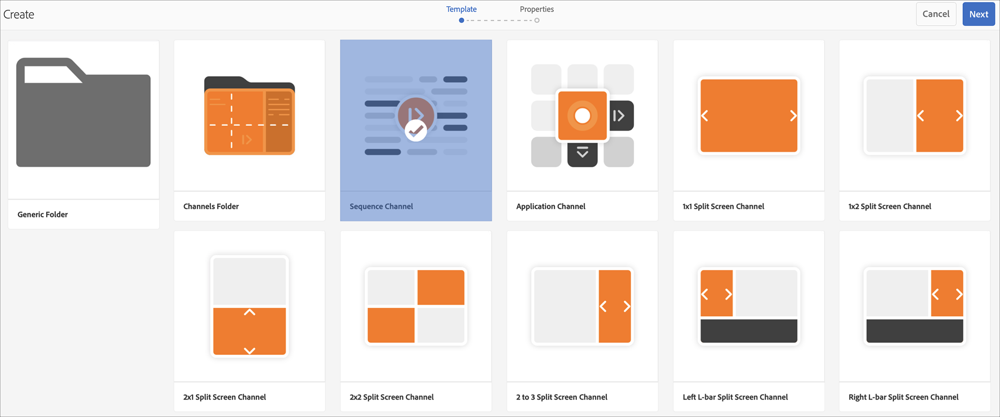

# 创建和管理渠道 {#creating-and-managing-channels}

渠道可显示一系列内容（图像和视频），还可显示网站或单页应用程序。

本页显示如何为AEM Screens创建和管理渠道。

**先决条件**：

* [配置和部署Screens](configuring-screens-introduction.md)
* [创建和管理Screens项目](creating-a-screens-project.md)

## 创建新渠道 {#creating-a-new-channel}

为AEM Screens创建项目后，请按照以下步骤为您的项目创建渠道：

1. 单击Adobe Experience Manager链接（左上方），然后单击Screens。 或者，您可以直接导航到 `https://localhost:4502/screens.html/content/screens`.

1. 导航到您的屏幕项目，然后单击 **渠道** 文件夹。

1. 单击 **创建** 从操作栏中。

   

1. 单击 **序列渠道** 模板来自 **创建** 向导并单击 **下一个**.

   

1. 输入标题为 **ScreensChannel** 并单击 **创建**.

   

1. 序列渠道现已添加到您的 **渠道** 文件夹。

### 渠道类型 {#channel-types}

使用该向导时，可以使用以下模板选项，例如：

| **模板选项** | **描述** |
|---|---|
| 渠道文件夹 | 创建用于存储渠道集合的文件夹。 |
| 序列渠道 | 创建一个按顺序播放组件的渠道（在幻灯片放映中逐一播放）。 |
| 应用程序渠道 | 在Screens播放器中展示您的自定义Web应用程序。 |
| 1x1 分屏渠道 | 在单个区域中查看组件。 |
| 1x2 分屏渠道 | 在两个区域（水平拆分）中查看资源。 |
| 2X1分屏渠道 | 查看两个区域中的资源（垂直拆分）。 |
| 2x2 分屏渠道 | 在四个区域（在矩阵中水平拆分和垂直拆分）中查看资源。 |
| 2x3 分屏渠道 | 查看两个区域（水平拆分）中的资产，其中一个区域大于另一个区域。 |
| 左或右L栏分屏渠道 | 内容作者可以在适当大小的区域中查看不同类型的资产。 |

>[!NOTE]
>
>分屏渠道将显示分成多个区域，以便您能够并排同时播放多种体验。 体验可以是静态资源/文本或嵌入序列。

>[!IMPORTANT]
>
>创建内容并将其添加到渠道后，下一步是创建一个位置，然后创建一个显示。 此外，将该频道分配给显示器。 请参阅本节末尾的以下资源。

## 使用渠道 {#working-with-channels}

您可以编辑、查看属性和功能板，复制、预览和删除渠道。

### 向渠道添加/编辑内容 {#adding-editing-content-to-a-channel}

要在渠道中添加或编辑内容，请执行以下步骤：

1. 单击要编辑的通道（如上图所示）。
1. 单击 **编辑** 从操作栏的左上角，以便编辑渠道属性。 编辑器将打开，允许您向要发布的渠道添加资产/组件。

>[!NOTE]
>您可以将组件添加到渠道。 请参阅 **[将组件添加到渠道](adding-components-to-a-channel.md)** 以了解更多详细信息。

**正在将视频上传到渠道**

请按照以下步骤将视频上传到您的渠道：

1. 单击要上传视频的频道。
1. 单击 **编辑** 从操作栏中。
1. 在编辑器中，单击 **视频** 在“资产”下，拖放所需的视频。

>[!NOTE]
>如果您在渠道中上传视频时遇到问题，请参阅 [视频疑难解答](troubleshoot-videos.md).

### 查看或编辑渠道属性 {#viewing-properties}

1. 单击要编辑的渠道。
1. 单击 **属性** 以查看/编辑渠道属性。 您可以通过下面的选项卡更改选项。

### 查看仪表板 {#viewing-dashboard}

1. 单击要编辑的渠道。
1. 单击 **仪表板** 从操作栏中。

### 渠道信息 {#channel-information}

“渠道信息”面板描述渠道属性，以及渠道的预览。 此外，它还为您提供有关渠道是离线还是在线的信息。

单击(**...**)中的 **渠道信息** 操作栏，以便查看属性、编辑内容或更新渠道的缓存（离线内容）。

#### 查看清单 {#view-manifest}

您可以从渠道仪表板查看清单。

>[!IMPORTANT]
>此选项仅在AEM 6.4 Feature Pack 8或AEM 6.5 Feature Pack 4中可用。

请按照以下步骤操作，以便您可以从渠道功能板启用此选项：

1. **将渠道设置为脱机**
   1. 单击渠道，然后单击 **属性** 操作栏中的
   1. 导航至 **渠道** 选项卡，并确保取消选中 **开发人员模式（强制渠道联机）** option
   1. 单击 **保存并关闭**
1. **更新离线内容**
   1. 单击渠道，然后单击 **仪表板** 操作栏中的
   1. 导航至 **渠道信息** 面板并单击 *...*
   1. 单击 **更新离线内容**

您应会看到 **查看清单** 选项来自 **渠道信息** 面板中。

### 线上和线下渠道 {#online-and-offline-channels}

>[!NOTE]
>默认情况下，在创建渠道时，该渠道为“脱机”。

创建渠道时，可以将其定义为在线或离线渠道。

An ***线上渠道*** 在实时环境中显示更新的内容，而 ***脱机渠道*** 显示缓存的内容。

请按照以下步骤使渠道联机：

1. 导航到渠道为 **测试项目** > **渠道** > **TestChannel**.

   单击渠道。

   

   单击 **仪表板** ，以便查看播放器的状态。 此 **渠道信息** 面板提供了有关渠道处于在线还是离线状态的信息。

   

1. 单击 **属性** 操作，然后导航到 **渠道** 选项卡，如下所示：

   

1. 查看 **开发人员** **模式（强制渠道联机）** 使频道联机。

   单击 **保存并关闭** 以保存您的选项。

   

   导航回渠道功能板，现在转到 **渠道信息** 面板显示播放器的在线状态。

   

>[!NOTE]
>要将渠道再次配置为脱机，请从取消选中 **属性** 选项卡(如步骤(3)中所示)。 然后，从 **渠道信息** 面板点击 **更新离线内容**，如下图所示。

#### 从设备仪表板进行自动更新与手动更新 {#automatic-versus-manual-updates-from-the-device-dashboard}

下表总结了与设备仪表板中的自动更新和手动更新关联的事件。

<table>
 <tbody>
  <tr>
   <td><strong>事件</strong></td>
   <td><strong>设备自动更新</strong></td>
   <td><strong>设备手动更新</strong></td>
  </tr>
  <tr>
   <td>在线渠道中的更改</td>
   <td>内容已自动更新</td>
   <td>
在“设备：推送配置”上更新了内容
 
或者，
 
内容更新日期 <strong><i>设备：重新启动</i></strong>
 </td>
  </tr>
  <tr>
   <td>更改了离线渠道，但未触发渠道“推送内容”（不重新创建离线包）</td>
   <td>无内容更新</td>
   <td>无内容更新</td>
  </tr>
  <tr>
   <td>触发脱机渠道和渠道“推送内容”中的更改（新的脱机包）</td>
   <td>内容已自动更新</td>
   <td>
内容更新日期 <strong><i>设备：推送配置</i></strong>
 
或者，
 
内容更新日期 <strong><i>设备：重新启动</i></strong>
 </td>
  </tr>
  <tr>
   <td>
配置中的更改

    <ul>
     <li>显示（强制通道）</li>
     <li>设备</li>
     <li>渠道分配（新渠道、已删除渠道）</li>
     <li>渠道分配（角色、事件、计划）</li>
    </ul> </td>
   <td>配置会自动更新</td>
   <td>
配置更新于 <strong><i>设备：推送配置</i></strong>
 
或者，
 
配置更新于 <strong><i>设备：重新启动</i></strong>
 </td>
  </tr>
 </tbody>
</table>

### 已指定显示 {#assigned-displays}

此 **已分配显示区** 面板显示与渠道关联的显示。 它提供已分配显示的快照以及分辨率。

关联的显示会列在 **已分配显示区** 面板中，如下所示：

>[!NOTE]
>要了解如何在位置中创建显示，请参阅：
>
>* [创建和管理位置](managing-locations.md)
>* [创建和管理显示区](managing-displays.md)
>

此外，单击以下位置中的显示： **已分配显示区** 面板，查看显示信息，如下所示：

### 后续步骤 {#the-next-steps}

创建渠道并在渠道中添加/编辑内容后的下一个步骤是了解如何创建位置和显示。 此外，还为该显示器分配一个渠道。

有关后续步骤，请参阅以下资源：

* [创建和管理渠道](managing-channels.md)
* [创建和管理位置](managing-locations.md)
* [创建和管理显示区](managing-displays.md)
