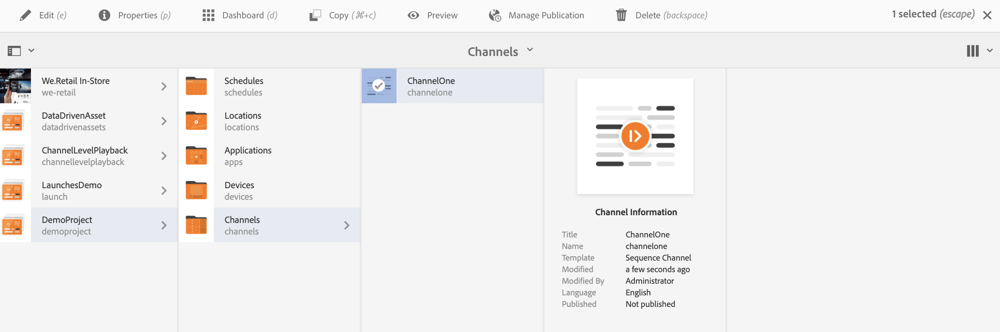

# 创建和管理渠道 {#creating-and-managing-channels}

渠道显示一系列内容以及显示图像和视频，但也可以显示网站或单页应用程序。

本页显示了如何为 Screens 创建和管理渠道。

**先决条件**：

* [配置和部署 Screens](configuring-screens-introduction.md)
* [创建和管理Screens项目](creating-a-screens-project.md)

## 创建新渠道 {#creating-a-new-channel}

创建 Screens 项目后，请按照以下步骤为 Screens 项目创建新渠道：

1. 选择 Adobe Experience Manager 链接（左上方），然后选择“屏幕”。Alternatively, you can go directly to: `https://localhost:4502/screens.html/content/screens`.
1. Navigate to Screens project and click **Channels**.
1. Click **Create** next to the plus icon in the action bar. 此时会打开一个向导（请参阅“渠道类型”以了解更多信息&#x200B;**）。

1. Select the template from the wizard and click **Next**.
1. Enter the properties for **Title and Tags**, **More Titles and Description**, **On/Off Time**, and **Vanity URL**.

1. 单击&#x200B;**创建**，随即会创建渠道并将其添加到渠道文件夹中。

### 渠道类型 {#channel-types}

可以在向导中使用以下模板选项，例如：

| **模板选项** | **描述** |
|---|---|
| 渠道文件夹 | 允许创建一个文件夹来存储渠道的集合。 |
| 序列渠道 | 允许创建按顺序播放组件的渠道（在幻灯片中逐个播放）。 |
| 应用程序渠道 | 允许在 Screens 播放器中显示您的自定义 Web 应用程序。 |
| 1x1 分屏渠道 | 允许在单个区域中视图组件。 |
| 1x2 分屏渠道 | 允许视图两个区域中的资产（水平拆分）。 |
| 2X1分屏渠道 | 允许视图两个区域中的资产（垂直拆分）。 |
| 2x2 分屏渠道 | 允许在四个区域中视图资产（在矩阵中水平和垂直拆分）。 |
| 2x3 分屏渠道 | 允许视图两个区域中的资产（水平拆分），其中一个区域大于另一个区域。 |
| 左或右L栏分屏渠道 | 允许内容作者视图大小适当的区域中不同类型的资产。 |

>[!NOTE]
>
>“分屏”渠道将显示屏拆分为多个区域，因此您可以同时并排播放多个体验。 体验可以是静态资产／文本或嵌入式序列。

以下示例演示了如何为Screens项目(DemoProject **)创建序列&#x200B;*渠道*(ChannelOne)。

>[!NOTE]
>
>您可以使用模板选项（例如上面所述的 1x2 分屏渠道、2x2 分屏渠道或 2x3 分屏渠道）创建不同的区域。

>[!IMPORTANT]
>
> 在创建渠道并向渠道中添加内容后，下一步是创建位置，之后是创建显示屏。此外，您还需要将该渠道分配到显示屏。请参阅此部分末尾的资源以了解更多信息。

## 使用渠道 {#working-with-channels}

您可以编辑、复制、预览和删除渠道，以及查看渠道属性和功能板。

>[!NOTE]
>
>选择渠道，如下图所示。

### 在渠道中添加/编辑内容 {#adding-editing-content-to-a-channel}

要在渠道中添加或编辑内容，请按照以下步骤操作：

1. 选择要编辑的渠道（如上图所示）。
1. Click **Edit** from the top left corner of the action bar to edit the channel properties. 此时会打开编辑器，您可以在其中将资产/组件添加到要发布的渠道。

>[!NOTE]
>
>您可以向渠道添加组件。 有关更多 **[详细信息，请参阅将组件](adding-components-to-a-channel.md)** 添加到渠道。

**将视频上传到渠道**

请按照以下步骤将视频上传到渠道：

1. 选择要上传视频的渠道。
1. 单击操作栏中的&#x200B;**编辑**&#x200B;以打开编辑器。
1. 在“资产”下选择&#x200B;**视频**，然后拖放所需的视频。

>[!NOTE]
>
>If you encounter issues uploading videos in your channel, see [Troubleshooting Videos](troubleshoot-videos.md).

### 查看属性 {#viewing-properties}

要查看或编辑渠道的属性，请按照以下步骤操作：

1. 单击要编辑的渠道。
1. Click **Properties** from the action bar to view/edit the channel properties. 您可以在以下选项卡中更改选项。

### 查看功能板 {#viewing-dashboard}

要查看渠道的功能板，请按照以下步骤操作：

1. 选择要编辑的渠道。
1. Click **Dashboard** from the action bar to view the dashboard. The **CHANNEL INFORMATION**,**ASSIGNED DISPLAYS**, and **PENDING LAUNCHES** panel opens, as shown in the figure below:

### 渠道信息 {#channel-information}

“渠道信息”面板描述渠道属性以及渠道的预览。 此外，该面板还提供了有关渠道是处于脱机还是联机状态的信息。

Click on the (**...**) from the **CHANNEL INFORMATION** action bar to view properties, edit the content, or to update cache (offline content) for the channel.

#### 查看清单 {#view-manifest}

您可以从视图仪表板渠道清单。

>[!IMPORTANT]
>
>此选项仅在AEM 6.4 Feature Pack 8或AEM 6.5 Feature Pack 4中可用。

按照以下步骤从渠道仪表板启用此选项：
1. **将渠道设置为脱机**
   1. 选择渠道，然 **后从操** 作栏中选择属性
   1. 导航到 **渠道** 选项卡，并确保取消选中开发 **者模式(强制渠道联机)**
   1. Click **Save &amp; Close**
1. **更新脱机内容**
   1. 选择渠道，然后从 **操作** 栏中选择仪表板
   1. 导航到 **渠道信息** 面板，然后 *单击……*
   1. 单击“ **更新脱机内容”**

现在，您应该可以从视图 **仪表板的** “渠道信 **息”面板中查** 看“渠道清单”选项。

### 联机和脱机渠道 {#online-and-offline-channels}

>[!NOTE]
>
>默认情况下，创建渠道时，渠道为脱机。

创建渠道时，可以将其定义为联机渠道或脱机渠道。

“联机渠道”******&#x200B;将会在实时环境中显示更新的内容，而“脱机渠道”******&#x200B;则会显示缓存的内容。

请按照以下步骤使渠道处于联机状态：

1. 导航到渠道（**TestProject** --> **渠道** --> **TestChannel**）。

   选择渠道。

   

   Click **Dashboard** from the action bar to view the status of the player. **渠道信息**&#x200B;面板提供了有关渠道是处于联机还是脱机状态的信息。

   

1. 单击操作栏中的&#x200B;**属性**，然后导航到&#x200B;**渠道**&#x200B;选项卡，如下所示：

   

1. 检查开 **发人** 员模式 **(强制渠道联机)** ，使渠道联机。

   单击&#x200B;**保存并关闭**&#x200B;以保存您的选项。

   

   Navigate back to the channel dashboard and now the **CHANNEL INFORMATION** panel shows the online status of the player.

   

>[!NOTE]
>
>如果要将渠道再次配置为脱机，请取消选中“属性”选项卡(如 **第** 3步所示)中的“开发者模式”选项，然后从“渠道信息”面板中单击“更新脱机内容 **”，如******&#x200B;下图所示。

#### 设备功能板中的自动更新与手动更新 {#automatic-versus-manual-updates-from-the-device-dashboard}

下表总结了与设备功能板中的自动更新和手动更新相关的事件。

<table>
 <tbody>
  <tr>
   <td><strong>事件</strong></td>
   <td><strong>设备自动更新</strong></td>
   <td><strong>设备手动更新</strong></td>
  </tr>
  <tr>
   <td>在线渠道更改</td>
   <td>内容已自动更新</td>
   <td>
内容已更新到“设备：推送配置”
 
或者，
 
在设备上更新 <strong><i>的内容：重新启动</i></strong>
 </td>
  </tr>
  <tr>
   <td>脱机渠道中的更改，但渠道“推送内容”未触发（没有脱机包重新创建）</td>
   <td>无内容更新</td>
   <td>无内容更新</td>
  </tr>
  <tr>
   <td>脱机渠道更改和渠道“推送内容”被触发（新的脱机包）</td>
   <td>内容已自动更新</td>
   <td>
在设备上更新 <strong><i>的内容：推送配置</i></strong>
 
或者，
 
在设备上更新 <strong><i>的内容：重新启动</i></strong>
 </td>
  </tr>
  <tr>
   <td>
配置更改

    <ul>
     <li>显示(强制渠道)</li>
     <li>设备</li>
     <li>渠道分配(新渠道，已删除渠道)</li>
     <li>渠道分配(角色、事件、计划)</li>
    </ul> </td>
   <td>配置已自动更新</td>
   <td>
在设备上更新 <strong><i>了配置：推送配置</i></strong>
 
或者，
 
在设备上更新 <strong><i>了配置：重新启动</i></strong>
 </td>
  </tr>
 </tbody>
</table>

### 已指定显示 {#assigned-displays}

“已指定显示”面板显示了与渠道关联的显示屏。该面板提供了分配的显示屏的快照以及分辨率。

关联的显示屏将列在&#x200B;**已指定显示**&#x200B;面板中，如下所示：

>[!NOTE]
>
>要了解如何在位置创建显示屏，请参阅：
>
>* [创建和管理位置](managing-locations.md)
>* [创建和管理显示屏](managing-displays.md)

>

此外，单击&#x200B;**已指定显示**&#x200B;面板中的显示屏可查看显示屏信息，如下所示：

### 后续步骤 {#the-next-steps}

创建渠道并在渠道中添加/编辑内容后，下一步是了解如何创建位置和显示屏。此外，还需将渠道分配到该显示屏。

有关后续步骤，请参阅以下资源：

* [创建和管理渠道](managing-channels.md)
* [创建和管理位置](managing-locations.md)
* [创建和管理显示屏](managing-displays.md)

