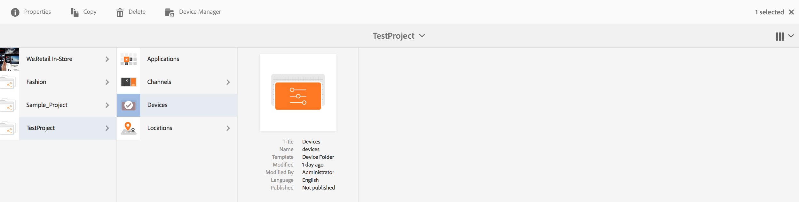
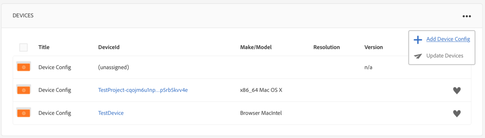

# 管理设备 {#managing-devices}

本页介绍了设备分配。

通过设备控制台，您可以访问设备管理器，以将设备分配到显示屏。

>[!CAUTION]
>
>在分配设备之前，您需要先注册该设备。有关更多信息，请参阅[设备注册](device-registration.md)。

## 设备分配 {#device-assignment}

请按照以下步骤将设备分配到显示屏：

1. 导航到项目的设备文件夹，例如

   `http://localhost:4502/screens.html/content/screens/TestProject`

   

1. Select your **Devices** folder and tap/click **Device Manager** in the action bar. 此时将显示已分配和未分配的设备。

   

1. Select an unassigned device from the list, and tap/click the **Assign Device** in the action bar.

   

1. Select the display you want to assign the device to from the list, and tap/click the **Assign**.

   

1. Tap/click the **Finish** to complete the assignment process.

   显示功能板会在&#x200B;**设备**&#x200B;面板中显示已分配的设备。

   

   单击&#x200B;**设备**&#x200B;面板右上角的 (**...**) 以添加设备配置或更新设备。

   

>[!NOTE]
>
>每次将第一台设备添加到新的 Screens 项目时，都会创建一个用户组。
>For instance, if the project node name is *we-retail*, then the user group name is *screens-we-retail-devices*.
>此组将添加为&#x200B;**参与者**&#x200B;组的成员，如下图所示：

### 后续步骤 {#the-next-steps}

在您熟悉如何将渠道分配到显示屏后，请参阅以下资源：

* [监测和故障诊断](monitoring-screens.md)

