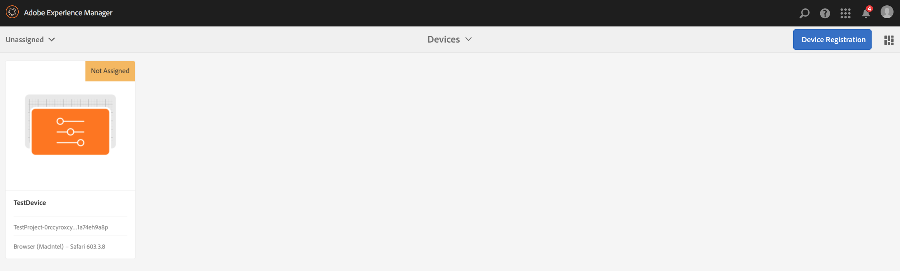
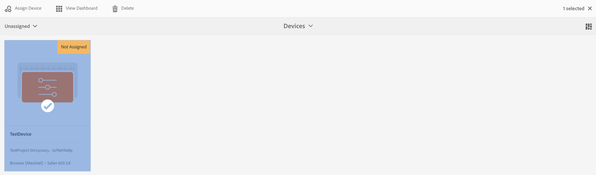

# 管理设备 {#managing-devices}

>[!IMPORTANT]
>此内容对AEM on-premise/AMS（AEM 6.5LTS和AEM 6.5）有效。 有关AEM as a Cloud Service Screens的内容，请参阅[AEM as a Cloud Service指南](https://experienceleague.adobe.com/en/docs/experience-manager-cloud-service/content/screens-as-cloud-service/overview/introduction)。

本页介绍设备分配。

通过“设备”控制台，您可以访问设备管理器，将设备分配给显示器。

>[!CAUTION]
>
>在分配设备之前，请先注册该设备。 请参阅[设备注册](device-registration.md)。

## 设备分配 {#device-assignment}

按照以下步骤将设备分配给显示器：

1. 例如，导航到项目的Devices文件夹

   `http://localhost:4502/screens.html/content/screens/TestProject`

   

1. 单击您的&#x200B;**设备**&#x200B;文件夹，然后单击操作栏中的&#x200B;**设备管理器**。 此时会显示已分配和未分配的设备。

   

1. 从列表中单击未分配的设备，然后在操作栏中单击&#x200B;**分配设备**。

   

1. 从列表中单击要为其分配设备的显示，然后单击&#x200B;**分配**。

   

1. 单击&#x200B;**完成**&#x200B;以完成分配流程。

   显示功能板在&#x200B;**设备**&#x200B;面板中显示分配的设备。

   

   单击(**...**) 在&#x200B;**设备**&#x200B;面板的右上角添加设备配置或更新设备。

   

>[!NOTE]
>
>每次将第一台设备添加到新的Screens项目时，都会创建一个用户组。例如，如果项目节点名称为&#x200B;*we-retail*，则用户组名称为&#x200B;*screens-we-retail-devices*。该组已添加为&#x200B;**参与者**&#x200B;组的成员，如下图所示：

### 后续步骤 {#the-next-steps}

熟悉如何为显示分配渠道后，请参阅t[监视和疑难解答](monitoring-screens.md)。

