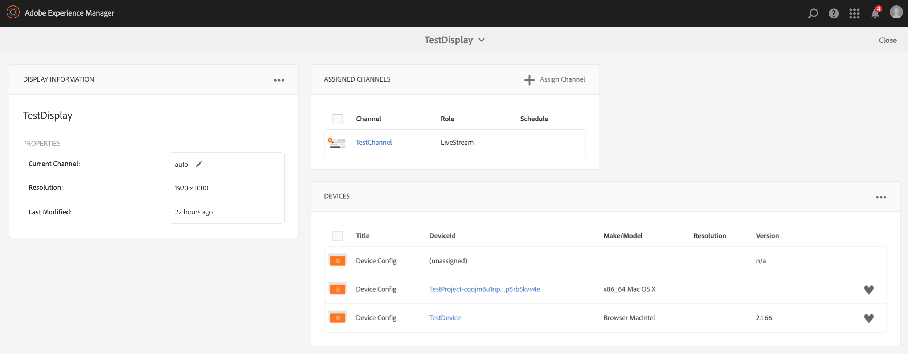

# 管理设备 {#managing-devices}

本页介绍了设备分配。

“设备”控制台允许您访问设备管理器，以将设备分配给显示器。

>[!CAUTION]
>
>在分配设备之前，您需要注册该设备。 有关更多信息，请参阅 [设备注册](device-registration.md).

## 设备分配 {#device-assignment}

按照以下步骤为显示设备指定设备：

1. 导航到项目的Devices文件夹，例如

   `http://localhost:4502/screens.html/content/screens/TestProject`

   

1. 选择您的 **设备** 文件夹，然后点按/单击 **设备管理器** 操作栏中的。 此时会显示已分配和未分配的设备。

   

1. 从列表中选择未分配的设备，然后点按/单击 **指定设备** 操作栏中的。

   

1. 从列表中选择要将设备分配给的显示，然后点按/单击 **分配**.

   

1. 点按/单击 **完成** 以完成分配流程。

   显示功能板会在以下位置显示分配的设备： **设备** 面板。

   

   单击(**...**)的右上角 **设备** 面板以添加设备配置或更新设备。

   

>[!NOTE]
>
>每次将第一个设备添加到新的Screens项目时，都会创建一个用户组。
>例如，如果项目节点名称为 *we-retail*，则用户组名称为 *screens-we-retail-devices*.
>此组将添加为 **参与者** 组，如下图所示：

### 后续步骤 {#the-next-steps}

熟悉了为显示分配渠道后，请参阅以下资源：

* [监视和故障排除](monitoring-screens.md)
