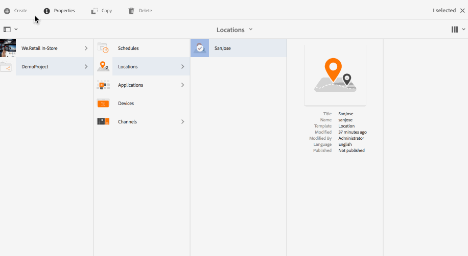
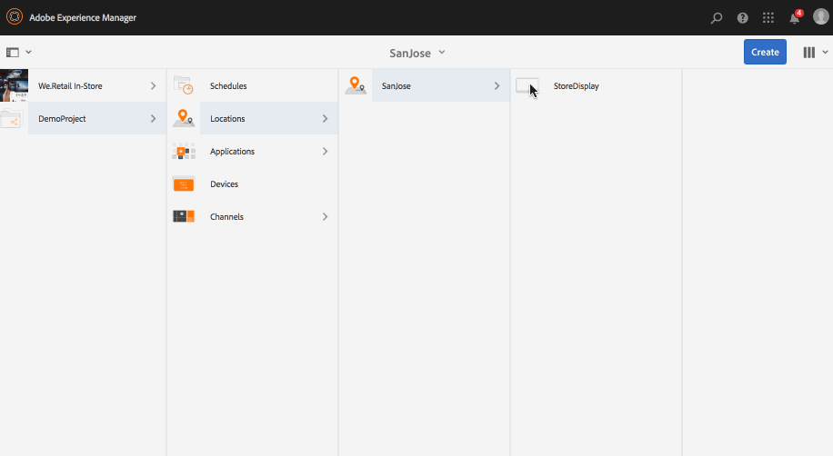

# 创建和管理显示屏 {#creating-and-managing-displays}

显示屏是通常彼此相邻放置的屏幕的虚拟分组。显示屏对于某个安装通常是永久性的。这将是作者要处理的对象内容，并且始终引用为逻辑显示而不是其实际计数部分。

创建位置后，您必须为该位置创建一个新显示屏。

本页显示了如何为 Screens 创建和管理显示屏。

**先决条件**：

* [配置和部署 Screens](configuring-screens-introduction.md)
* [创建和管理Screens项目](creating-a-screens-project.md)
* [创建和管理渠道](managing-channels.md)
* [创建和管理位置](managing-locations.md)

## 创建新显示屏 {#creating-a-new-display}

>[!NOTE]
>
>在创建显示屏之前，您需要先创建位置。要了解如何创建位置，请参阅[创建和管理位置](managing-locations.md)以了解详细信息。

要在您的位置中创建新显示屏，请按照以下步骤操作：

1. 导航到相应的位置，例如`http://localhost:4502/screens.html/content/screens/TestProject`。
1. 选择您的位置文件夹，然后点按/单击操作栏中加号图标旁边的&#x200B;**创建**。 此时将打开一个向导。
1. 从&#x200B;**创建**&#x200B;向导中选择&#x200B;**显示**，然后单击&#x200B;**下一步**。

1. 输入&#x200B;**名称**&#x200B;和&#x200B;**标题**&#x200B;作为显示位置。

1. 在&#x200B;**显示**&#x200B;选项卡下，选择布局的详细信息。 选择所需的&#x200B;**分辨率**（例如，**全高清**）。 此外，您还可以选择水平和垂直设备的数量。

1. 单击&#x200B;**创建**。

将创建显示屏(*StoreDisplay*)并将其添加到位置(*SanJose*)。

创建显示屏后，下一步是为该特定显示屏创建设备配置。请按照以下部分创建新设备配置。

>[!NOTE]
>
>**下一步**：
>
>为您的位置创建显示屏后，您需要为显示屏分配渠道以利用内容。
>
>请参阅[指定渠道](channel-assignment.md)部分，了解如何为显示屏指定渠道。

## 创建新设备配置 {#creating-a-new-device-config}

设备配置充当尚未安装的实际数字标牌设备的占位符。

请按照以下步骤创建新设备配置：

1. 导航到相应的显示屏，例如`http://localhost:4502/screens.html/content/screens/TestProject/locations/newlocation`。
1. 选择您的显示文件夹，然后点按/单击操作栏中的&#x200B;**视图仪表板**。
1. 点按/单击&#x200B;**设备**&#x200B;面板右上角的&#x200B;**+添加设备配置**。

1. 选择&#x200B;**设备配置**&#x200B;作为所需的模板，然后点按/单击&#x200B;**下一步**。

1. 根据需要输入属性，然后点按/单击&#x200B;**创建**。

将创建设备配置并将其添加到当前显示屏（在以下演示中，新设备配置为&#x200B;*DeviceConfig*）。

为位置中的显示屏设置设备配置后，下一步是将渠道分配到显示屏。

>[!NOTE]
>
>为位置中的显示屏设置设备配置后，下一步是将渠道分配到显示屏。
>
>如下图所示，如果设备配置在&#x200B;**设备**&#x200B;面板中显示为未分配，则未为该特定设备配置分配渠道。
>
>您应当已事先了解如何创建和管理渠道。有关详细信息，请参阅[创建和管理渠道](managing-channels.md)。

## 显示功能板 {#display-dashboard}

显示功能板为您提供了不同的面板，用于为您的设备管理显示设备和设备配置。

>[!NOTE]
>
>您可以选择功能板列表并对多个项目触发批量操作，而不是对每个项目单独执行操作。
>
>例如，下图显示了如何从显示功能板中选择多个渠道。

### “显示信息”面板{#display-information-panel}

**显示信息**&#x200B;面板提供了显示属性。

单击&#x200B;**显示信息**&#x200B;面板右上角的 (**...**) 可查看属性并预览显示。

#### 查看属性 {#viewing-properties}

单击&#x200B;**属性**&#x200B;可查看或更改显示屏的属性。

此外，您还可以在&#x200B;**Display**&#x200B;选项卡下的&#x200B;**Idle timeout**&#x200B;属性中调整交互式渠道的事件计时器值。 默认值设为 *300 秒*。

使用&#x200B;**CRXDE Lite**&#x200B;访问&#x200B;**idleTimeout**&#x200B;属性，即`http://localhost:4502/crx/de/index.jsp#/content/screens/we-retail/locations/demo/flagship/single/jcr%3Acontent/channels`。

### “已指定渠道”面板{#assigned-channels-panel}

**已指定渠道**&#x200B;面板显示了已分配到此设备的渠道。

### “设备”面板  {#devices-panel}

**设备**&#x200B;面板提供了有关设备配置的信息。

单击(**...**)，用于添加设备配置和更新设备。****

此外，单击设备配置以视图属性、分配设备或完全删除设备。

#### 后续步骤 {#the-next-steps}

为您的位置创建完显示屏后，您需要为显示屏分配渠道。

有关详细信息，请参阅[分配渠道](channel-assignment.md)。
