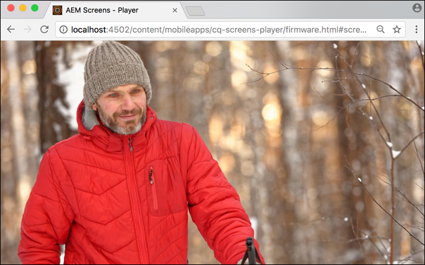

# 创建和管理Live Copy {#creating-and-managing-a-live-copy}

本页介绍了如何创建和管理渠道的 Live Copy。

***Live Copy***&#x200B;是特定站点内容的副本，其中保留了与原始源的实时关系。 此实时关系允许 Live Copy 从源中继承内容和页面属性。

本页介绍了如何创建渠道的 Live Copy、查看属性、检查状态，以及将渠道中的更改传播到其 Live Copy。

## 创建 Live Copy {#creating-a-live-copy}

请按照以下步骤在项目文件夹中创建渠道的 Live Copy。

1. 选择 Adobe Experience Manager 链接（左上方），然后选择&#x200B;**屏幕**。或者，您也可以直接转到：`http://localhost:4502/screens.html/content/screens`。

1. 导航到 Screens 项目，然后单击&#x200B;**渠道**。
1. 单击&#x200B;**创建**&#x200B;并选择&#x200B;**Live Copy**&#x200B;以创建渠道的Live Copy。

1. 选择目标，然后单击&#x200B;**下一步**。
1. 选择将存放 Live Copy 的位置。
1. 在&#x200B;**创建 Live Copy** 页面中输入&#x200B;**标题**&#x200B;和&#x200B;**名称**。

1. 单击&#x200B;**打开**&#x200B;以查看新 Live Copy 的内容，或单击&#x200B;**完成**&#x200B;以返回主页。

或者，请查看下面以可视化形式显示的有关创建渠道的新 Live Copy 的步骤。

以下示例显示了如何在目标文件夹&#x200B;***渠道***&#x200B;中创建 ***Idle Channel*** 的 Live Copy (***IdleLiveCopy***)。

## 查看 Live Copy 渠道的内容 {#viewing-content-of-the-live-copy-channel}

Live Copy 是已存在的渠道的副本。

要查看您的 Live Copy 内容，请执行以下步骤：

1. 导航到 Screens 项目，然后单击您最初创建 Live Copy 的位置，如上面的部分所示。(此处，选择的位置为&#x200B;**渠道**&#x200B;文件夹)

   

1. 单击操作栏中的&#x200B;**编辑**&#x200B;以查看渠道中的内容。

   

   >[!NOTE]
   >
   >查看 Live Copy 渠道的内容时，您将在菜单中看到一个额外的项目 **Live Copy 状态**。有关更多详细信息，请参阅以下部分。

### 查看 Live Copy 的属性  {#viewing-properties-of-a-live-copy}

您还可以查看 Live Copy 渠道的属性。

1. 导航到您的 Live Copy 渠道，然后单击操作栏中的&#x200B;**属性**。

   

1. 选择 **Live Copy** 选项卡以查看渠道的详细信息。

   

### Live Copy 状态 {#live-copy-status}

如下图所示，**Live Copy 状态**&#x200B;模式允许您查看渠道中所有资产的关系状态。

1. 单击&#x200B;**编辑**&#x200B;以选择&#x200B;**Live Copy状态**，并将渠道内容与原始渠道（从中生成Live Copy）的关联视图。

   

1. 选择 **Live Copy 状态**&#x200B;以显示预览页面。

   所有具有绿色边框的资源均表示内容是从原始渠道继承的。

   

### 中断继承 {#breaking-the-inheritance}

您也可以从 Live Copy 中取消继承，以使内容变得与原始分支无关。

如以下示例所示，您可以在编辑模式下选择图像，然后单击右上方的取消继承符号。

### 将更改传播到 Live Copy 渠道 {#propagating-changes-to-the-live-copy-channel}

如果您在原始渠道中进行了更改/更新，您需要也将这些更改传播到 Live Copy 渠道。

请按照以下步骤确保您的更改会从原始渠道传播到 Live Copy 渠道：

1. 选择原始渠道 (***Idle Channel***)，然后单击操作栏中的&#x200B;**编辑**。

   

1. 对此渠道内容进行编辑。例如，从此渠道中删除一个图像。

   

1. 选择此渠道的 Live Copy (***IdleLiveCopy***)，然后单击操作栏中的&#x200B;**编辑**。此时您将注意到已删除的图像仍显示在 Live Copy 中。

   为了传播更改，您需要同步渠道。

   

1. 要将更改传播到 Live Copy 渠道，请导航到 AEM 功能板并选择 Live Copy 渠道，然后单击操作栏中的&#x200B;**属性**。

   

1. 选择 **Live Copy** 选项卡，然后单击操作栏中的&#x200B;**同步**。

   

1. 单击&#x200B;**同步**&#x200B;以确认所做的更改。单击&#x200B;**保存并关闭**&#x200B;以导航回AEM仪表板。

   

   此时您将注意到图像现在也已从 Live Copy 渠道中删除。

