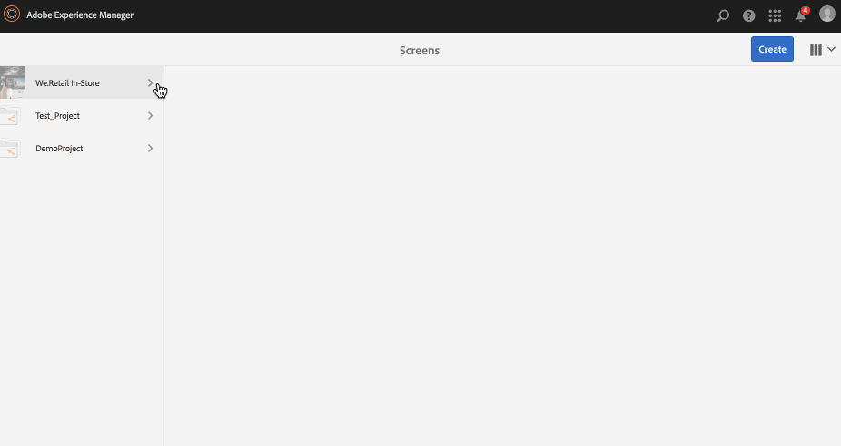
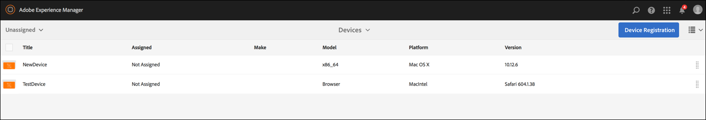
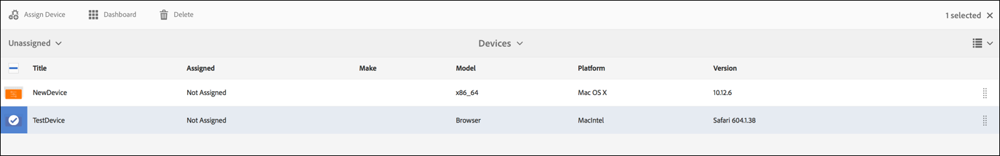
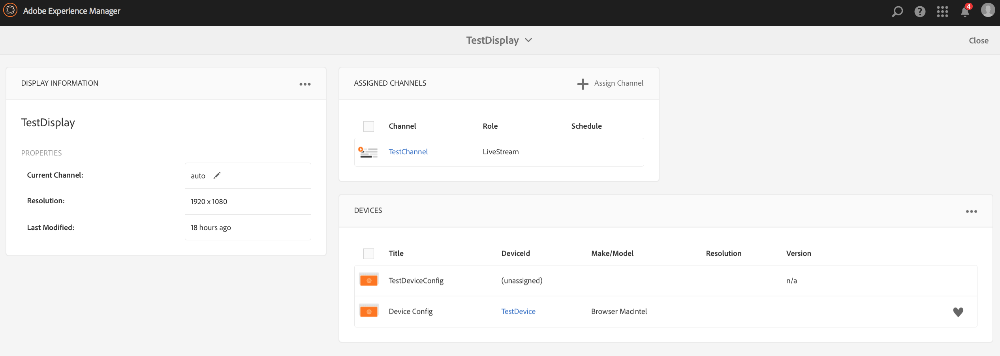

# 创建和管理Live Copy {#creating-and-managing-a-live-copy}

>[!IMPORTANT]
>此内容对AEM on-premise/AMS（AEM 6.5LTS和AEM 6.5）有效。 有关AEM as a Cloud Service Screens的内容，请参阅[AEM as a Cloud Service指南](https://experienceleague.adobe.com/en/docs/experience-manager-cloud-service/content/screens-as-cloud-service/overview/introduction)。

本页介绍如何创建和管理渠道的活动副本。

***Live Copy***&#x200B;是特定站点内容的副本，它保留了与原始源的实时关系。 此实时关系允许Live Copy从源继承内容和页面属性。

本页介绍如何创建渠道的Live Copy、查看属性、检查状态以及将更改从渠道传播到其Live Copy。

## 创建 Live Copy {#creating-a-live-copy}

执行以下步骤，在您的项目文件夹中创建渠道的Live Copy。

1. 单击Adobe Experience Manager链接（左上方），然后单击&#x200B;**Screens**。 或者，您可以直接转到： `http://localhost:4502/screens.html/content/screens`。

1. 导航到Screens项目，然后单击&#x200B;**渠道**。
1. 单击&#x200B;**创建**，然后单击&#x200B;**Live Copy**，以便您可以创建该渠道的Live Copy。
1. 单击目标，然后单击&#x200B;**下一步**。
1. 单击Live Copy可以驻留的位置。
1. 在&#x200B;**创建Live Copy**&#x200B;页面中输入&#x200B;**标题**&#x200B;和&#x200B;**名称**。

1. 单击&#x200B;**打开**&#x200B;以查看新Live Copy的内容，或单击&#x200B;**完成**&#x200B;返回主页。

或者，请参阅以下步骤来获取用于创建渠道的新Live Copy的可视表示法。

以下示例显示为&#x200B;***空闲频道***&#x200B;创建Live Copy (***IdleLiveCopy***)，目标文件夹为&#x200B;***频道***。

## 查看Live Copy渠道的内容 {#viewing-content-of-the-live-copy-channel}

Live Copy是已存在的渠道的副本。

要查看Live Copy的内容，请参阅以下步骤：

1. 导航到Screens项目，然后单击最初创建Live Copy的位置，如上面的部分所示。 （此处，该位置被选为&#x200B;**渠道**&#x200B;文件夹）

   

1. 单击操作栏中的&#x200B;**编辑**。

   

   >[!NOTE]
   >
   >在查看Live Copy渠道的内容时，您可在菜单中以&#x200B;**Live Copy状态**&#x200B;查看多余的项目。 更多详细信息，请参阅以下部分。

### 查看Live Copy的属性 {#viewing-properties-of-a-live-copy}

此外，您还可以查看Live Copy渠道的属性。

1. 导航到您的Live Copy频道，然后单击操作栏中的&#x200B;**属性**。

   

1. 单击&#x200B;**Live Copy**&#x200B;选项卡，以便查看渠道的详细信息。

   

### Live Copy 状态 {#live-copy-status}

模式&#x200B;**Live Copy状态**（如下图所示）允许您查看渠道中所有资产的关系状态。

1. 单击&#x200B;**编辑**，以便选择&#x200B;**Live Copy状态**。 您还可以查看渠道内容与生成Live Copy的原始渠道的关联。

   

1. 单击&#x200B;**Live Copy状态**，以便显示预览页面。

   所有带绿色边框的资源均显示内容继承自原始渠道。

   

### 中断继承 {#breaking-the-inheritance}

您还可以取消从Live Copy的继承，以便内容独立于原始分支。

以下示例显示您在编辑模式下单击图像，然后单击右上角的&#x200B;**取消继承**&#x200B;图标。

### 将更改传播到Live Copy渠道 {#propagating-changes-to-the-live-copy-channel}

如果您在原始渠道中进行更改或更新，则也会将这些更改传播到您的Live Copy渠道。

请按照以下步骤操作，以确保将更改从原始渠道传播到Live Copy渠道：

1. 单击原始频道（***空闲频道***），然后单击操作栏中的&#x200B;**编辑**。

   

1. 对此渠道内容进行编辑。 例如，从此渠道中删除图像。

   

1. 单击渠道的Live Copy (***IdleLiveCopy***)，然后单击操作栏中的&#x200B;**编辑**。 请注意，您删除的图像在Live Copy中仍可见。

   要传播更改，请同步渠道。

   

1. 要将更改传播到Live Copy渠道，请导航到AEM仪表板，单击Live Copy渠道，然后单击操作栏中的&#x200B;**属性**。

   

1. 单击&#x200B;**Live Copy**&#x200B;选项卡，然后单击操作栏中的&#x200B;**同步**。

   

1. 单击&#x200B;**同步**，然后单击&#x200B;**保存并关闭**&#x200B;以导航回AEM仪表板。

   

   请注意，图像现在也从Live Copy渠道中删除。

