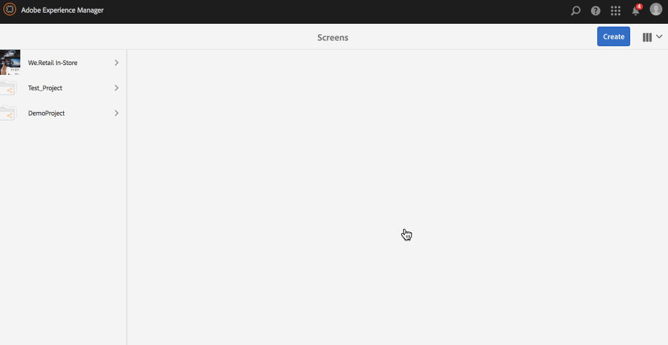

# 创建和管理计划 {#creating-and-managing-schedules}

通过 AEM Screens 中的&#x200B;**计划**，您可以将渠道组织到可重用的组中，这样您就不必为每个要显示内容的显示屏逐个重复其分配。

Schedules when combined with ***Dayparting***, allows you to set a global schedule with multiple channels running at specific times of the day, and re-use that setup for all your displays at once.

>[!NOTE]
>
>只有在安装了 AEM 6.3 站点功能包 1 时，才能使用此 AEM Screens 功能。要获取此功能包，您必须联系 Adobe 支持人员并申请访问权限。您获得权限后，就可以从“包共享”下载它。

## 创建计划 {#creating-a-schedule}

您可以为 Screens 项目创建一个计划，以管理用例的所有活动。

请按照以下步骤为您的渠道创建计划：

1. 选择 Adobe Experience Manager 链接（左上方），然后选择“屏幕”。Alternatively, you can go directly to: `http://localhost:4502/screens.html/content/screens`.
1. Navigate to Screens project and click **Schedules**.
1. 单击操作栏中的&#x200B;**创建**。
1. 从&#x200B;**创建**&#x200B;向导中选择&#x200B;**计划**，然后单击&#x200B;**下一步**。

1. 输入&#x200B;**名称**&#x200B;和&#x200B;**标题**，然后单击&#x200B;**创建**。

您将在项目中看到一个具有指定名称和标题的计划文件夹。

## 查看功能板 {#viewing-dashboard}

在项目中创建计划文件夹后，您可以从计划功能板中查看详细信息。

请按照以下步骤查看计划功能板。以下示例显示了 We.Retail 项目的功能板：

1. 导航到 Screens 项目（例如 We.Retail）的&#x200B;**计划**&#x200B;文件夹。

   

1. 单击操作栏中的&#x200B;**功能板**&#x200B;以打开计划功能板。

   您可以查看三个不同的面板，例如&#x200B;**计划信息**、**已指定渠道**&#x200B;和&#x200B;**已指定显示**。

   

   **计划信息面板** 单击计划信息面板右上角的属性以查看／更改计划的属性。

   **已分配渠道面板** 单击已分配渠道面板右上角的+分配渠道以打开渠道分配对话框。 有关更多详细信息，请参阅“分配渠道”。

   **已分配显示面板** 从已分配的显示面板中选择任何显示屏以打开显示功能板。

