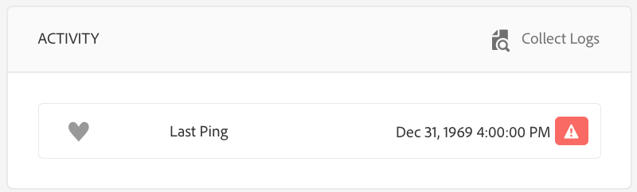

# 创建和管理计划 {#creating-and-managing-schedules}

>[!IMPORTANT]
>此内容对AEM on-premise/AMS（AEM 6.5LTS和AEM 6.5）有效。 有关AEM as a Cloud Service Screens的内容，请参阅[AEM as a Cloud Service指南](https://experienceleague.adobe.com/en/docs/experience-manager-cloud-service/content/screens-as-cloud-service/overview/introduction)。

通过AEM Screens中的&#x200B;**计划**，您可以将渠道组织到可重复使用的组中。 这样做意味着您不必对要显示内容的每个显示分别重复其分配。

与&#x200B;***DayParting***&#x200B;结合使用的计划允许您设置全局计划，其中多个渠道在一天中的特定时间运行，并且允许您同时重用为所有显示设置的全局计划。

>[!NOTE]
>
>此AEM Screens功能仅在您安装了AEM 6.3 Sites Feature Pack 1时才可用。 要访问此功能包，请联系Adobe支持并请求获取访问权限。 在获得必要的权限后，您可以从包共享中下载它。

## 创建计划 {#creating-a-schedule}

您可以为Screens项目创建计划，以便管理用例的所有活动。

请按照以下步骤为您的渠道创建计划：

1. 单击Adobe Experience Manager链接（左上方），然后单击Screens。 或者，您可以直接转到： `http://localhost:4502/screens.html/content/screens`。
1. 导航到Screens项目，然后单击&#x200B;**计划**。
1. 单击操作栏中的&#x200B;**创建**。
1. 从&#x200B;**创建**&#x200B;向导中单击&#x200B;**计划**，然后单击&#x200B;**下一步**。

1. 输入&#x200B;**名称**&#x200B;和&#x200B;**标题**，然后单击&#x200B;**创建**。

您可以在项目中看到一个具有指定名称和标题的计划文件夹。

## 查看仪表板 {#viewing-dashboard}

在项目中创建计划文件夹后，可以从计划仪表板查看详细信息。

按照以下步骤查看计划仪表板。 以下示例显示了`We.Retail`项目的仪表板：

1. 导航到Screens的&#x200B;**计划**&#x200B;文件夹（例如，`We.Retail`）项目。

   

1. 单击操作栏中的&#x200B;**仪表板**。

   您可以查看三个不同的面板，如&#x200B;**计划信息**、**已分配渠道**&#x200B;和&#x200B;**已分配显示区**。

   

   **计划信息面板** — 单击“计划信息”面板右上角的“属性”以查看/更改计划的属性。

   **已分配的渠道面板** — 单击“已分配的渠道”面板右上角的+分配渠道，打开“渠道分配”对话框。

   **已分配显示面板** — 单击已分配显示面板中的任何显示以打开显示功能板。
