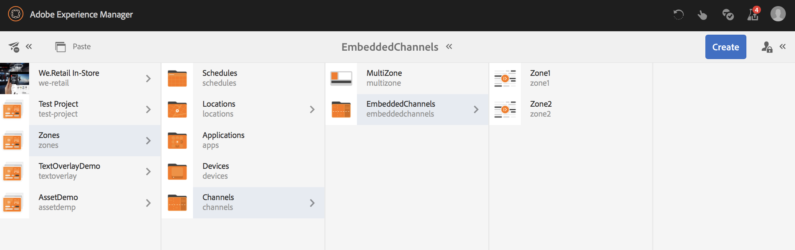

# 多区域布局 {#multi-zone-layout}

以下页面介绍了多区域布局的使用情况，并涵盖了以下主题：

* 概述
* 创建多区域布局
* 先决条件
* 在一个或多个区域中使用单个Assets
* 在一个或多个区域中使用序列内容

## 概述 {#overview}

***多区域布局***&#x200B;允许您创建多个区域内容并使用可在单个屏幕中组合的各种资源，例如视频、图像和文本。 您可以纳入图像、视频和文本，使它们能够混合在一起，创建直观的数字体验。

根据项目要求，有时您需要在一个渠道中拥有多个区域，并将它们编辑为一个完整的单元。 例如，在单个渠道的三个独立区域中运行的具有相关社交媒体馈送的产品序列。

>[!NOTE]
>在多区域渠道中，由于潜在的冲突和意外行为，不建议进行资产级计划。 如果需要进行资产级计划，请创建一个单独的序列渠道并在该渠道中应用计划逻辑。 接下来，将序列通道嵌入到多区域通道中。

### 先决条件 {#prerequisites}

在开始实施此功能之前，请确保您对以下内容具有概念性知识：

* [创建AEM Screens项目](https://experienceleague.adobe.com/zh-hans/docs/experience-manager-screens/user-guide/authoring/setting-up-projects/creating-a-screens-project)
* [创建显示区](https://experienceleague.adobe.com/zh-hans/docs/experience-manager-screens/user-guide/authoring/setting-up-projects/managing-displays)
* [将渠道分配给显示](/help/user-guide/channel-assignment.md)

## 创建多区域布局 {#creating-multi-zone-layout}

在创建渠道时，您可以使用不同的模板在渠道中创建区域。 您可以添加单个图像、视频或允许按顺序显示多个资产的嵌入式渠道。

**创建渠道**

1. 单击Adobe Experience Manager链接（左上方），然后单击&#x200B;**Screens**。 或者，您可以直接转到： `http://localhost:4502/screens.html/content/screens`。
1. 导航到&#x200B;**渠道**&#x200B;文件夹，然后单击操作栏中的&#x200B;**创建**。

1. 从&#x200B;**创建**&#x200B;向导中单击&#x200B;**1x2分屏渠道**。

1. 单击&#x200B;**下一步**&#x200B;并输入&#x200B;**标题**&#x200B;作为&#x200B;**MultiZone**。

1. 单击&#x200B;**创建**&#x200B;以完成渠道创建。

### 在一个或多个区域中使用单个Assets {#using-single-assets-in-one-or-more-zones}

您可以在所有单独的区域中使用单个资产，例如图像或视频。 要实施，请执行以下步骤：

1. **正在向渠道添加内容**

   1. 导航到&#x200B;**区域** > **渠道**> **多区域**。
   1. 单击&#x200B;**MultiZone**&#x200B;通道，然后单击操作栏中的&#x200B;**编辑**。

1. **将图像添加到频道**

   要在两个区域播放单个图像或视频，只需将图像拖放到渠道编辑器中的每个区域即可，如下图所示：

   

### 在一个或多个区域中使用序列内容 {#using-sequenced-content-in-one-or-more-zones}

如果您希望这些区域在不同区域中显示一系列图像和视频，请按照以下步骤了解详细信息。

1. **创建渠道文件夹**

   1. 导航到&#x200B;**区域** > **MultiZone** > **渠道**，然后单击操作栏中的&#x200B;**创建**。
   1. 从&#x200B;**创建**&#x200B;向导中单击&#x200B;**渠道文件夹**，然后单击&#x200B;**下一步**。
   1. 输入标题为&#x200B;**EmbeddedChannels**，然后单击&#x200B;**创建**。

   

1. **将两个渠道添加到渠道文件夹**

   1. 导航到&#x200B;**区域** > **渠道** > **嵌入式渠道**，然后单击操作栏中的&#x200B;**创建**。
   1. 从&#x200B;**创建**&#x200B;向导中单击&#x200B;**序列频道**&#x200B;以创建标题为&#x200B;**`Zone1`**&#x200B;的频道。
   1. 单击&#x200B;**`Zone1`**，然后单击操作栏中的&#x200B;**编辑**。
   1. 将一些图像拖放到此渠道中。
   1. 同样，在&#x200B;**EmbeddedChannels**&#x200B;文件夹中创建另一个标题为&#x200B;**`Zone2`**&#x200B;的序列频道。
   1. 将视频拖放到此渠道中。

   下图显示了频道&#x200B;**`Zone1`**&#x200B;和&#x200B;**`Zone2`**：

   

   添加到&#x200B;**`Zone1`**&#x200B;序列渠道编辑器的图像如下所示：

   

   添加到&#x200B;**`Zone2`**&#x200B;序列渠道编辑器的视频如下所示：

   

1. **将嵌入式序列（组件）添加到主通道(MultiZone)**

   1. 导航到&#x200B;**区域** > **渠道** > **多区域**。
   1. 单击操作栏中的&#x200B;**编辑**。
   1. 将&#x200B;**嵌入式序列**&#x200B;组件拖放到两个区域。
   1. 单击其中一个区域中的嵌入式序列。
   1. 单击编辑器中的一个嵌入序列的&#x200B;**配置** （扳手）图标。
   1. 单击通道路径为&#x200B;**区域** > **通道** > **嵌入式通道** > **`Zone1`**，如下图所示。
   1. 同样，将&#x200B;**`Zone2`**&#x200B;添加到编辑器中的另一个嵌入序列组件。

      

### 创建位置和显示 {#creating-location}

创建一个位置和显示，以便在AEM Screens播放器中查看内容。

1. **创建位置**

   1. 导航到&#x200B;**区域** > **位置**&#x200B;文件夹。
   1. 单击&#x200B;**位置**&#x200B;文件夹，然后单击操作栏中的&#x200B;**创建**。
   1. 从&#x200B;**创建**&#x200B;向导中单击&#x200B;**位置**，然后单击&#x200B;**下一步**。
   1. 输入&#x200B;**标题**&#x200B;作为&#x200B;**SanJose**，然后单击&#x200B;**创建**。

1. **创建显示区**

   1. 导航到&#x200B;**区域** > **位置**&#x200B;文件夹。
   1. 单击&#x200B;**SanJose**&#x200B;位置，然后单击操作栏中的&#x200B;**创建**。
   1. 从&#x200B;**创建**&#x200B;向导中单击&#x200B;**显示**，然后单击&#x200B;**下一步**。
   1. 输入&#x200B;**标题**&#x200B;作为&#x200B;**大厅**，然后单击&#x200B;**创建**。

### 将渠道分配给显示 {#channel-channel}

将渠道分配给显示内容以查看内容。 按照以下步骤将渠道分配给显示器。

1. **将渠道分配给显示区**

   1. 导航到&#x200B;**区域** > **位置** > **圣何塞**> **大厅**。
   1. 单击&#x200B;**大厅**&#x200B;显示，然后单击操作栏中的&#x200B;**分配渠道**。
   1. 在&#x200B;**通道路径**&#x200B;中输入&#x200B;**MultiZone**&#x200B;通道的路径。
   1. 将&#x200B;**支持的事件**&#x200B;设置为&#x200B;**初始加载**、**空闲屏幕**&#x200B;和&#x200B;**计时器**。
   1. 单击&#x200B;**保存**。

      
   1. 同样，将其他两个嵌入渠道（**`Zone1`**&#x200B;和&#x200B;**`Zone2`**）分配给此显示。
   1. 在将所有三个渠道分配给&#x200B;**大厅**&#x200B;显示区后，您应该能够从显示区仪表板中查看分配的渠道。

      

      >[!IMPORTANT]
      >
      >将主渠道（在本例中为&#x200B;**MultiZone**）分配给显示区后，必须将其他两个嵌入渠道&#x200B;**`Zone1`**&#x200B;和&#x200B;**`Zone2`**&#x200B;也分配给同一显示区。

### 注册设备 {#registering-device}

设置位置和显示后，请按照以下步骤注册设备并将显示分配给设备。

1. **正在注册设备**

   1. 导航到&#x200B;**区域** > **设备**&#x200B;文件夹。
   1. 单击&#x200B;**设备**&#x200B;文件夹，然后单击操作栏中的&#x200B;**设备管理器**。
   1. 单击&#x200B;**设备注册**，然后在列表中单击挂起的设备。

      >[!NOTE]
      > 设备的标题必须与&#x200B;**设备注册**&#x200B;选项卡中显示的设备令牌（**令牌**&#x200B;字段）匹配。

   1. 如果标题与设备令牌匹配，请单击设备，然后单击操作栏中的&#x200B;**注册设备**。
   1. 如果注册码与Screens播放器&#x200B;**设备注册**&#x200B;选项卡中的代码匹配，请单击操作栏中的&#x200B;**验证**。

      
   1. 输入&#x200B;**标题**&#x200B;作为&#x200B;**`Chrome-Device1`**，然后单击&#x200B;**注册**。
   1. 单击&#x200B;**指定显示区**，然后单击设备配置的路径。

   >[!NOTE]
   >如果您尝试在Screens播放器中查看内容，请确保从渠道仪表板中为分配给显示的每个渠道单击&#x200B;**更新离线内容**。

### 查看结果 {#viewing-the-result}

使用上述步骤实施多区域布局时，将显示以下输出。

选中Screens播放器，以便查看在两个不同区域中显示内容的输出。 左侧和右侧区域（都使用嵌入式序列作为组件）。

左区域是序列通道，右区域包括视频。

