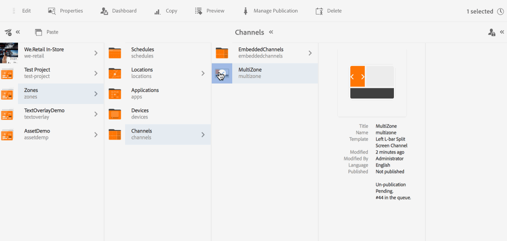

# 多区域布局 {#multi-zone-layout}

下页介绍了多区域布局的用法，并涵盖以下主题：

* 概述
* 创建多区域布局
* 前提条件
* 在一个或多个区域中使用单个资产
* 在一个或多个区域中使用序列内容

## 概述 {#overview}

***多区域布局*** ，允许您创建多个区域内容并使用各种资源，如可组合到单个屏幕中的视频、图像和文本。 您可以拖入图像、视频和文本，使图像、视频和文本全部融为一体并创建直观的数字体验。

根据项目要求，有时您需要在渠道中使用多个区域并将其作为一个完整的单位进行编辑。例如，具有相关社交媒体源的产品序列在单个渠道的三个单独区域中运行。

## 创建多区域布局 {#creating-multi-zone-layout}

在创建渠道时，您可以使用不同的模板在渠道中创建区域。 您可以添加单个图像、视频或嵌入式渠道，该渠道允许在序列中显示多个资产。

### 前提条件 {#prerequisites}

在开始实施此功能之前，请确保您已准备好一个项目作为开始实施多区域布局的先决条件。 例如，

* 创建标题为“区域”的AEM Screens项 **目**
* 在标题为MultiZoneDisplay的位 **置**&#x200B;下创建显示&#x200B;**。**

在Zones项目中创建标题为 **MultiZone** 的 **渠道** 。 按照以下步骤操作：

**创建渠道**

1. 选择 Adobe Experience Manager 链接（左上方），然后选择&#x200B;**屏幕**。Alternatively, you can go directly to: `http://localhost:4502/screens.html/content/screens`.
1. 导航到渠 **道文件夹** ，然后单 **击操作栏** 中的“创建”。

1. 从创 **建向导中选择左侧L栏分屏渠道****** 。

1. 单击 **下一步** ，然后输 **入** MultiZone **标题**。

1. 单击 **创建** ，以完成渠道创建。

### 在一个或多个区域中使用单个资产 {#using-single-assets-in-one-or-more-zones}

您可以在所有三个不同区域中使用单个资源，如图像或视频。 请按照以下步骤实施：

1. **将内容添加到渠道**

   1. 导航到 **Zones** —&gt; **Channels**—&gt;**MultiZone**。
   1. Select the **MultiZone** channel and click **Edit** from the action bar to open the editor.
   

1. **将图像添加到渠道**

   要在所有三个区域中播放单个图像或视频，只需在渠道编辑器中拖放图像，如下所示。

   

### 在一个或多个区域中使用序列内容 {#using-sequenced-content-in-one-or-more-zones}

如果希望这些区域在三个不同的区域中显示图像或内容的序列以及静态图像，请按照以下步骤了解详细信息。

1. **创建渠道文件夹**

   1. 导航到 **Zones** — **MultiZone** —&gt; Channels **（通道），然** 后单击操 **** 作栏中的CreateZone。
   1. Select **Channels Folder** from the **Create** wizard and click **Next**.
   1. Enter the title as **EmbeddedChannels** and click **Create**.
   

1. **向渠道文件夹添加两个渠道**

   1. 导航到 **Zones** — &gt; **Channels** — &gt; **EmbeddedChannels** ，然后单 **** 击操作栏中的创建CreateChannel。
   1. 从创 **建向导中** ，选择序列渠道 **** 以创建标题为** Zone1**的渠道。
   1. Select **Zone1** and click **Edit** from the action bar to open the editor.
   1. 将几幅图像拖放到此渠道。
   同样，在EmbeddedChannels文件夹中创建另一个标题为 **Zone2** 的 **序列渠道** 。

   

1. **将嵌入式序列／组件添加到主渠道(MultiZone)**

   1. 导航到 **Zones** —&gt; **Channels** —&gt; **MultiZone**。
   1. 单击操作栏中的&#x200B;**编辑**&#x200B;以打开编辑器。
   1. 将嵌入式序 **列组件拖放到两个区域** ，如下图所示。
   

1. **将内容添加到所有三个区域**

   1. 导航到 **Zones** —&gt; **Channels** —&gt; **MultiZone**。
   1. 在其中一个区域中选择嵌入式序列。
   1. 单击编 **辑器中某个嵌入序列的“配置** （扳手）”图标。
   1. 选择渠道路径作为 **Zones** —&gt; **Channels** —&gt; **EmbeddedChannels** —&gt; **** Zone1Zone，如下图所示。
   同样，将 **Zone2** 添加到编辑器中的其他嵌入式序列组件。 另外，向底部的第三个区域添加图像，如下所示。

   

#### 查看结果 {#viewing-the-result}

使用上述步骤实施多区域布局后，将显示以下输出，如下图所示。

Screens播放器中的以下输出在三个不同区域中显示内容。 左侧和右侧区域（均使用嵌入式序列作为组件）显示图像序列，下面的区域显示静态图像。

