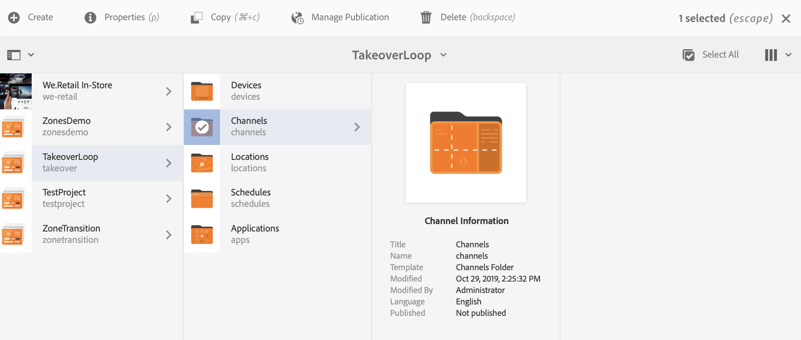
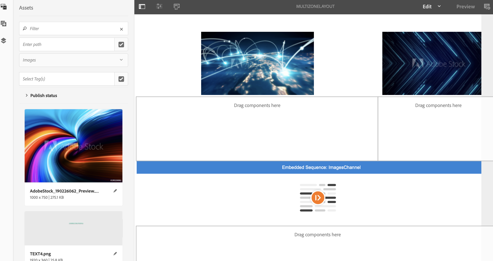
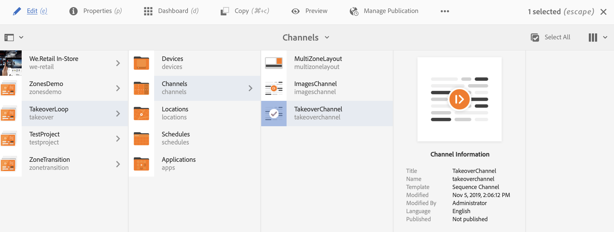
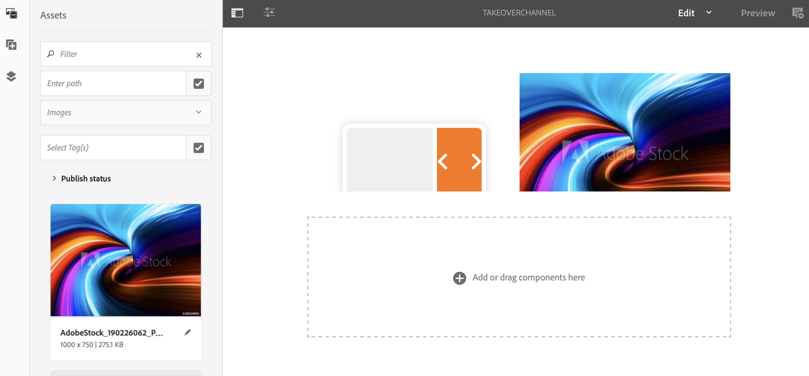
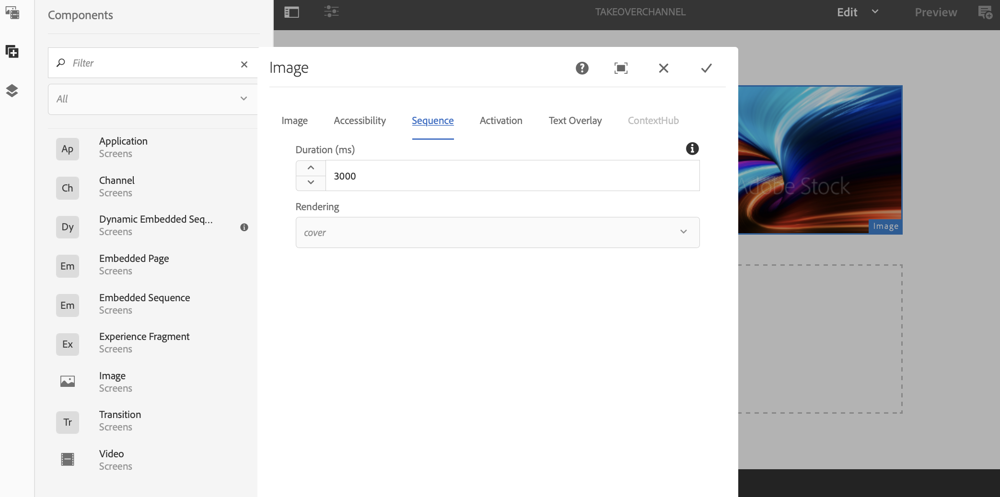

# 多区域到单区域转换 {#multizone-to-singlezone-use-case}

## 用例说明 {#use-case-description}

>[!IMPORTANT]
>此内容对AEM on-premise/AMS（AEM 6.5LTS和AEM 6.5）有效。 有关AEM as a Cloud Service Screens的内容，请参阅[AEM as a Cloud Service指南](https://experienceleague.adobe.com/zh-hans/docs/experience-manager-cloud-service/content/screens-as-cloud-service/overview/introduction)。

本节介绍一个用例示例，该示例重点介绍如何设置与单区域布局渠道交替的多区域布局渠道。 多区域渠道具有图像/视频资产排序，它显示如何设置一个项目，该项目可在多区域与单区域之间交替使用，反之亦然。

### 前提条件 {#preconditions}

在开始此用例之前，请确保您了解如何：

* **[创建和管理渠道](managing-channels.md)**
* **[创建和管理位置](managing-locations.md)**
* **[创建和管理计划](managing-schedules.md)**
* **[设备注册](device-registration.md)**

### 主要行为者 {#primary-actors}

内容作者

## 设置项目 {#setting-up-the-project}

请按照以下步骤设置项目：

1. 创建名为&#x200B;**TakeoverLoop**&#x200B;的AEM Screens项目，如下所示。

   

1. **创建多区域Screens渠道**

   1. 单击&#x200B;**渠道**&#x200B;文件夹，然后单击操作栏中的&#x200B;**创建**&#x200B;并打开向导，以便创建渠道。
   1. 从向导中单击&#x200B;**左L栏分屏渠道**，并创建标题为&#x200B;**MultiZoneLayout**&#x200B;的渠道。
   1. 向渠道添加内容。 将资源拖放到每个区域。 以下示例显示了一个&#x200B;**MultiZoneLayout**&#x200B;渠道，其中包含视频、图像和文本横幅（以嵌入顺序），如下所示。

   

   >[!NOTE]
   >
   >要了解有关在渠道中创建多区域布局的更多信息，请参阅[多区域布局](multi-zone-layout-aem-screens.md)。

1. 在您的&#x200B;**Channels**&#x200B;文件夹中创建另一个标题为&#x200B;**TakeoverChannel**&#x200B;的频道。

   

1. 单击操作栏中的&#x200B;**编辑**，以便向此渠道添加内容。 添加一个&#x200B;**渠道**&#x200B;组件和一个要为此渠道切换到的图像资产，如下图所示：

   

1. 打开渠道组件的设置，并将其指向您在&#x200B;*步骤2*&#x200B;中创建的&#x200B;**MultiZoneLayout**&#x200B;渠道。

   

1. 将持续时间从&#x200B;**序列**&#x200B;字段设置为&#x200B;**10000毫秒**。

   

1. 同样，打开图像（您添加的资产）的设置，并将其持续时间从&#x200B;**序列**&#x200B;字段设置为&#x200B;**3000毫秒**。

   

## 检查预览 {#checking-the-preview}

您可以从播放器查看所需的输出，或者只需从编辑器中选择&#x200B;**预览**&#x200B;即可。

输出演示了多区域布局在&#x200B;*10000毫秒*&#x200B;内如何播放。 然后，它切换到播放持续时间为&#x200B;*3000毫秒*&#x200B;的单个区域布局。 最后，它切换回多区域布局。

>[!VIDEO](https://video.tv.adobe.com/v/30366)

>[!NOTE]
>
>您可以根据自己的要求自定义渠道过渡（从多区域布局到单区域布局或反之）。
