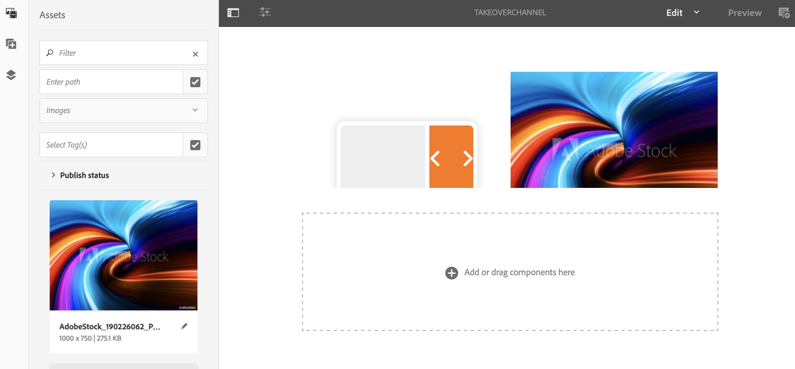

# 多区域到单区域过渡{#multizone-to-singlezone-use-case}

## 用例描述 {#use-case-description}

本节介绍一个用例示例，重点介绍如何设置与单区域布局渠道交替的多区域布局渠道。 多区域渠道具有图像／视频资产的顺序，它显示了如何设置从多区域到单区域交替的项目，反之亦然。

### 先决条件{#preconditions}

在开始此用例之前，请确保您了解如何：

* **[创建和管理渠道](managing-channels.md)**
* **[创建和管理位置](managing-locations.md)**
* **[创建和管理计划](managing-schedules.md)**
* **[设备注册](device-registration.md)**

### 主要操作者{#primary-actors}

内容作者

## 设置项目{#setting-up-the-project}

请按照以下步骤设置项目：

1. 创建名为&#x200B;**TakeoverLoop**&#x200B;的AEM Screens项目，如下所示。

   

1. **创建多区域屏幕渠道**

   1. 选择&#x200B;**渠道**&#x200B;文件夹，然后单击操作栏中的&#x200B;**创建**&#x200B;以打开向导以创建渠道。
   1. 从向导中选择&#x200B;**Left-L Bar Split Screen渠道**&#x200B;并创建标题为&#x200B;**MultiZoneLayout**&#x200B;的渠道。
   1. 向渠道添加内容。 将资产拖放到每个区域。 以下示例展示了&#x200B;**MultiZoneLayout**&#x200B;渠道，它包含视频、图像和文本横幅（在嵌入式序列中），如下所示。

   

   >[!NOTE]
   >
   >要进一步了解如何在渠道中创建多区域布局，请参阅[多区域布局](multi-zone-layout-aem-screens.md)。

1. 为&#x200B;**渠道**&#x200B;文件夹创建标题为&#x200B;**TakeoverChannel**&#x200B;的另一个渠道。

   

1. 单击操作栏中的&#x200B;**编辑**&#x200B;以向此渠道添加内容。 将&#x200B;**渠道**&#x200B;组件和要切换到的图像资产添加到此渠道，如下图所示：

   

1. 打开渠道组件的设置，并将其指向您在&#x200B;*步骤2*&#x200B;中创建的&#x200B;**MultiZoneLayout**&#x200B;渠道。

   

1. 将持续时间从&#x200B;**序列**&#x200B;字段设置为&#x200B;**10000 ms**。

   

1. 同样，打开图像（您添加的资产）的设置，并将其持续时间从&#x200B;**序列**&#x200B;字段设置为&#x200B;**3000 ms**。

   

## 检查预览{#checking-the-preview}

您可以视图播放器中的所需输出，或者只需单击编辑器中的&#x200B;**预览**&#x200B;即可。

输出将演示多区域布局在&#x200B;*10000 ms*&#x200B;下的播放方式，然后切换到播放持续时间为&#x200B;*3000 ms*&#x200B;的单个区域布局，然后切换回多区域布局。

>[!VIDEO](https://video.tv.adobe.com/v/30366)

>[!NOTE]
>
>您可以根据您的要求自定义渠道过渡（从多区域到单区域布局，反之亦然）。