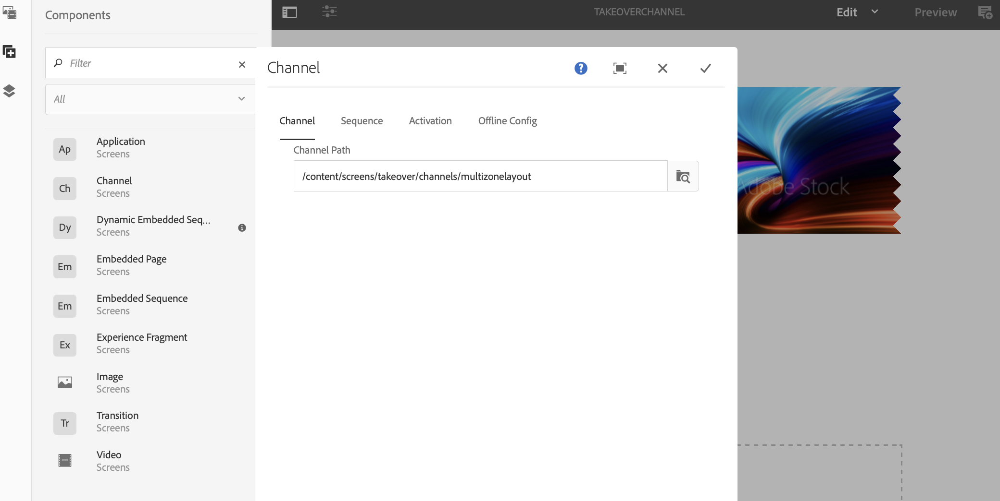

# 多区域到单区域转换 {#multizone-to-singlezone-use-case}

## 用例描述 {#use-case-description}

本节介绍一个用例示例，该示例重点介绍如何设置与单区域布局渠道交替的多区域布局渠道。 多区域渠道具有图像/视频资产的排序功能，它显示了如何设置可在多区域与单区域之间进行交替的项目，反之亦然。

### 前提条件 {#preconditions}

在开始此用例之前，请确保您了解如何：

* **[创建和管理渠道](managing-channels.md)**
* **[创建和管理位置](managing-locations.md)**
* **[创建和管理时间表](managing-schedules.md)**
* **[设备注册](device-registration.md)**

### 主要行为者 {#primary-actors}

内容作者

## 设置项目 {#setting-up-the-project}

请按照以下步骤设置项目：

1. 创建名为的AEM Screens项目 **TakoverLoop**，如下所示。

   

1. **创建多区域Screens频道**

   1. 单击 **渠道** 文件夹并单击 **创建** 并打开向导，以便创建渠道。
   1. 单击 **左L栏分屏渠道** 并从向导中创建标题为 **MultiZoneLayout**.
   1. 向渠道添加内容。 将资源拖放到每个区域。 以下示例显示了 **MultiZoneLayout** 包含视频、图像和文本横幅（以嵌入顺序）的频道，如下所示。

   

   >[!NOTE]
   >
   >要详细了解如何在渠道中创建多区域布局，请参阅 [多区域布局](multi-zone-layout-aem-screens.md).

1. 创建另一个标题为 **TakeoverChannel** 敬您的 **渠道** 文件夹。

   

1. 单击 **编辑** 以向此渠道添加内容。 添加 **渠道** 要为此渠道切换到的组件和图像资源，如下图所示：

   

1. 打开渠道组件的设置，并将其指向 **MultiZoneLayout** 您在中创建的渠道 *步骤2*.

   

1. 设置持续时间 **序列** 字段至 **10000毫秒**.

   

1. 同样，打开图像（您添加的资产）的设置，然后从设置其持续时间 **序列** 字段至 **3000毫秒**.

   

## 检查预览 {#checking-the-preview}

您可以在播放器中查看所需的输出，也可以通过选择 **预览** 从编辑器中删除。

输出演示了多区域布局如何播放 *10000毫秒* 然后切换到播放持续时间的单区域布局 *3000毫秒* 然后切换回多区域布局。

>[!VIDEO](https://video.tv.adobe.com/v/30366)

>[!NOTE]
>
>您可以根据自己的要求自定义渠道过渡（从多区域布局到单区域布局或反之）。
