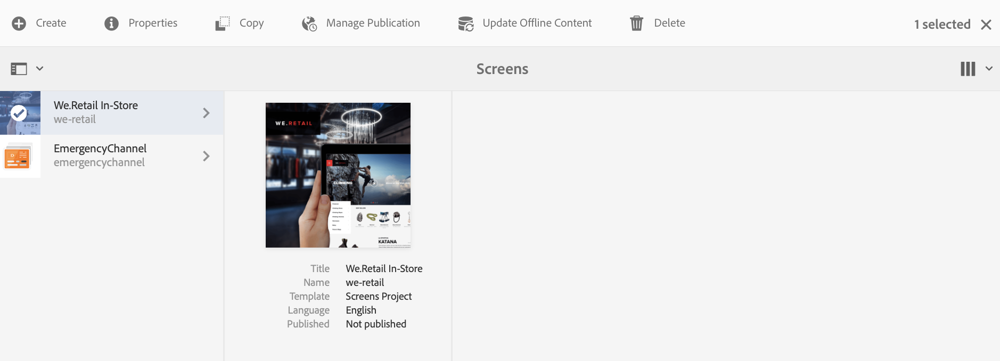
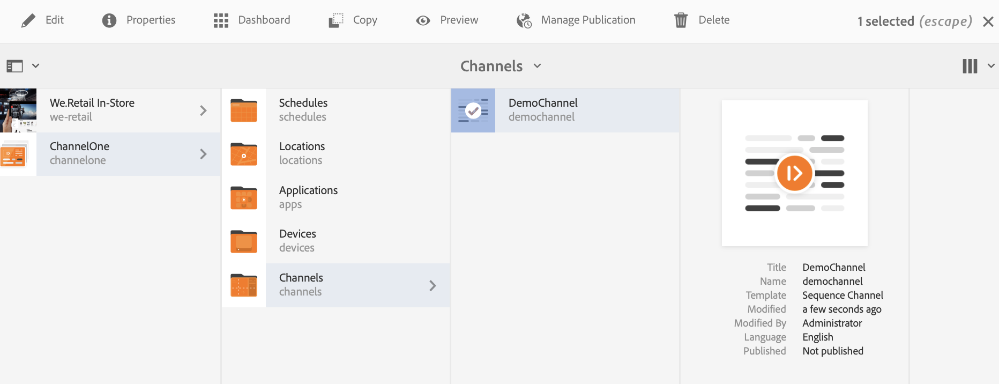

# 按需内容更新 {#on-demand}

本节介绍用于管理出版物的按需内容。

## 管理发布：将内容更新从作者发布到设备 {#managing-publication-delivering-content-updates-from-author-to-publish-to-device}

您可以从AEM Screens发布和取消发布内容。 “管理发布”功能允许您从作者到发布设备交付内容更新。 您可以为整个AEM Screens项目或仅为某个渠道、位置、设备、应用程序或计划发布/取消发布内容。

### 管理AEM Screens项目的发布 {#managing-publication-for-an-aem-screens-project}

请按照以下步骤为AEM Screens项目从创作到发布到设备交付内容更新：

1. 导航到您的AEM Screens项目。
1. 选择 **管理发布** 以将该项目发布到发布实例。

   

1. 此 **管理发布** 向导将打开。 您可以选择 **操作** 还可以安排现在或之后的发布时间。 选择&#x200B;**下一步**。

   

1. 选中方框，以便您可以从中选择整个项目 **`Manage Publication`** 向导。

   

1. 选择 **+包括子项** 从操作栏中取消选中所有选项，以便发布项目中的所有模块并选择 **添加** 以发布。

   >[!NOTE]
   >
   >默认情况下，所有复选框都处于选中状态，您必须手动取消选中这些复选框才能发布项目中的所有模块。

   

   **“了解包括子项”对话框**

   上述步骤显示了如何发布整个内容。 如果要使用其他三个可用的替代项，则必须选中该特定选项。
例如，下图显示了如何仅管理和更新项目中已修改的页面：
   

   请按照下面的解释进行操作，以便您了解可用的选项：

   1. **仅包括下级子项**：利用此选项可管理仅对项目结构中的子节点的更新。
   1. **仅包括已修改的页面**：利用此选项，您可以仅管理对项目结构中找到的更改的已修改页面的更新。
   1. **仅包括已发布的页面**：利用此选项，您可以仅管理对之前发布的页面的更新。

1. 从 **`Manage Publication wizard`**，选择 **Publish**.

   

   >[!NOTE]
   >
   >请等待几秒/分钟，以便内容可到达发布实例。
   >
   >
   >    1. 如果项目中没有变化，并且没有变化，则工作流不起作用 **更新离线内容**.
   >    1. 如果作者在单击“ ”后未完成复制过程（内容仍在上载到发布实例），则工作流将不起作用 **Publish** 按钮。

   >[!CAUTION]
   >如果作为作者或内容创建者，您希望查看附加到创作实例的设备中的更改，请单击 **更新离线内容** 通过渠道仪表板或选择项目。 在这种情况下，仅在创作实例中执行更新离线内容。

1. 导航到项目并单击 **更新离线内容** 从操作栏中。 此操作会将相同的命令转发到发布实例，以便在发布实例上也创建离线ZIP。

   

   >[!NOTE]
   >
   >完成管理发布工作流后，如果存在指向创作实例的播放器，则在创作中触发更新离线内容。 这样做会在创作实例上脱机创建更新。

   >[!CAUTION]
   >
   >如果您有向创作服务器注册的播放器，则在创作实例中触发更新离线内容。 在发布实例中注册的播放器不需要更新离线内容。

### 管理渠道的发布 {#managing-publication-for-a-channel}

请按照以下步骤在AEM Screens项目中通过“创作”>“发布”>“设备”为渠道交付内容更新：

>[!NOTE]
>
>仅当渠道中有更改时，才遵循此部分。 如果在上次更新离线内容后，渠道没有任何更改，则单个渠道的管理发布工作流将无法工作。

1. 导航到您的AEM Screens项目并选择相应的渠道。
1. 选择 **管理发布** 以将该渠道发布到发布实例。

   

1. 此 **管理发布** 向导将打开。 您可以选择 **操作** 还可以安排现在或之后的发布时间。 选择&#x200B;**下一步**。

   

1. 选择 **Publish** 从 **`Manage Publication`** 向导。

   

   >[!NOTE]
   >
   >请等待几秒/分钟，以便内容可到达发布实例。

1. 正在触发 **更新离线内容** 在渠道功能板中，只将离线内容推送到“创作”实例，而不会推送到“发布”实例。 步骤1-4是将离线内容推送到发布实例。

   

   >[!CAUTION]
   >
   >首先发布，然后触发更新离线内容，如前面的步骤中所述。

### 渠道和设备重新分配： {#channel-and-device-re-assignment}

如果重新分配了设备，则一旦将设备重新分配给新显示，就必须发布初始显示和新显示。

同样，如果重新分配了渠道，在将渠道重新分配给新显示后，您必须发布初始显示和新显示。
