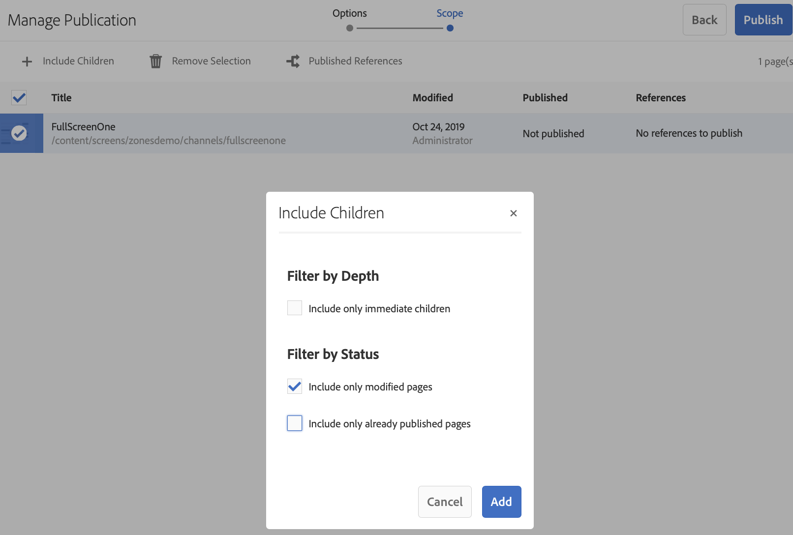

# 按需内容更新{#on-demand}

本节介绍用于管理发布的按需内容。

## 管理发布：将内容更新从创作传送到发布到设备{#managing-publication-delivering-content-updates-from-author-to-publish-to-device}

您可以从AEM Screens发布和取消发布内容。 通过管理发布功能，您可以将内容更新从创作交付到发布到设备。 您可以发布/取消发布整个AEM Screens项目的内容，也只能发布/取消发布渠道、位置、设备、应用程序或计划之一的内容。

### 管理AEM Screens项目{#managing-publication-for-an-aem-screens-project}的发布

请按照以下步骤将内容更新从创作交付到发布到AEM Screens项目的设备：

1. 导航到您的AEM Screens项目。
1. 单击操作栏中的&#x200B;**管理发布**&#x200B;以将项目发布到发布实例。

   

1. 将打开&#x200B;**管理发布**&#x200B;向导。 您可以选择&#x200B;**Action**，还可以安排当前或以后的发布时间。 单击&#x200B;**下一步**。

   

1. 选中方框以从&#x200B;**管理发布**&#x200B;向导中选择整个项目。

   

1. 单击操作栏中的&#x200B;**+包含子项** ，然后取消选中所有选项以发布项目中的所有模块，然后单击&#x200B;**添加**&#x200B;以发布。

   >[!NOTE]
   >
   >默认情况下，将选中所有框，您必须手动取消选中这些框才能发布项目中的所有模块。

   

   **“了解包括子项”对话框**

   上述步骤显示了如何发布整个内容。 如果要使用其他三个可用选项，则必须选中该特定选项。
例如，下图允许您仅管理和更新项目中修改的页面：
   

   请按照以下说明了解可用的选项：

   1. **仅包括直接子项**:此选项仅允许您管理项目结构中子节点的更新。
   1. **仅包含已修改的页面**:此选项允许您仅管理对修改后的项目页面的更新，在修改后的页面中，项目结构中会发现更改。
   1. **仅包含已发布的页面**:此选项仅允许管理之前发布的页面的更新。

1. 单击&#x200B;**管理发布向导中的**&#x200B;发布&#x200B;**。**

   

   >[!NOTE]
   >
   >等待几秒钟/分钟，以便内容到达发布实例。
   >
   >
   >    1. 如果项目中没有更改，并且&#x200B;**更新离线内容**&#x200B;中没有任何更改，则工作流将无法工作。
   >    1. 如果作者在单击管理发布工作流中的&#x200B;**Publish**&#x200B;按钮后未完成复制过程（内容仍在上传到发布实例），则该工作流将无法工作。

   >[!CAUTION]
   >如果您是作者或内容创建者，则希望查看附加到创作实例的设备中所做的更改，请单击渠道功能板中的&#x200B;**更新离线内容**，或选择项目。 在这种情况下，只会在创作实例中执行更新离线内容。

1. 导航到项目，然后单击操作栏中的&#x200B;**更新离线内容**。 此操作会将相同的命令转发到发布实例，以便在发布实例上也创建离线Zip。

   

   >[!NOTE]
   >
   >完成管理发布工作流程后，如果存在指向创作实例的播放器，则必须触发创作中的更新离线内容，该内容将在创作实例上创建脱机更新。

   >[!CAUTION]
   >
   >如果您有播放器向创作服务器进行了注册，则必须在创作实例中触发更新离线内容。 向发布实例注册的播放器不需要更新离线内容。

### 管理渠道{#managing-publication-for-a-channel}的发布

请按照以下步骤将内容更新从作者交付到AEM Screens项目中渠道的设备：

>[!NOTE]
>
>仅当渠道中存在更改时，才应遵循此部分。 如果渠道在上次更新离线内容后没有任何更改，则单个渠道的管理发布工作流将无法运行。

1. 导航到您的Screens项目并选择渠道。
1. 单击操作栏中的&#x200B;**管理发布**&#x200B;以发布渠道以发布实例。

   

1. 将打开&#x200B;**管理发布**&#x200B;向导。 您可以选择&#x200B;**Action**，还可以安排当前或以后的发布时间。 单击&#x200B;**下一步**。

   

1. 单击&#x200B;**管理发布向导中的**&#x200B;发布&#x200B;**。**

   

   >[!NOTE]
   >
   >等待几秒钟/分钟，以便内容到达发布实例。

1. 渠道功能板中的触发器&#x200B;**更新离线内容**&#x200B;将仅将离线内容推送到创作实例，而不会发布实例。 步骤1-4用于将离线内容推送到发布实例。

   

   >[!CAUTION]
   >
   >您必须先发布，然后触发更新离线内容，如前面步骤中所述。

### 通道和设备重新分配：{#channel-and-device-re-assignment}

如果已重新分配设备，则必须在将设备重新分配到新显示屏后，同时发布初始显示屏和新显示屏。

同样，如果已重新分配渠道，则必须在将渠道重新分配到新显示屏后，同时发布初始显示屏和新显示屏。