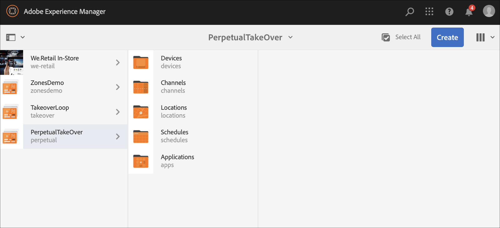
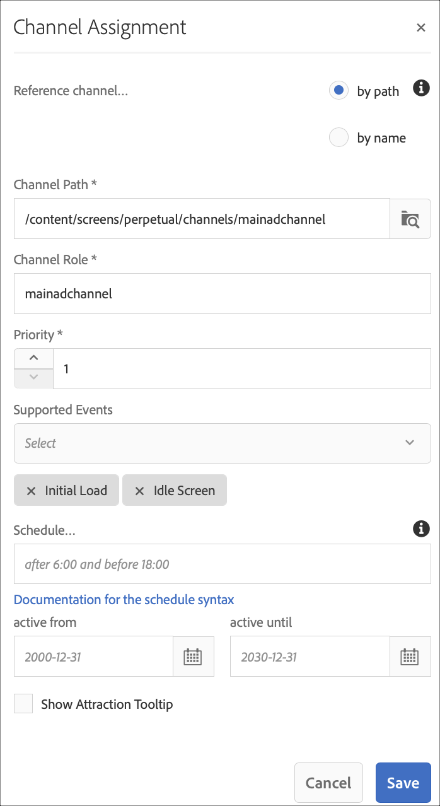
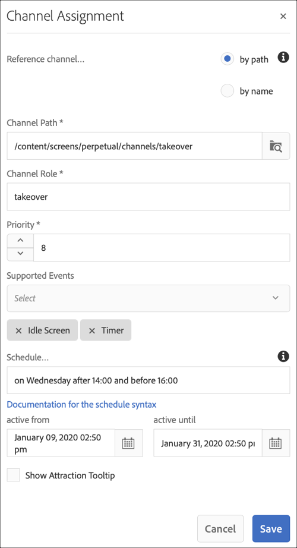

# 永久接管渠道 {#perpetual-takeover-channel}

下页展示了一个用例，重点介绍如何设置一个项目，以创建一个在特定时间段内连续播放的永久接管渠道。

## 用例描述 {#use-case-description}

此用例介绍如何为显示屏或一组 *显示屏* ，创建从正常播放的渠道接管的渠道。 该收购将持续特定的日期和时间。
例如，有一个永久接管渠道，每周五从上午9点到上午10点播放。 在此期间，不应播放其他频道。 以下示例展示了如何创建永久接管渠道，该渠道的播放允许内容在每周三的2小时（从下午2:00到下午4:00）内播放。

### 先决条件 {#preconditions}

在开始此使用案例之前，请确保您了解如何：

* **[创建和管理渠道](managing-channels.md)**
* **[创建和管理位置](managing-locations.md)**
* **[创建和管理计划](managing-schedules.md)**
* **[设备注册](device-registration.md)**

### 主要演员 {#primary-actors}

内容作者

## 设置项目 {#setting-up-the-project}

请按照以下步骤设置项目：

**设置渠道和显示**

1. 创建标题为PerpetualTakeOver的AEM Screens **项目**，如下所示。

   

1. 在“渠 **道”文件夹** 中创 **建MainAdChannel** 。

   

1. 选择 **MainAdChannel** ，然 **后单击操作** 栏中的“编辑”。 将一些资产（图像、视频、嵌入式序列）拖放到渠道中。

   

   >[!NOTE]
   >此示 **例中的MainAdChannel** 演示了连续播放内容的序列渠道。

1. 创建 **TakeOver** 频道，它接管 **** MainAdChannel中的内容，并将于每周三的下午2:00至4:00播放。

1. 选择TakeOver **，然** 后单击操 **作栏中的** Edit。 将一些资产拖放到您的渠道。 以下示例展示了添加到此渠道的单个区域图像。

   

1. 设置渠道的位置和显示。 例如，为此项目设 **置了以下位置** MainLobby和 **displayMainLobbyDisplay** 。

   

**将渠道分配给显示屏**

1. 从“位置” **文件夹中选择显** 示MainLobbyDisplay **** 。 单击 **操作栏中的分配渠道** ，以打开渠道 **分配对话框** 。

   >[!NOTE]
   >要了解如何将渠道分配给显示屏，请参阅渠 **[道分配](channel-assignment.md)**。

1. 从Channel AssignmentDiagmentDialog和&#x200B;**clickSave**&#x200B;对话框中填充字段(Channel **、** Priority和 **Supported Events************** )，将Channel AssignmentSaveTos分配给您的显示屏的Channel Channel Ad主Display。

   * **渠道路径**:选择MainAdChannel渠道的 **路径** 。
   * **优先级**:将此渠道的优先级设置为1。
   * **支持的事件**:选择“初 **始加载** ”和“ **空闲屏幕”**。
   

1. 从“位置” **文件夹中** ，选择 **显示TakeOver** 。 单击 **操作栏中的分配渠道** ，以分配接管渠道。

1. 要在计划时 **间将TakeOver** Channel分配给您的显示屏，并从“渠道分配”对话框中填充以下字段，然后单击“保 **存”******:

   * **渠道路径**:选择TakeOver渠道的 **路径** 。
   * **优先级**:将此渠道的优先级设置为大于 **MainAdChannel**。 例如，本例中设置的优先级为8。
   * **支持的事件**:选择“ **空闲屏幕** ”和 **“计时器”**。
   * **计划**:输入您希望此渠道运行显示屏的计划文本。 本例中提 **及的** Schedule中的文本是 *在星期三14:00之后和16:00之前*。
      >[!NOTE]
      >要进一步了解可添加到“计划”的表达式 ****，请参阅下面的“示例表 [达式](#example-expressions) ”部分
   * **活动自**:开始日期和时间。
   * **active until**:结束日期和时间。
   例如，此处的“计划 **** ”中和“活动自”和“活动至”中的文本，允许每周三从2:00 pm到4:00 pm ******** 。

   

   导航到显示屏，从 **TakeOver** —>位置 **—>** MainLobby **—>********** MainLobbyDisplayDisplayBar中导航到显示屏，以查看分配的渠道及其优先级的控制面板，如下所示。

   >[!NOTE]
   >必须将接管渠道的优先级设置为最高。

   Now, **TakeOver频道将于下午2:00接管** MainAdChannel **** ，持续两小时，直至每周三下午4:00，并在2020年1月9日至2020年1月31日播放其内容。

### 示例表达式 {#example-expressions}

下表汇总了几个示例表达式，您可以在将渠道分配给显示屏时添加到计划中。

| **表达式** | **解释** |
|---|---|
| 早8:00 | 该频道每天上午8点之前播放 |
| 下午2点多 | 每天下午2:00后播放频道 |
| 12点15分后和12点45分前 | 该频道每天下午12:15后播放30分钟 |
| 12点15分之前也是12点45分之后 | 该频道每天下午12:15之前播放，然后也在下午12:45之后播放 |
| 一月一号下午两点多，也是一月二号，也是一月三号凌晨三点多 | 1月1日下午12点45分开播，1月2日全天持续播放，直到1月3日凌晨3点 |
| 1月1-2日下午2:00，也是1月2-3日凌晨3:00 | 该频道在1月1日下午12:45后开始播放，持续播放至1月2日凌晨3:00，然后于1月2日下午12:45再次开始，并持续播放至1月3日凌晨3:00 |

>[!NOTE]
>您还可以使 _用军事时间_ （即14:00）代替am/pm记号（即2:00 pm）。
