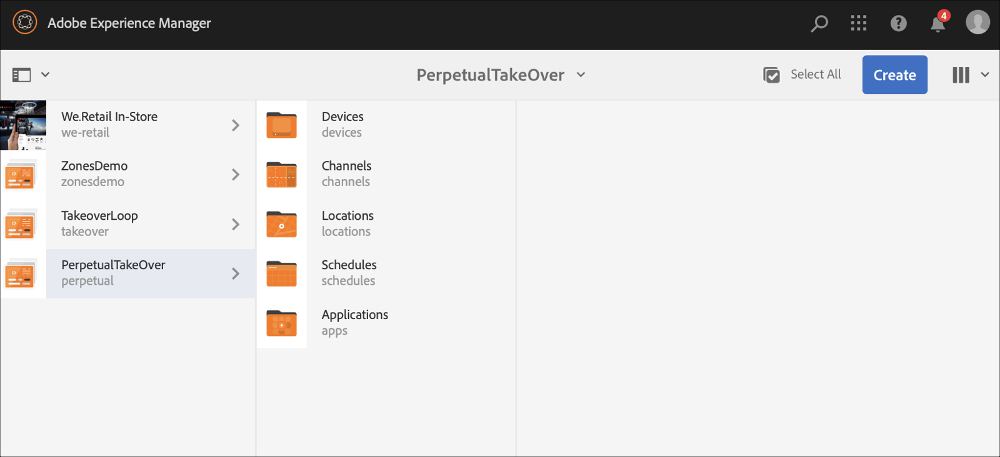
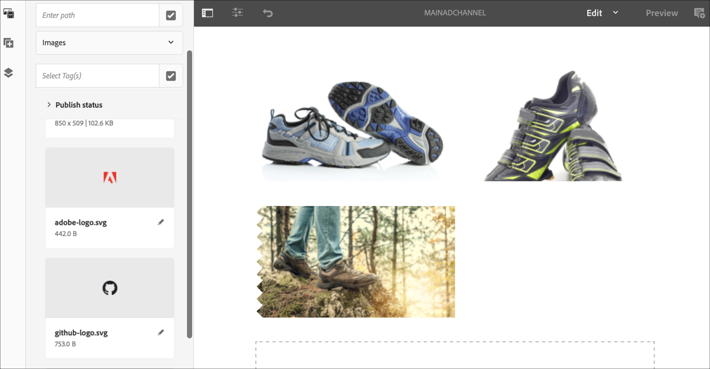

# 永久接管渠道 {#perpetual-takeover-channel}

>[!IMPORTANT]
>此内容对AEM on-premise/AMS（AEM 6.5LTS和AEM 6.5）有效。 有关AEM as a Cloud Service Screens的内容，请参阅[AEM as a Cloud Service指南](https://experienceleague.adobe.com/en/docs/experience-manager-cloud-service/content/screens-as-cloud-service/overview/introduction)。

以下页面展示了一个用例，重点介绍如何设置一个项目，介绍如何创建一个在特定时间（一天到一整天）连续播放的永久接管渠道。

## 用例说明 {#use-case-description}

此用例说明如何为显示或显示组创建从正常播放渠道中&#x200B;*接管*&#x200B;的渠道。 收购会在特定的日期和时间持续进行。例如，有一个永久TakeOver频道，它在每个星期五的上午9:00到上午10:00播放。在此期间，不应播放其他渠道。 以下示例演示如何创建永久接管渠道，该渠道允许内容从每周三下午2:00到下午4:00播放两个小时。

### 前提条件 {#preconditions}

在开始此用例之前，请确保您了解如何：

* **[创建和管理渠道](managing-channels.md)**
* **[创建和管理位置](managing-locations.md)**
* **[创建和管理计划](managing-schedules.md)**
* **[设备注册](device-registration.md)**

### 主要行为者 {#primary-actors}

内容作者

## 设置项目 {#setting-up-the-project}

请按照以下步骤设置项目：

**设置频道和显示区**

1. 创建标题为&#x200B;**PerpetualTakeOver**&#x200B;的AEM Screens项目，如下所示。

   

1. 在&#x200B;**Channels**&#x200B;文件夹中创建一个&#x200B;**MainAdChannel**。

   

1. 单击&#x200B;**MainAdChannel**，然后单击操作栏中的&#x200B;**编辑**。 将某些资产（图像、视频、嵌入式序列）拖放到渠道中。

   

   >[!NOTE]
   >本例中的&#x200B;**MainAdChannel**&#x200B;演示了一个连续播放内容的顺序频道。

1. 创建一个&#x200B;**TakeOver**&#x200B;频道，该频道接管&#x200B;**MainAdChannel**&#x200B;中的内容，并在每个星期三下午2:00到下午4:00播放。

1. 单击&#x200B;**TakeOver**，然后单击操作栏中的&#x200B;**Edit**。 将一些资产拖放到您的渠道中。 以下示例展示了添加到此渠道的单个区域图像。

   

1. 设置渠道的位置和显示。 例如，为此项目设置了以下位置&#x200B;**MainLobby**&#x200B;和显示区&#x200B;**MainLobbyDisplay**。

   

**将渠道分配给显示区**

1. 从&#x200B;**位置**&#x200B;文件夹中单击显示区&#x200B;**MainLobbyDisplay**。 单击操作栏中的&#x200B;**分配渠道**，以便打开&#x200B;**渠道分配**&#x200B;对话框。

   >[!NOTE]
   >要了解如何将渠道分配给显示，请参阅&#x200B;**[渠道分配](channel-assignment.md)**。

1. 从&#x200B;**渠道分配**&#x200B;对话框中填充字段（**渠道路径**、**优先级**&#x200B;和&#x200B;**支持的事件**），然后单击&#x200B;**保存**&#x200B;以将&#x200B;**MainAdChannel**&#x200B;分配给您的显示区。

   * **渠道路径**：单击&#x200B;**MainAdChannel**&#x200B;渠道的路径
   * **优先级**：将此渠道的优先级设置为1。
   * **支持的事件**：单击&#x200B;**初始加载**&#x200B;和&#x200B;**空闲屏幕**。

   

1. 单击&#x200B;**位置**&#x200B;文件夹中的显示&#x200B;**接管**。 单击操作栏中的&#x200B;**分配渠道**，以便分配接管渠道。

1. 在计划时间将&#x200B;**TakeOver**&#x200B;频道分配给您的显示器。 然后，从&#x200B;**渠道分配**&#x200B;对话框中填充以下字段并选择&#x200B;**保存**：

   * **渠道路径**：单击&#x200B;**TakeOver**&#x200B;渠道的路径
   * **优先级**：将此渠道的优先级设置为大于&#x200B;**MainAdChannel**。 例如，本示例中设置的优先级为8。
   * **支持的事件**：单击&#x200B;**空闲屏幕**&#x200B;和&#x200B;**计时器**。
   * **计划**：输入您希望此频道在显示上运行的计划的文本。 本示例中提到的&#x200B;**计划**&#x200B;中的文本是&#x200B;*在14:00之后的星期三和16:00*&#x200B;之前的星期三。

     >[!NOTE]
     >要了解有关可添加到&#x200B;**计划**&#x200B;中的表达式的详细信息，请参阅下面的[示例表达式](#example-expressions)部分。
   * **从**&#x200B;开始处于活动状态：开始日期和时间。
   * **一直处于活动状态，直到**：结束日期和时间。

     例如，在此处，**计划**&#x200B;和&#x200B;**中的文本从**&#x200B;到&#x200B;**一直处于活动状态，一直到**&#x200B;的日期和时间，这允许内容从每星期三的2:00下午播放到下午4:00。

     

     从&#x200B;**TakeOver** > **位置** > **MainLobby** > **MainLobbyDisplay**&#x200B;导航到显示区，然后单击操作栏中的&#x200B;**Dashboard**，以便您可以查看已分配渠道及其优先级，如下所示。

     >[!NOTE]
     >必须将接管渠道的优先级设置为最高。

     
现在，**TakeOver**&#x200B;频道在下午2:00接管了&#x200B;**MainAdChannel**&#x200B;并持续播放了两个小时，直到每周三下午4:00，并从2020年1月9日至2020年1月31日播放了其内容。

## 表达式示例 {#example-expressions}

下表总结了将渠道分配给显示内容时可以添加到计划的几个示例表达式。

| **表达式** | **解释** |
|---|---|
| 上午8:00之前 | 该频道每天上午8:00之前播放 |
| 下午2:00之后 | 该频道每天下午2:00点后播放 |
| 12:15之后和12:45之前 | 该频道每天下午12:15后播放30分钟 |
| 在12:15之前也在12:45之后 | 该频道在每天下午12:15之前播放，然后在下午12:45之后播放。 |
| 1月第一天下午2:00之后，也在1月第二天，也在1月第三天凌晨3:00之前。 | 该频道从2001年1月1日下午2:00点开始播放，一直到2002年1月3日凌晨3:00为止 |
| 1月1-2日下午2:00点之后以及1月2-3日凌晨3:00点之前 | 该频道在2001年1月下午2:00后开始播放，继续播放直到2002年1月凌晨3:00，然后在2002年1月下午2:00再次开始播放，并继续播放直到2003年1月凌晨3:00 |

>[!NOTE]
>
>您还可以使用&#x200B;_军用时间_&#x200B;表示法(14:00)，而不是&#x200B;*A.M./P.M.* （2:00下午）。

