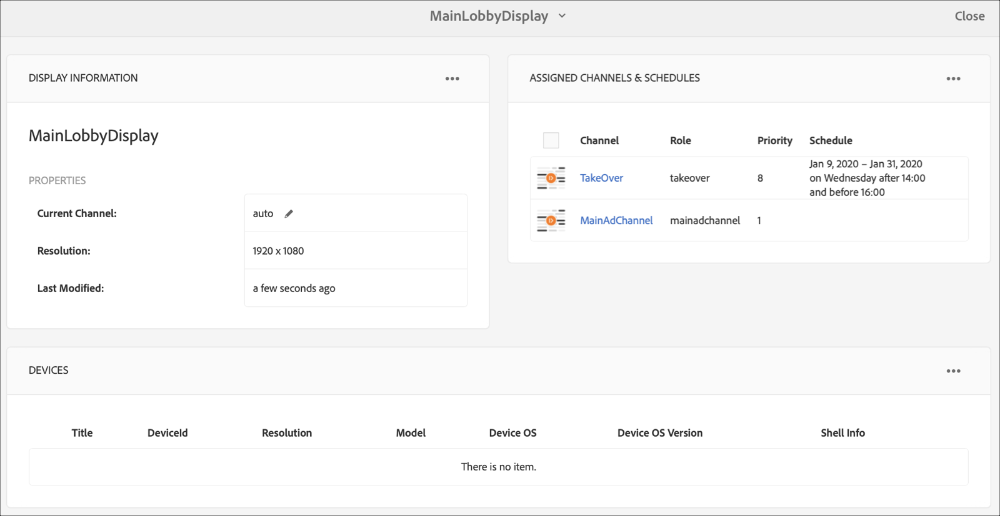

# 永久接管渠道 {#perpetual-takeover-channel}

下页展示了一个用例，重点介绍如何设置一个项目，以创建一个连续播放特定时间天和时间的永久接管渠道。

## 用例描述 {#use-case-description}

此用例说明如何创建从正常播 *放的渠道* ，接管显示屏或一组显示屏的渠道。 收购将持续特定的日期和时间。
例如，有一个永久接管渠道，每周五从上午9点到上午10点播放。 在此期间，不应再有其他渠道。 以下示例展示了如何创建永久接管渠道，该播放允许内容每周三播放2小时，从下午2:00到下午4:00。

### 先决条件 {#preconditions}

在开始此用例之前，请确保您了解如何：

* **[创建和管理渠道](managing-channels.md)**
* **[创建和管理位置](managing-locations.md)**
* **[创建和管理计划](managing-schedules.md)**
* **[设备注册](device-registration.md)**

### 主要演员 {#primary-actors}

内容作者

## 设置项目 {#setting-up-the-project}

请按照以下步骤设置项目：

**设置渠道和显示**

1. 创建标题为PerpetualTakeOver的 **AEM Screens项**，如下所示。

   

1. 在渠道 **文件夹中** ，创 **建MainAdChannel** 。

   

1. 选择 **MainAdChannel** ，然后 **单击操** 作栏中的“编辑”。 将一些资产（图像、视频、嵌入式序列）拖放到您的渠道。

   

   >[!NOTE]
   >本 **例中的** MainAdChannel演示了连续播放内容的序列渠道。

1. 创建 **接管** 渠道，接管MainAdChannel中的 **内容，每周三从2:00** 到4:00播放内容。

1. 选择“接管 **”** ，然后 **单击操** 作栏中的“编辑”。 将一些资产拖放到您的渠道。 以下示例展示了添加到此渠道的单个区域图像。

   

1. 为渠道设置位置和显示屏。 例如，为此项 **目设置** 以 **下位置MainLobby** 和displayMainLobbyDisplay。

   

**将渠道分配给显示屏**

1. 从“位置” **文件夹中** ，选择 **显示MainLobby** Display。 单 **击操作栏** 中的“分配渠道 **”以打开“** 渠道分配”对话框。

   >[!NOTE]
   >要了解如何将渠道分配给显示屏，请参阅 **[渠道分配](channel-assignment.md)**。

1. 从“渠道分配”对话&#x200B;**框中填充**( **路径、优先级和**&#x200B;受支持事件 **)，并单击************** “渠道分配保存”将主Channel Ad分配给您的显示屏。

   * **渠道路径**: 选择MainAdChannel渠道 **的路径**
   * **优先级**: 将此渠道的优先级设置为1。
   * **支持的事件**: 选择“ **初始加载** ”和 **“空闲屏幕**”。
   

1. 从位置文 **件夹** 中选 **择显** 示TakeOver。 单 **击操作栏** 中的“分配渠道”以分配接管渠道。

1. 要在计划的 **时间将** TakeOver渠道分配给您的显示屏，并从“渠道分配”对话框填充以 **下字段** ，然后单击“ **保存**”:

   * **渠道路径**: 选择接管渠道 **的路径**
   * **优先级**: 将此渠道的优先级设置为大于 **MainAdChannel**。 例如，本例中设置的优先级为8。
   * **支持的事件**: 选择“ **空闲屏幕** ”和 **计时器**。
   * **计划**: 输入希望此计划运行显示的渠道的文本。 此示例中 **提到** 的计划中的文 *本为星期三14:00后和16:00之前*。
      >[!NOTE]
      >[!NOTE]
**
   * 要进一步了解可添加到表达式的 **计划**，请参阅以 [下示例表达式](#example-expressions) 部分。
   * **活动自**: 开始日期和时间。

      **活动到**: 结束日期和时间。********

      例如，此处以 **计划** 、活 **动开始和活** 动开始到日 **** 期和时间显示的文本允许内容在每周三的下午2:00至下午4:00之间播放。

      ****************

      >从TakeOver **—>位置****—> MainLobby** **—> MainLobby********** —> MainLobbyDisplayDisplayBar中导航到显示屏，从视图中点击仪表板，将分配的渠道与其优先级，如下所示。      >[!NOTE]

      ********

## Now, TakeOver **渠道将于下午2:00接管** MainAdChannel **** ，时间为2:00，每周三下午4:00，并播放其内容，时间从2020年1月9日到2020年1月31日。

示例表达式 {#example-expressions}

| **下表总结了在为显示屏分配表达式时可以添加到计划的几个示例渠道。** | **表达式** |
|---|---|
| **解释** | 早8点之前 |
| 渠道每天早上8点之前播放 | 下午2:00后 |
| 渠道每天下午2点后播放 | 12:15后和12:45前 |
| 渠道每天下午12:15后播放30分钟 | 12时15分之前也是12时45分之后 |
| 渠道每天中午12:15之前播放，下午12:45之后播放 | 一月一号晚两点以后，也是一月二号，也是一月三号凌晨三点之前 |
| 1月1日下午2点以后，渠道开始继续在1月2日全天进行比赛，直到1月3日凌晨3点 | 1月1-2日下午2:00，也是1月2-3日凌晨3:00 |

>[!NOTE]1月1日下午2点以后，渠道开始播放器继续播放到1月2日凌晨3点，然后在1月2日下午2点再次开始，直到1月3日凌晨3点。
>
>[!NOTE]_**
