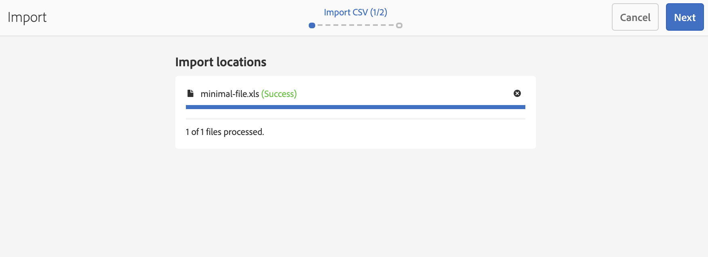

# 从文件新建项目导入程序 {#new-project-importer-from-file}

本节介绍的功能可将一组位置从CSV/XLS电子表格批量导入您的AEM Screens项目。

## 简介 {#introduction}

在组织中首次设置AEM Screens项目时，也应创建所有位置。 如果您的项目涉及多个位置，则会导致一项繁琐的任务，包括在UI中进行大量选择和等待。

此功能的目标是减少设置项目所需的时间，从而解决预算问题。

通过让作者提供电子表格作为输入文件，并让系统在后端自动创建位置树，此功能：

* *获得比通过UI手动选择更好的性能*
* *允许客户从自己的系统导出其位置，并轻松地直接在AEM中导入这些位置*

在初始项目设置期间或将现有AEM Screens扩展到新位置时，此过程可节省时间和资金。

## 架构概述 {#architectural-overview}

下图显示了项目导入程序功能的架构概述：

### 数据模型 {#data-model}

项目导入程序的数据模型描述如下：

>[!NOTE]
>
>当前版本仅支持导入位置。

| **属性** | **描述** |
|---|---|
| ***`path {string*}`*** | 位置的资源路径 |
| ***`[./jcr:title] {string*}`*** | 要使用的模板的名称（即&#x200B;*屏幕/核心/模板/位置*&#x200B;的位置） |
| ***`template {string}`*** | 用于页面的可选标题 |
| ***`[./jcr:description] {string}`*** | 用于页面的可选描述 |

因此，电子表格(CSV/XLS)文件需要以下列：

* **路径{string}** — 要导入位置的路径，其中路径的根是项目的位置文件夹（即，*`/foo`*&#x200B;已导入到&#x200B;*`/content/screens/<project>/locations/foo`*）
* **模板{string}** — 用于新位置的模板，目前唯一允许的值是“location”，但此值将来会扩展到所有Screens模板（`display`、`sequencechannel`等）
* **[。/*] {string}** — 要在位置设置的任何可选属性（即，`./jcr:title`、`./jcr:description`、`./foo, ./bar`）。 当前版本不允许筛选。

>[!NOTE]
>
>任何不符合上述条件的列将被忽略。 例如，如果您的工作表(CSV/XLS)文件中定义了除&#x200B;**path**、**template**、**title**&#x200B;和&#x200B;**description**&#x200B;之外的任何其他列，则忽略这些字段。 并且，**项目导入器**&#x200B;不会验证用于将项目导入到AEM Screens项目的这些附加字段。

## 使用项目导入程序 {#using-project-importer}

以下部分将介绍如何在AEM Screens项目中使用项目导入器。

>[!CAUTION]
>
>限制：
>
>* 当前版本不支持CSV/XLS/XLSX扩展名以外的文件。
>* 对于导入的文件和任何以“”开头的文件，不存在属性过滤。“/”已导入。
>

### 先决条件 {#prerequisites}

* 创建标题为&#x200B;**DemoProjectImport**&#x200B;的项目

* 使用必须导入的示例CSV或Excel文件。

出于演示目的，您可以从以下部分下载Excel文件。

[获取文件](assets/minimal-file.xls)

### 导入具有最少必填字段的文件 {#importing-the-file-with-minimum-required-fields}

请按照以下步骤将文件导入到具有最少必填字段的位置文件夹中：

>[!NOTE]
>
>以下示例显示了导入项目至少需要四个字段：

1. 导航到您的AEM Screens项目(**DemoProjectImport**)。

   

1. 单击侧栏中的项目&#x200B;**DemoProjectImporter &#x200B;**>**&#x200B;创建&#x200B;**>**&#x200B;导入位置**。

   

1. 将显示&#x200B;**导入**&#x200B;向导。 单击包含位置的项目文件，或单击从&#x200B;*先决条件*&#x200B;部分下载的文件(***minimal-file.xls***)。

   选择文件后，单击&#x200B;**下一步**。

   

1. 从“导入”向导中验证文件的内容（位置），然后单击&#x200B;**导入**。

   

1. 因此，您现在可以查看导入到项目的所有位置。

   
