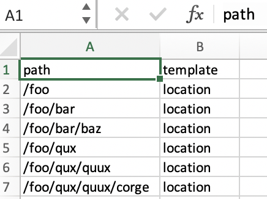

# 从文件新建项目导入程序 {#new-project-importer-from-file}

此部分介绍了将一组位置从CSV/XLS电子表格批量导入AEM Screens项目的功能。

## 简介 {#introduction}

在您组织中首次设置AEM Screens项目时，您还需要创建所有位置。 如果您的项目涉及大量位置，则会导致一项繁琐的任务，该任务需要在UI中多次单击并等待。

此功能的目标是缩短设置项目所需的时间，从而解决预算问题。

通过让作者提供电子表格作为输入文件，并让系统在后端自动创建位置树，该功能可以：

* *与通过用户界面手动单击相比，可以获得更好的性能*
* *允许客户从其自己的系统中导出他们拥有的位置，并轻松地直接在AEM中导入这些位置*

这既节省了初始项目设置期间的时间，也节省了资金，同时也节省了将现有AEM Screens扩展到新位置时的时间和资金。

## 架构概述 {#architectural-overview}

下图显示了项目导入器功能的架构概述：

### 数据模型 {#data-model}

项目导入器的数据模型如下所述：

>[!NOTE]
>
>当前版本仅支持导入位置。

| **属性** | **描述** |
|---|---|
| ***路径{string*}** | 位置的资源路径 |
| ***[。/jcr:title] {string*}** | 要使用的模板的名称（即&#x200B;*screens/core/templates/location*&#x200B;的位置） |
| ***模板{string}*** | 用于页面的可选标题 |
| ***[。/jcr:description] {string}*** | 用于页面的可选描述 |

因此，电子表格(CSV/XLS)文件需要以下列：

* **路径{string}** 要导入的位置的路径，其中路径的根是项目的位置文件夹(即， */* 将导入 */content/screens/&lt;project> /locations/foo*)

* **模板{string}** 用于新位置的模板，目前唯一允许的值是“location”，但将来会扩展到所有Screens模板（“display”、“sequencchannel”等）
* **[。/*] {string}**&#x200B;要在该位置设置的任何可选属性(即。/jcr:title, ./jcr:description, ./foo、。/条形图). 当前版本不允许进行筛选

>[!NOTE]
>
>任何与上述条件不匹配的列将被忽略。 例如，如果您在工作表(CSV/XLS)文件中定义了除&#x200B;**path**、**template**、**title**&#x200B;和&#x200B;**description**&#x200B;之外的任何其他列，则这些字段将被忽略，而&#x200B;**项目导入器**&#x200B;将不会验证这些附加字段，以便将项目导入到AEM Screens项目。

## 使用项目导入器 {#using-project-importer}

以下部分介绍如何在AEM Screens项目中使用项目导入器。

>[!CAUTION]
>
>限制:
>
>* 当前版本不支持CSV/XLS/XLSX扩展名以外的文件。
>* 对于导入的文件以及以“”开头的任何内容，不存在对属性的筛选。/”。

>

### 前提条件 {#prerequisites}

* 创建名为&#x200B;**DemoProjectImport**&#x200B;的新项目

* 使用需要导入的CSV或Excel示例文件。

出于演示目的，您可以从以下部分下载Excel文件。

[获取文件](assets/minimal-file.xls)

### 使用最少必填字段导入文件 {#importing-the-file-with-minimum-required-fields}

请按照以下步骤将文件导入位置文件夹，其中至少包含必填字段：

>[!NOTE]
>
>以下示例显示导入项目所需的至少四个字段：

1. 导航到您的AEM Screens项目(**DemoProjectImport**)。

   

1. 从侧栏中选择** DemoProjectImporter **—>**&#x200B;创建&#x200B;**—>**&#x200B;导入位置**项目。

   

1. 将打开&#x200B;**Import**&#x200B;向导。 选择您为具有位置的项目所拥有的文件，或选择您从&#x200B;*Requisements*&#x200B;部分下载的文件(***minimal-file.xls***)。

   选择文件后，单击&#x200B;**Next**。

   

1. 从“导入”向导中验证文件（位置）的内容，然后单击&#x200B;**导入**。

   

1. 因此，您现在将能够查看导入到项目的所有位置。

   
