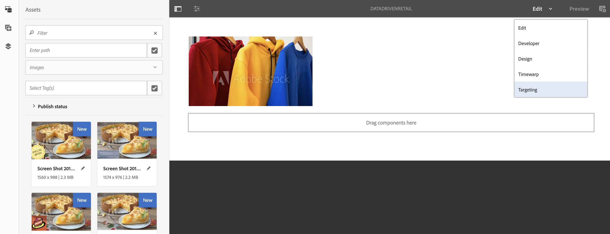

# 零售库存目标激活 {#retail-inventory-targeted-activation}

以下用例根据Google工作表中的值演示了三种不同的图像。

## 描述 {#description}

此用例展示了三种不同颜色运动衫的零售库存量。 根据Google Sheets中记录的可用库存运动衫数量，屏幕上将显示数量最高的图像（红色、绿色或蓝色运动衫）。

对于此用例，红色、绿色或蓝色毛衣将根据可用毛衣数量的最大值显示在屏幕上。

## 前提条件 {#preconditions}

在开始实施零售库存定位激活之前，您必须了解如何设置 ***数据存储***， ***受众分段*** 和 ***为渠道启用定位*** 在AEM Screens项目中。

请参阅 [在AEM Screens中配置ContextHub](configuring-context-hub.md) 以了解详细信息。

## 基本流量 {#basic-flow}

按照以下步骤实施零售库存激活用例：

1. **填充Google工作表**

   1. 导航到ContextHubDemo Google工作表。
   1. 为三件不同的运动衫添加三列（红色、绿色和蓝色），并为其添加相应的值。

   

1. **根据要求配置受众**

   1. 导航到受众中的区段(请参阅 ***步骤2：设置受众分段*** 在 **[在AEM Screens中配置ContextHub](configuring-context-hub.md)** 页面（了解更多详细信息）。

   1. 添加三个新区段 **For_Red**， **For_Green**、和 **For_Blue**.

   1. 选择 **For_Red** 并单击 **编辑** 操作栏中的。

   1. 拖放 **比较：属性 — 属性** 到编辑器中，然后单击“配置”图标以编辑属性。
   1. 选择 **google表/value/1/2** 从的下拉菜单中 **第一个属性名称**

   1. 选择 **运算符** 作为 **大于** 从下拉菜单中

   1. 选择 **数据类型** 作为 **数字**

   1. 选择 **google表/value/1/1** 从的下拉菜单中 **第二个属性名称**.

   1. 拖放 **其他比较：属性 — 属性** 到编辑器中，然后单击“配置”图标以编辑属性。
   1. 选择 **google表/value/1/2** 从的下拉菜单中 **第一个属性名称**.

   1. 选择 **运算符** 作为 **大于** 从下拉菜单中

   1. 选择 **数据类型** 作为 **数字**

   1. 选择 **google表/value/1/0** 从的下拉菜单中 **第二个属性名称**

   

   同样，编辑比较属性规则并将其添加到中 **For_Blue** 区段如下图所示：

   

   同样，编辑比较属性规则并将其添加到** For_Green **segment，如下图所示：

   

   >[!NOTE]
   >
   >您会注意到，对于区段 **For_Green** 和 **For_Green**，数据无法在编辑器中解析，因为按照Google工作表中的值，只有第一次比较现在有效。

1. 导航并选择您的 **DataDrivenRetail** 渠道（一个序列化渠道）并单击 **编辑** 操作栏中的。

   

   >[!CAUTION]
   >
   >您应该设置您的 **ContextHub** **配置** 使用渠道 **属性** —> **个性化** 选项卡。

   

   >[!NOTE]
   您必须同时选择 **品牌** 和 **面积图** ，以便在您启动定位流程时正确列出活动。

1. **添加默认图像**

   1. 向渠道添加默认图像并单击 **定位**.
   1. 选择 **品牌** 和 **活动** 从下拉菜单中单击 **开始定位**.

   1. 单击 **开始定位**.

   

   >[!NOTE]
   在开始定位之前，必须添加区段(**For_Green**， **For_Red**、和 **For_Blue**)，方法是单击 **+添加体验定位** 从侧边栏中（如下图所示）。

   

1. 将图像添加到所有三个不同的屏幕中，如下所示。

   

1. **检查预览**

   1. 单击 **预览。** 此外，打开您的Google工作表并更新其值。
   1. 更改所有三个不同列的值，您将注意到显示图像会根据清单中的最高值更新。
   
