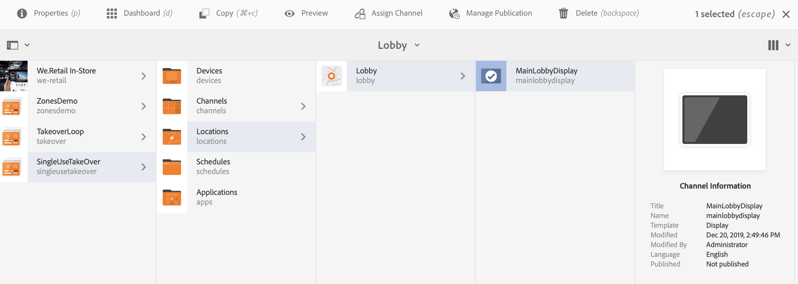

# 单次使用接管渠道 {#single-use-takeover-channel}

以下页面展示了一个用例，重点介绍如何设置一个项目，以创建在特定时间内仅播放一次的单次转移渠道。

## 用例描述 {#use-case-description}

此用例介绍如何为显示屏或一组 *显示屏* ，创建从正常播放的渠道接管的渠道。 收购将仅在特定时间进行一次。
例如，有一个Single TakeOver频道在星期五上午9点到上午10点播放。 在此期间，不应播放其他频道。 在此之前和之后，单次使用接管渠道将不会播放。 以下示例展示了如何创建一个播放的接管渠道，该渠道允许内容在12月31日上午12:00至凌晨12:01之前播放2分钟。

### 先决条件 {#preconditions}

在开始此使用案例之前，请确保您了解如何：

* **[创建和管理渠道](managing-channels.md)**
* **[创建和管理位置](managing-locations.md)**
* **[创建和管理计划](managing-schedules.md)**
* **[设备注册](device-registration.md)**

### 主要演员 {#primary-actors}

内容作者

## 设置项目 {#setting-up-the-project}

请按照以下步骤设置项目：

**设置渠道和显示**

1. 创建标题为 **SingleUseTakeOver的AEM Screens项目**，如下所示。

   

1. 在“渠 **道”文件夹** 中创 **建MainAdChannel** 。

   

1. 选择 **MainAdChannel** ，然 **后单击操作** 栏中的“编辑”。 将一些资产（图像、视频、嵌入式序列）拖放到渠道中。

   

   >[!NOTE]
   >此示 **例中的MainAdChannel** 演示了连续播放内容的序列渠道。

   

1. 创建 **TakeOver** 频道，该频道接管 **** MainAdChannel中的内容，并且仅在特定日期和时间播放。

1. 选择TakeOver **，然** 后单击操 **作栏中的** Edit。 将一些资产拖放到您的渠道。 以下示例展示了添加到此渠道的单个区域图像。

   

1. 设置渠道的位置和显示。 例如，为此项目设 **置了以下****位置Lobby和display mainLobbyDisplay** 。

   

**将渠道分配给显示屏**

1. 从“位置” **文件夹中选择显** 示MainLobbyDisplay **** 。 单击 **操作栏中的** “分配渠道”。

   

   >[!NOTE]
   >要了解如何将渠道分配给显示屏，请参阅渠 **[道分配](channel-assignment.md)**。

1. 从“渠道分配&#x200B;**保存”对话框和“单击** Channel AssignmentSave”对话框中填充字段 **(渠道路径、优先级和**************&#x200B;受支持事件)。 现在，您已将 **MainAdChannel分配到显示屏** 。

   

1. 从“位置” **文件夹中** ，选择 **显示TakeOver** 。 单击 **操作栏中的分配渠道** ，以分配单次使用的接管渠道。

1. 要在计划时 **间将TakeOver** Channel分配给您的显示屏，并从“渠道分配”对话框中填充以下字段，然后单击“保 **存”******:

   * **渠道路径**:选择TakeOver渠道的路径
   * **优先级**:将此渠道的优先级设置为大于 **MainAdChannel**。 例如，本例中设置的优先级为8。
   * **支持的事件**:选择“ **空闲屏幕** ”和 **“计时器”**。
   * **计划**:输入您希望此渠道运行显示屏的计划文本。 例如，此处的文本允许内容在12月31日凌晨12:00至凌晨12:01之前播放2分钟。
本例中提 **及的** Schedule *（附表）的案文为12月31日23:58之后，也为1月1日00.01之前*。

      

      >[!NOTE]
      >您可以提及不同用例的计划。 有关更多详细信息，请参阅永久用例。