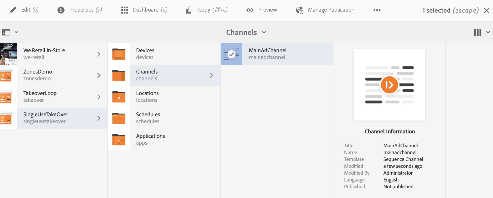

# 单次使用接管渠道 {#single-use-takeover-channel}

以下页面展示了一个用例，重点介绍如何设置一个项目，介绍如何创建一个在特定时间内播放一次的Single TakeOver渠道。

## 用例描述 {#use-case-description}

此用例说明如何为显示或显示组创建从正常播放渠道中&#x200B;*接管*&#x200B;的渠道。 接管仅发生一次，并且只发生在特定时间。

例如，有一个单次接管渠道在星期五上午9:00到上午10:00播放。在此期间，不应播放其他渠道。 在此时间之前和之后，单次使用接管渠道不播放。 以下示例演示了如何创建一个单一接管渠道，以允许在12月31日凌晨12:00之前播放2分钟内容直到凌晨12:01。

### 前提条件 {#preconditions}

在开始此用例之前，请确保您了解如何：

* **[创建和管理渠道](managing-channels.md)**
* **[创建和管理位置](managing-locations.md)**
* **[创建和管理计划](managing-schedules.md)**
* **[设备注册](device-registration.md)**

### 主要行为者 {#primary-actors}

内容作者

## 设置项目 {#setting-up-the-project}

请按照以下步骤设置项目：

**设置频道和显示区**

1. 创建标题为&#x200B;**SingleUseTakeOver**&#x200B;的AEM Screens项目，如下所示。

   

1. 在&#x200B;**Channels**&#x200B;文件夹中创建一个&#x200B;**MainAdChannel**。

   

1. 单击&#x200B;**MainAdChannel**，然后单击操作栏中的&#x200B;**编辑**。 将某些资产（图像、视频、嵌入式序列）拖放到渠道中。

   

   >[!NOTE]
   >本例中的&#x200B;**MainAdChannel**&#x200B;演示了一个连续播放内容的顺序频道。

   

1. 创建一个接管&#x200B;**MainAdChannel**&#x200B;中的内容并仅播放特定日期和时间的&#x200B;**TakeOver**&#x200B;频道。

1. 单击&#x200B;**TakeOver**，然后单击操作栏中的&#x200B;**Edit**。 将一些资产拖放到您的渠道中。 以下示例展示了添加到此渠道的单个区域图像。

   

1. 设置渠道的位置和显示。 例如，已为此项目设置以下&#x200B;**大厅**&#x200B;位置和&#x200B;**MainLobbyDisplay**&#x200B;显示。

   

**将渠道分配给显示区**

1. 从&#x200B;**位置**&#x200B;文件夹中单击显示区&#x200B;**MainLobbyDisplay**。 单击操作栏中的&#x200B;**分配渠道**。

   

   >[!NOTE]
   >要了解如何将渠道分配给显示，请参阅&#x200B;**[渠道分配](channel-assignment.md)**。

1. 从&#x200B;**渠道分配**&#x200B;对话框中填充字段（**渠道路径**、**优先级**&#x200B;和&#x200B;**支持的事件**），然后单击&#x200B;**保存**。 您现在已将&#x200B;**MainAdChannel**&#x200B;分配给您的显示区。

   

1. 单击&#x200B;**位置**&#x200B;文件夹中的显示&#x200B;**接管**。 单击操作栏中的&#x200B;**分配渠道**，以便分配一次性接管渠道。

1. 按计划时间将&#x200B;**TakeOver**&#x200B;频道分配给您的显示器，并在&#x200B;**频道分配**&#x200B;对话框中填充以下字段，然后单击&#x200B;**保存**：

   * **渠道路径**：单击接管渠道的路径
   * **优先级**：将此渠道的优先级设置为大于&#x200B;**MainAdChannel**。 例如，本示例中设置的优先级为8。

     >[!NOTE]
     >优先级可以是高于正常播放渠道的优先级值的任意值。
   * **支持的事件**：单击&#x200B;**空闲屏幕**&#x200B;和&#x200B;**计时器**。
   * **计划**：输入您希望此频道在显示上运行的计划的文本。 例如，此文本允许在12月31日凌晨12:00之前播放内容2分钟直到凌晨12:01。
本示例中提到的&#x200B;**计划**&#x200B;中的文本是&#x200B;*，其日期为12月31日，即23:58之后，也为1月1日，即00.01*&#x200B;之前。

     

     从&#x200B;**SingleUseTakeOver** > **位置** > **大厅** > **MainLobbyDisplay**&#x200B;导航到显示器。 单击操作栏中的&#x200B;**功能板**，以便查看已分配渠道及其优先级，如下所示。

     >[!NOTE]
     >必须将接管渠道的优先级设置为最高。

     

>[!NOTE]
>
>最佳实践是在播放后删除一次性TakeOver渠道。
