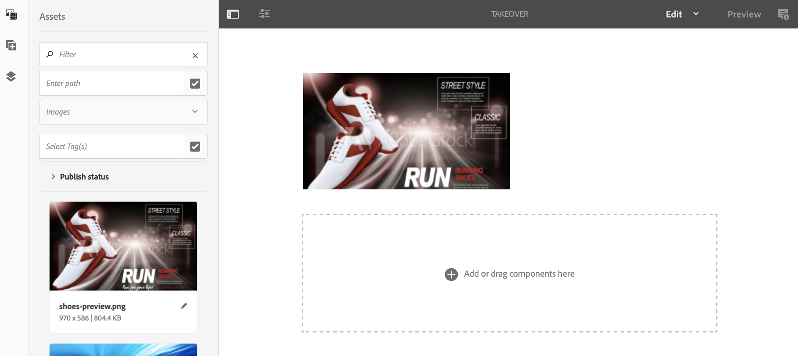

# 一次性使用接管渠道 {#single-use-takeover-channel}

以下页面展示了一个用例，重点介绍如何设置一个项目，以创建在特定时间仅播放一次的一次“一次接管”渠道。

## 用例描述 {#use-case-description}

此用例说明如何创建从正常播 *放的渠道* ，接管显示屏或一组显示屏的渠道。 接管将仅发生一次，并且只在特定时间进行。
例如，有一个“单次接管”渠道在周五上午9点到10点播放。 在此期间，不应再有其他渠道。 在此之前和之后，将不会播放“单次使用接管”渠道。 以下示例展示了如何创建一个播放的单次接管渠道，允许内容在12月31日凌晨12:00至凌晨12:01之前播放2分钟。

### 先决条件 {#preconditions}

在开始此用例之前，请确保您了解如何：

* **[创建和管理渠道](managing-channels.md)**
* **[创建和管理位置](managing-locations.md)**
* **[创建和管理计划](managing-schedules.md)**
* **[设备注册](device-registration.md)**

### 主要演员 {#primary-actors}

内容作者

## 设置项目 {#setting-up-the-project}

请按照以下步骤设置项目：

**设置渠道和显示**

1. 创建标题为SingleUseTakeOver **的AEM Screens项**，如下所示。

   

1. 在渠道 **文件夹中** ，创 **建MainAdChannel** 。

   

1. 选择 **MainAdChannel** ，然后 **单击操** 作栏中的“编辑”。 将一些资产（图像、视频、嵌入式序列）拖放到您的渠道。

   

   >[!NOTE]
   >本 **例中的** MainAdChannel演示了连续播放内容的序列渠道。

   

1. 创建 **接管** 渠道，它接管MainAdChannel中 **的内容** ，并且只在特定日期和时间播放。

1. 选择“接管 **”** ，然后 **单击操** 作栏中的“编辑”。 将一些资产拖放到您的渠道。 以下示例展示了添加到此渠道的单个区域图像。

   

1. 为渠道设置位置和显示屏。 例如，为此项目 **设置****了以下位** 置Lobby和display MainLobbyDisplay。

   

**将渠道分配给显示屏**

1. 从“位置” **文件夹中** ，选择 **显示MainLobby** Display。 单击 **操作栏** 中的“分配渠道”。

   

   >[!NOTE]
   >要了解如何将渠道分配给显示屏，请参阅 **[渠道分配](channel-assignment.md)**。

1. 从“渠道分配保存&#x200B;**”对话框中填**&#x200B;充字段 **(渠道路**&#x200B;径、优先级和 **受支持事件**)，然后 ********&#x200B;单击进行。 您现在已将MainAdChannel **分配给您** 的显示屏。

   

1. 从位置文 **件夹** 中选 **择显** 示TakeOver。 单击 **操作栏中** 的“指定渠道”，以指定单次使用接管渠道。

1. 要在计划的 **时间将** TakeOver渠道分配给您的显示屏，并从“渠道分配”对话框填充以 **下字段** ，然后单击“ **保存**”:

   * **渠道路径**: 选择接管渠道的路径
   * **优先级**: 将此渠道的优先级设置为大于 **MainAdChannel**。 例如，本例中设置的优先级为8。

      >[!NOTE]
      >优先级可以是高于正常播放渠道的优先级值的任何值。
   * **支持的事件**: 选择“ **空闲屏幕** ”和 **计时器**。
   * **计划**: 输入希望此计划运行显示屏的渠道的文本。 例如，此处的文本允许内容在12月31日凌晨12点00分之前播放2分钟，直到凌晨12点01分。
本例中 **提到** 的计划中的文 *本为12月31日23:58后，也为1月1日00.01前*。

      

      从SingleUseTakeOver **—>位置****—> Lobby** **Lobby** —>MainLobbyDisplay操 ******** 作栏导航到显示屏，并从视图中单击仪表板操作，将分配的渠道与其优先级，如下所示。

      >[!NOTE]
      >必须将接管渠道的优先级设置为最高。

      

>[!NOTE]
>
>播放“一次性使用接管”渠道后，最好删除该选项。