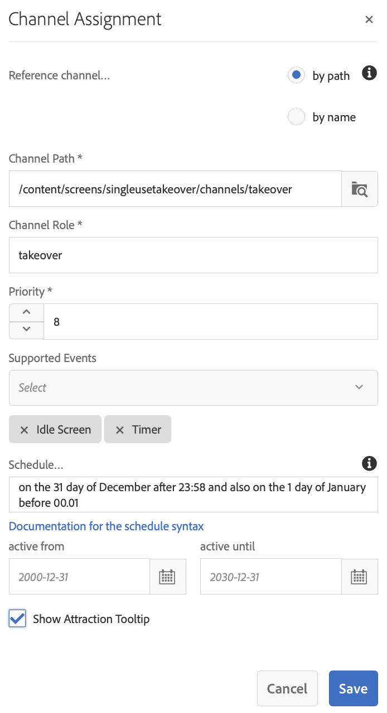

# 单次使用TakeOver渠道{#single-use-takeover-channel}

以下页面展示了一个用例，重点介绍如何设置一个项目，以创建在特定时间仅播放一次的一次“一次接管”渠道。

## 用例描述 {#use-case-description}

此用例说明如何为显示屏或显示屏组创建&#x200B;*从正常播放渠道接管*的渠道。 接管将仅发生一次，并且只在特定时间进行。
例如，有一个“单次接管”渠道在周五上午9点到10点播放。 在此期间，不应再有其他渠道。 在此之前和之后，将不会播放“单次使用接管”渠道。 以下示例展示了如何创建一个播放的单次接管渠道，允许内容在12月31日凌晨12:00至凌晨12:01之前播放2分钟。

### 先决条件{#preconditions}

在开始此用例之前，请确保您了解如何：

* **[创建和管理渠道](managing-channels.md)**
* **[创建和管理位置](managing-locations.md)**
* **[创建和管理计划](managing-schedules.md)**
* **[设备注册](device-registration.md)**

### 主要操作者{#primary-actors}

内容作者

## 设置项目{#setting-up-the-project}

请按照以下步骤设置项目：

**设置渠道和显示**

1. 创建标题为&#x200B;**SingleUseTakeOver**&#x200B;的AEM Screens项目，如下所示。

   

1. 在&#x200B;**渠道**&#x200B;文件夹中创建&#x200B;**MainAdChannel**。

   

1. 选择&#x200B;**MainAdChannel**，然后单击操作栏中的&#x200B;**编辑**。 将一些资产（图像、视频、嵌入式序列）拖放到您的渠道。

   

   >[!NOTE]
   >此示例中的&#x200B;**MainAdChannel**&#x200B;演示了连续播放内容的序列渠道。

   

1. 创建一个&#x200B;**TakeOver**&#x200B;渠道，它接管&#x200B;**MainAdChannel**&#x200B;中的内容，并且只在特定日期和时间播放。

1. 选择&#x200B;**TakeOver**&#x200B;并单击操作栏中的&#x200B;**编辑**。 将一些资产拖放到您的渠道。 以下示例展示了添加到此渠道的单个区域图像。

   

1. 为渠道设置位置和显示屏。 例如，为此项目设置了以下位置&#x200B;**Lobby**&#x200B;和显示&#x200B;**MainLobbyDisplay**。

   

**将渠道分配给显示屏**

1. 从&#x200B;**位置**&#x200B;文件夹中选择显示屏&#x200B;**MainLobbyDisplay**。 单击操作栏中的&#x200B;**分配渠道**。

   

   >[!NOTE]
   >要了解如何将渠道分配给显示屏，请参阅&#x200B;**[渠道分配](channel-assignment.md)**。

1. 从&#x200B;**渠道分配**&#x200B;对话框填充字段(**渠道路径**、**优先级**&#x200B;和&#x200B;**支持的事件**)，然后单击&#x200B;**保存**。 您现在已将&#x200B;**MainAdChannel**&#x200B;分配给您的显示屏。

   

1. 从&#x200B;**位置**&#x200B;文件夹中选择显示屏&#x200B;**TakeOver**。 单击操作栏中的&#x200B;**分配渠道**&#x200B;以分配单次使用接管渠道。

1. 要在计划时间将&#x200B;**TakeOver**&#x200B;渠道分配给您的显示屏，并在&#x200B;**渠道分配**&#x200B;对话框中填充以下字段，然后单击&#x200B;**保存**:

   * **渠道路径**:选择接管渠道的路径
   * **优先级**:将此渠道的优先级设置为大于 **MainAdChannel**。例如，本例中设置的优先级为8。

      >[!NOTE]
      >优先级可以是高于正常播放渠道的优先级值的任何值。
   * **支持的事件**:选择“ **空闲** 屏幕和 **计时器**”。
   * **计划**:输入希望此计划运行显示的渠道的文本。例如，此处的文本允许内容在12月31日凌晨12点00分之前播放2分钟，直到凌晨12点01分。
本例中提到的**计划**&#x200B;中的文本为&#x200B;*在12月23日之后的31天，也在1月1日00.01*&#x200B;之前。

      

      从&#x200B;**SingleUseTakeOver** —> **位置** —> **休息室** —> **主休息室显示**&#x200B;导航到显示屏，然后单击操作栏中的&#x200B;**仪表板**&#x200B;视图分配的渠道优先级，如下所示。

      >[!NOTE]
      >必须将接管渠道的优先级设置为最高。

      

>[!NOTE]
>
>播放“一次性使用接管”渠道后，最好删除该选项。