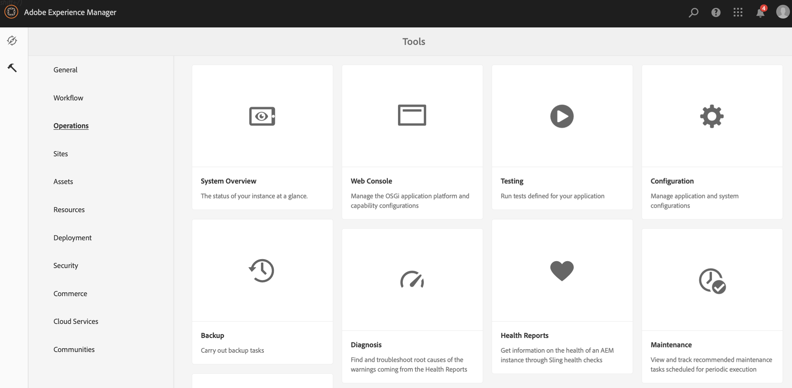

# 从ContentSync转换为SmartSync {#transitioning-from-contentsync-to-smartsync}

本节概述SmartSync功能，以及它如何最大限度地减少服务器负载/存储和网络流量以降低成本。

## 概述 {#overview}

SmartSync是AEM Screens使用的最新机制。 它取代了当前用于缓存离线渠道并将其交付给播放器的方法。

它同时在服务器端和客户端执行。

**在服务器端**：

* 渠道的内容（包括资产）缓存在中 */var/contentsync*.
* 缓存通过描述用于显示的可用内容的清单向播放器公开。

**在客户端**：

* 播放器会根据上面生成的清单更新其内容。

### 使用SmartSync的好处 {#benefits-of-using-smartsync}

SmartSync功能为您的AEM Screens项目提供了许多好处。 它允许

* 显着降低网络流量和服务器端存储需求
* 仅当资产缺失或更改时，播放器才会智能地下载资产
* 服务器端和客户端存储优化

>[!NOTE]
>
>Adobe强烈建议对AEM Screens项目使用SmartSync。

## 从ContentSync迁移到SmartSync {#migrating-from-contentsync-to-smartsync}

>[!NOTE]
>
>如果您已安装AEM 6.3 Feature Pack 5和AEM 6.4 Feature Pack 3，则可以启用SmartSync for Assets以提高磁盘空间利用率。 要启用SmartSync，请按照以下部分从ContentSync过渡到SmartSync，从而启用SmartSync。
>
>SmartSync适用于具有受支持的服务器AEM 6.4.3 FP3的Screens Player。
>
>请参阅 [AEM Screens播放器下载](https://download.macromedia.com/screens/) 以下载最新的播放器。 下表描述了每个平台所需的最低播放器版本：

| **平台** | **支持的播放器最低版本** |
|---|---|
| Android | 3.3.72 |
| Chrome操作系统 | 1.0.136 |
| Windows | 1.0.136 |

按照以下步骤从ContentSync过渡到SmartSync：

1. 从ContentSync迁移到SmartSync要求在激活SmartSync之前清除ContentSync缓存。

   使用链接从实例导航到ContentSync控制台 ***https://localhost:4502/libs/cq/contentsync/content/console.html*** 并单击 **清除缓存**，如下图所示：

   

   >[!CAUTION]
   >
   >在首次使用SmartSync之前，必须清除所有内容缓存。

1. 导航到 **Adobe Experience Manager Web控制台配置** 通过AEM实例>锤子图标> **操作** > **Web控制台**.

   

1. **Adobe Experience Manager Web控制台配置** 打开。 搜索 *offlinecontentservice*.

   用于搜索 **Screens离线内容服务** 属性，按 **Command+F** 对象 **Mac** 和 **Control+F** 对象 **Windows**.

   

1. 单击 **保存** 以启用 **Screens离线内容服务** 属性，因此使用SmartSync for AEM Screens。
1. 启用SmartSync后，必须导航到您的项目并单击 **更新离线内容** *（从操作栏中），* 如下图所示。

   
