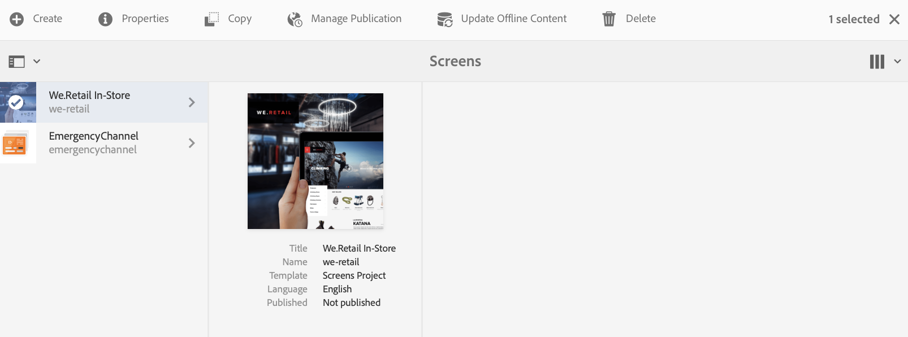

# 从ContentSync过渡到SmartSync {#transitioning-from-contentsync-to-smartsync}

本节概述了SmartSync功能，以及它如何最大限度地减少服务器负载／存储和网络流量以降低成本。

## 概述 {#overview}

SmartSync是AEM Screens使用的最新机制。 它替代了当前用于缓存脱机渠道并将它们交付到播放器的方法。

它同时在服务器端和客户端执行。

**在服务器端**:

* 渠道的内容（包括资产）将缓存在 */var/contentsync中*。
* 高速缓存通过清单向播放器公开，清单描述了用于显示的可用内容。

**客户端**:

* Player根据上述生成的清单更新其内容。

### 使用SmartSync的优势 {#benefits-of-using-smartsync}

SmartSync功能为您的AEM Screens项目提供了许多优势。 它允许

* 大幅减少网络流量和服务器端存储需求
* 仅当资产丢失或发生更改时，播放器才会智能下载资产
* 服务器端和客户端存储优化

>[!NOTE]
>
>Adobe强烈建议对AEM Screens项目使用SmartSync。

## 从ContentSync迁移到SmartSync {#migrating-from-contentsync-to-smartsync}

>[!NOTE]
>
>如果您已安装AEM 6.3功能包5和AEM 6.4功能包3，则可以为资产启用SmartSync以提高磁盘空间使用率。 要启用SmartSync，请按照以下部分从ContentSync过渡到SmartSync，从而启用SmartSync。
>
>SmartSync可用于Screens Player（带有受支持的服务器AEM 6.4.3 FP3）。
>
>请参阅 [AEM Screens播放器下载](https://download.macromedia.com/screens/) ，下载最新播放器。 下表描述了每个平台所需的最低播放器版本：

| **平台** | **支持的播放器的最低版本** |
|---|---|
| Android | 3.3.72 |
| Chrome OS | 1.0.136 |
| Windows | 1.0.136 |

请按照以下步骤从ContentSync过渡到SmartSync:

1. 从ContentSync迁移到SmartSync需要在激活SmartSync之前清除ContentSync缓存。

   使用链接https://localhost:4502/libs/cq/contentsync/content/console.html从实例导航到ContentSync控制台 ****** ，然后单击“ **清除缓存**”，如下图所示：

   

   >[!CAUTION]
   >
   >首次使用SmartSync之前，必须清除所有内容缓存。

1. 通过 **AEM实例—&gt;锤子图标—&gt;操作** —&gt; web控制台，导航到 **Adobe Experience Manager Web Console配置******。

   

1. **Adobe Experience Manager web控制台配置**打开。 搜索脱 *机服务*。

   要搜索 **Screens Offline Content Service** （脱机内容服务）属性，请按 **Command+F** (对于 **Mac** )和 ******** Control+F（对于Windows Control+F）。

   

1. 单击 **保存** ，以启用 **Screens Offline Content Services属性** ，因此对AEM Screens使用SmartSync。
1. 启用SmartSync后，您必须导航到项目并单击“ **Update Offline Content** ( *从操作栏)”* ，如下图所示。

   