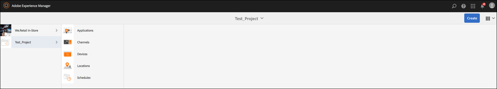

# 视频播放配置和疑难解答 {#video-playback-configuration-and-troubleshooting}

将视频上传到DAM并添加渠道时，您可能会遇到视频在Screens播放器中可能无法播放的问题。

以下各节介绍如何调试和排除在渠道中播放视频的故障。

## DAM演绎版 {#dam-renditions}

将视频上传到渠道后，AEM应开始为其创建一些再现。 您可以在“资产”下视图您的视频。

视图视频：

1. 例如，导航到您的视频 `http://localhost:4502/assets.html/content/dam/we-retail/en/videos`。
1. 单击视频并展开左上角的菜单，然后单击“演 **绎版**”。

应有不同的再现（MP4或M4V）。

如果没有再现，请确保在运行AEM的OS上安装了ffmpeg。

>[!CAUTION]
>
>如果没有再现，请确保在运行AEM的OS上安装了ffmpeg。
>
>单击 [此处](https://www.ffmpeg.org/download.html) ，安装ffmpeg。

## 视频资产 {#video-assets}

如果您在视频下看不到源属性，可能是视频未转码。 如果视频转码正确，它将显示在仪表板中，如下图所示。

检查ffmpeg已安装并且视频用户档案。

### 检查视频用户档案 {#checking-video-profile}

1. 导航到视 **频用户档案**，即，然后 `http://localhost:4502/etc/dam/video.html` 单击“上 **传测试视频”**。

   

1. 上传测试视频并单 **击** “确定”开始转码。

   如果转码失败，请展开ffmpeg输出以了解ffmpeg的控制台输出中的任何错误。

   

   此外，如果视频转码成功，则可下载转码文件。

   

   >[!NOTE]
   >
   >在将视频添加到任何渠道之前，请确保为视频提供足够的时间进行转码（它应显示新标记而不是处理标记）。

### 使用视频组件检查用户档案 {#checking-profile-with-a-video-component}

如果视频组件配置不正确，请检查页面设计中的列表。

1. 导航到渠道并选择 **设计** 模式。

   

1. 选择视频并打开“编 **辑** ”对话框。 Open the **Profiles** tab.

   >[!NOTE]
   >选择不同的用户档案(至少应该有“高品质H.264”用户档案)。

### 检查Web播放器中的视频 {#checking-the-video-in-the-web-player}

使用Web **播放器** ，验证 `http://localhost:4502/content/mobileapps/cq-screens-player/firmware.html/content/screens/we-retail/locations/demo/flagship/single/device0` 在浏览器（Chrome和Safari）中的播放。 Chrome用于Android设备，而Safari是OSX和iOS浏览器。

如果视频未在Safari上运行，则它将不在OSX和iOS播放器中运行。 这可能是编码问题，必须重新编码视频。

按照以下步骤使用DAM工作流创建FullHD演绎版：

1. 导航到工 *作流模型*(即管理 `http://localhost:4502/libs/cq/workflow/admin/console/content/models.html/etc/workflow/models`)。
1. 选择屏 **幕更新资产模型** 。
1. 单 **击操作栏** 中的“开始工作流 **”以打开“运** 行工作流”对话框。

1. 在有效负荷中选择您的视 **频资产**。
1. 单击“ **运行**”。

>[!NOTE]
>
>允许一些时间创建再现，但几秒／分钟（取决于视频大小）后，请在Safari上重新加载Web播放器。

#### 自动播放策略标志疑难解答 {#troubleshooting-autoplay-policy-flag}

如果AEM Screens播放器拾取视频但不显示，您需要对自动播放策略标志进行疑难解答。

请按照以下步骤对google的自动播放策略标志问题进行疑难解答：

1. 导航到 ***chrome://flags/#autoplay-policy***
1. 将“ **自动播放** ”策 **略从** “默认 **”更改为不需要用户手势**

1. 重新启动Web浏览器并更新播放器

>[!NOTE]
>
>要进一步了解使用Chrome中新的自动播放策略获得良好用户体验的最佳实践，请参阅 *自动播放策略更改*(即 `https://developers.google.com/web/updates/2017/09/autoplay-policy-changes#webaudio`)。

### 在多个播放器间同步视频 {#syncing-video-across-multiple-players}

要跨多个设备同步播放视频，您应对视频所属的序列使用绝对策略。

#### 要求 {#requirements}

* 相同的2+播放器
* 理想的相似硬件
* 相同的网络拓扑（播放器连接到NTP服务器，该服务器将调整其内部系统时钟）

#### 设置绝对策略 {#setting-up-the-absolute-strategy}

绝对战略：

* 计算锚点时间（当天的午夜）
* 计算序列的持续时间（其所有项的持续时间总和）
* 在任何时间点，它通过解序列_remaining_time =(current_time - anchor_time)% sequence_duration计算当前应播放的项目和下一个项目。

请按照以下步骤设置绝对战略：

1. 导航到您的渠道作者并选择序列组件，如下图所示。
1. 打开其配置对话框。
1. 编辑策 **略** 并添加绝对。

   

   >[!NOTE]
   >玩家的操作系统必须具有相同的时钟。

**在OS X上对齐时钟** 按照以下步骤在OSX上对齐时钟：

1. 在每 **个OSX框上打开** “日期和时间”首选项
1. 自动 **选中设置日期和时间**
1. 将值0.pool.ntp.org、1.pool.ntp.org、2.pool.ntp.org、3.pool.ntp.org、time.apple.com粘贴到下拉菜单中，或仅运 *行sudo ntpdate -u -v 0.pool.ntp.org*
1. 开始2+播放器

玩家开始新的对齐序列可能需要一些时间。

