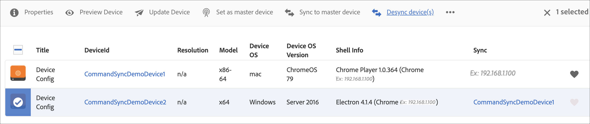

# 命令同步 {#command-sync}

以下页面介绍了如何使用“命令同步”。 命令同步允许跨不同播放器同步播放。 播放器可以播放不同的内容，但每个资源必须具有相同的持续时间。

>[!IMPORTANT]
>
>此功能不支持嵌入式序列、动态嵌入式序列、应用程序通道或过渡。

## 概述 {#overview}

数字标牌解决方案必须支持视频墙和同步播放，才能支持新年倒计时，或分割为多个屏幕播放的大型视频等场景，这正是发挥命令同步功能的地方。

要使用Command Sync，一个播放器将充当 *主要* 发送命令，其他所有播放器 *客户端* 当他们收到命令时播放。

此 *主要* 将要开始播放项目时，向所有注册的客户端发送命令。 其有效负载可以是要播放的项目的索引和/或要播放的元素的外部HTML。

## 实施命令同步 {#using-command-sync}

以下部分介绍如何在AEM Screens项目中使用Command Sync。

>[!NOTE]
>
>对于同步播放，要求所有硬件设备具有相同的硬件规格并且最好具有相同的操作系统。 不建议在不同硬件和操作系统之间同步。

### 设置项目 {#setting-up}

在使用命令同步功能之前，请确保您有一个项目和一个渠道，其中包含为您的项目设置的内容。

1. 以下示例展示了名为的演示项目 **CommandSyncDemo** 和序列渠道 **ChannelLobby**.

   

   >[!NOTE]
   >
   >要了解如何创建渠道或向渠道添加内容，请参阅 [创建和管理渠道](/help/user-guide/managing-channels.md)

   该渠道包含以下内容，如下图所示。

   

1. 创建位置 **大厅** 然后显示标题为 **LobbyDisplay** 在 **位置** 文件夹，如下图所示。
   

1. 分配渠道， **ChannelLobby** 敬您的 **LobbyDisplay**. 您现在可以从显示功能板中查看分配给显示的渠道。
   

   >[!NOTE]
   >
   >要了解如何将渠道分配给显示，请参阅 [创建和管理显示区](/help/user-guide/managing-displays.md).

1. 导航到 **设备** 文件夹。
1. 单击 **设备管理器** 从操作栏中。

   

   >[!NOTE]
   >
   >要了解如何注册设备，请参阅 [设备注册](/help/user-guide/device-registration.md)

1. 为演示起见，此示例将Chrome设备和Windows Player显示为两个单独的设备。 两台设备指向同一个显示器。
   

### 更新渠道设置

1. 导航到 **ChannelLobby**.
1. 单击 **编辑** 从操作栏中。
1. 选择整个通道，如下图所示。
   

1. 单击扳手图标。
   

1. 在 **页面** 对话框中，输入 *已同步* 中的关键词 **策略** 字段。
   

### 设置主要播放器 {#setting-up-primary}

1. 从导航到显示功能板 **CommandSyncDemo** > **位置**  > **大厅** > **LobbyDisplay** 并单击 **仪表板** 从操作栏中。
请注意中的两个设备（chrome和windows player） **设备** 面板中，如以下所示：
   

1. 从 **设备** 面板中，选择要设置为主设备的设备。 以下示例演示了如何将Chrome设备设置为主要设备。 单击 **设置为主设备**.

   

1. 在中输入IP地址 **设置为主设备** 并单击 **保存**.

   

>[!NOTE]
>
>您可以将多个设备设置为主设备。

### 正在与主要播放器同步 {#sync-up-primary}

1. 将Chrome设备设置为主设备后，您可以同步其他设备（在本例中为Windows Player）以便与主设备同步。
从中选择其他设备（在本例中为windows player） **设备** 面板并单击 **同步到主设备**，如下图所示。

   

1. 从列表中选择设备并单击 **保存**.

   >[注意：]
   > 此 **同步到主设备** 对话框显示主设备的列表。 选择首选的。

1. 当设备(Windows Player)同步到主设备(Chrome Player)时，您会看到设备已在中同步 **设备** 面板。

   

### 正在与主要播放器取消同步 {#desync-up-primary}

将一个或多个设备同步到主设备后，即可从该设备取消同步分配。

>[!NOTE]
>
>如果取消同步主设备，它还将取消与该主设备关联的所有客户端设备的链接。

要从主设备删除同步，请执行以下步骤：

1. 导航至 **设备** 面板并选择设备。

1. 单击 **取消同步设备** 以便从主设备取消同步客户端。

   

1. 单击 **确认** 以从主设备取消同步选定的设备。

   >[注意：]
   > 如果选择主设备并使用de-sync选项，则所有连接到主设备的设备都将一步骤取消同步。
