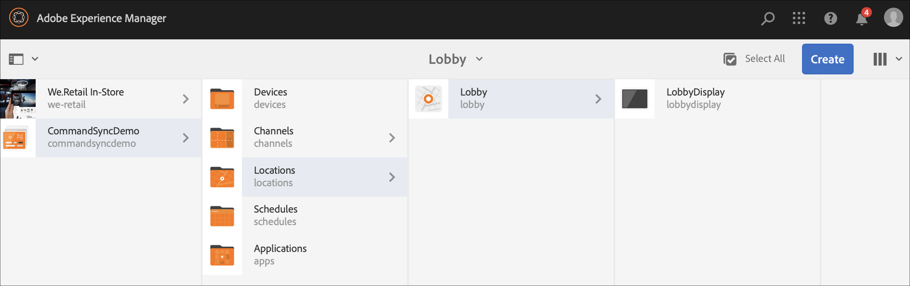

# 命令同步 {#command-sync}

下页介绍如何使用命令同步。 命令同步允许在不同播放器之间同步播放。 玩家可以播放不同的内容，但每个资产需要具有相同的持续时间。

>[!IMPORTANT]
>此功能不支持嵌入式序列、动态嵌入式序列、应用程序渠道或过渡。

## 概述 {#overview}

数字标牌解决方案需要支持视频墙和同步播放，以支持诸如新年倒计时或大视频等场景在多个屏幕上播放，这就是开始使用命令同步的地方。

要使用命令同步，一个播放器充当主 *播* ，发送命令，所有其他播放器都充当 *客户端* ，并在收到命令时播放。

当主 *设备* (Master)要开始项的回放时，会向所有注册的客户端发送命令。 此项的有效负荷可以是要播放的项的索引和／或要播放的元素的外部html。

## 实现命令同步 {#using-command-sync}

以下部分介绍如何在AEM Screens项目中使用命令同步。

>[!NOTE]
>对于同步播放，要求所有硬件设备具有相同的硬件规范，最好具有相同的操作系统。 不建议在不同硬件和操作系统之间同步。

### 设置项目 {#setting-up}

在使用命令同步功能之前，请确保您有一个项目和一个渠道，其中为项目设置了内容。

1. 以下示例展示了一个名为CommandSyncDemo的 **演示项目** ，以及一个序列 **渠道ChannelLobby**。

   

   >[!NOTE]
   >
   >要了解如何创建渠道或向渠道添加内容，请参阅创 [建和管理渠道](/help/user-guide/managing-channels.md)

   渠道包含以下内容，如下图所示。

   

1. 在“位置”文 **件夹** 中创建显示屏，如下图所示。
   

1. 将渠道 **ChannelLobby** 指定 **到LobbyDisplay**。
   

   >[!NOTE]
   >
   >要了解如何将渠道分配给显示屏，请参阅创 [建和管理显示屏](/help/user-guide/managing-displays.md)。

1. 导航到 **设备** 文件夹，并单 **击操作栏** 中的“设备管理器”以注册设备。

   

   >[!NOTE]
   >
   >要了解如何将渠道分配给显示屏，请参阅创 [建和管理显示屏](/help/user-guide/managing-displays.md)

1. 为便于演示，此示例将铬黄设备和windows播放器作为两个单独的设备进行展示。 这两个设备指向同一个显示屏。
   

### 更新渠道设置

1. 导航到 **ChannelLobby** ，然 **后单击操** 作栏中的“编辑”以更新渠道设置。

1. 选择整个渠道，如下图所示。
   

1. 单击扳手图标以打开 **页面** 对话框。
   

1. 在“策 *略* ”字段中输入 **已同步的** 关键字。

   

### 设置主视图 {#setting-up-master}

1. 导航到CommandSyncDemo中的显 **示仪表板** —>位 **置** —> Lobby **** — Lobby Display从操 ******** 作栏中单击仪表板并单击。
您将在“设备”面板中看到两个设备( **chrome** 和windows播放器)，如下图所示。
   

1. 从“设 **备** ”面板中，选择要设置为主设备的设备。 以下示例演示如何将Chrome设备设置为主设备。 单击“ **设为主设备”**。

   

1. 在设置为主设备 **中输入IP地址** ，然后单 **击保存**。

   

>[!NOTE]
> 您可以将多个设备设置为主设备。

### 与主同步 {#sync-up-master}

1. 将Chrome设备设置为主设备后，可以同步其他设备（本例中为windows播放器）以与主设备同步。
从“设备”面板中选择其他设备(本例中为windows播 **放器** )，然后单 **击“同步到主设备**”，如下图所示。

   

1. 从列表中选择设备，然后单击“ **保存**”。

   >[注意:]
   > “同 **步到主设备** ”对话框将显示主设备的列表。 您可以选择所需的首选项之一。

1. 设备（Windows播放器）同步到主设备（Chrome播放器）后，您将在“设备”面板中看到同 **步的设** 备。

   

### 与主同步 {#desync-up-master}

将设备或设备同步到主设备后，即可取消该设备中的分配同步。

>[!NOTE]
>如果取消同步主设备，它还会取消与该主设备关联的所有客户端设备的链接。

要从主设备中删除同步，请执行以下步骤：

1. 导航到“ **设备** ”面板并选择设备。

1. 单击 **取消同步设备** ，以从主设备取消客户端同步。

   

1. 单击 **确认** ，以从主设备中取消选定设备的同步。

   >[注意:]
   > 如果您选择主设备并使用取消同步选项，则所有连接到主设备的设备将通过一个步骤取消同步。
