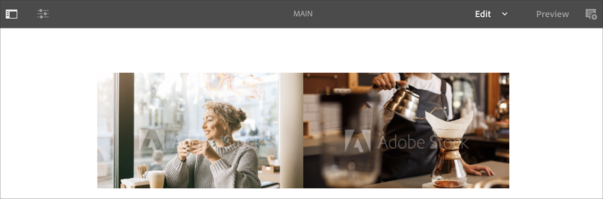
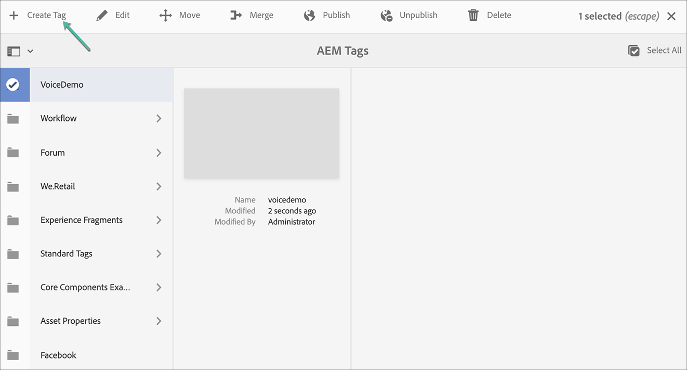
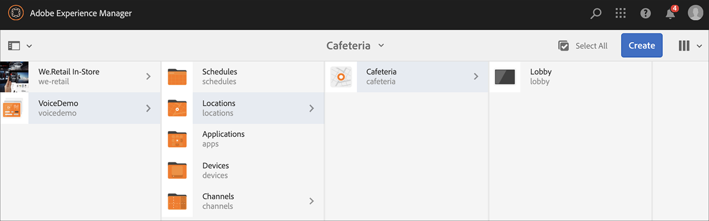
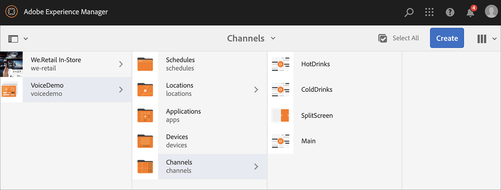
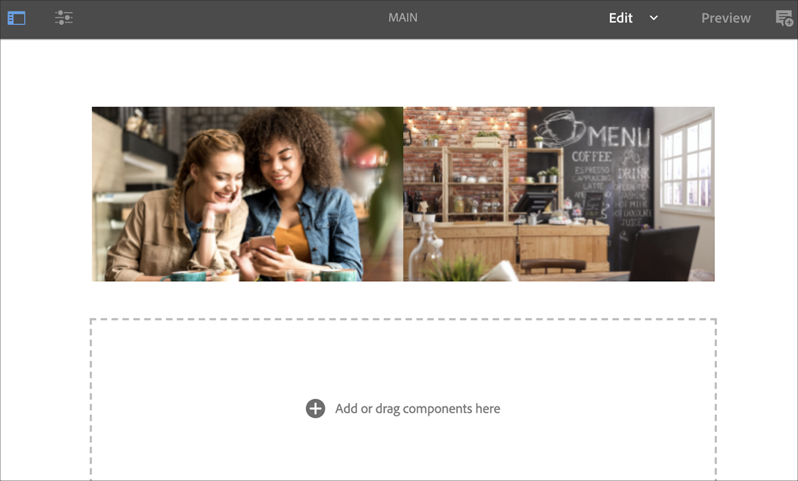

# AEM Screens语音识别 {#voice-recognition}

>[!IMPORTANT]
>
>**重要隐私信息**
>
>使用语音识别功能时，请遵循您所在地区的所有适用法律和道德准则（包括但不限于向最终用户显示播放器正在使用语音识别）。 Adobe Inc，不接收、存储或处理任何语音相关信息。 AEM Screens玩家使用内置在浏览引擎中的标准Web语音API。 在后台，您的语音波形会发送到谷歌的服务器，以便从语音转换为文本，播放器会根据配置的关键字对此文本进行匹配。
>
>有关更 [多详细信息，请参阅Web语音API上的Google隐私](https://www.google.com/chrome/privacy/whitepaper.html#speech) 白皮书。

语音识别功能允许在由语音交互驱动的AEM Screens渠道中更改内容。

内容作者可以将显示器配置为启用语音。 此功能旨在允许客户利用语音作为与其显示器交互的方法。 一些类似用例包括在商店中查找产品推荐、在用餐者和餐馆订购菜单。 此功能增强了用户的可访问性，并可以极大增强客户体验。

>[!NOTE]
>播放器硬件必须支持语音输入，如麦克风。

## 实现语音识别 {#implementing}

>[!IMPORTANT]
> 语音识别功能仅在Chrome OS和电子播放器上可用。

要在您的AEM Screens项目中实现语音识别，您必须为显示屏启用语音识别，并将每个渠道与一个唯一标签相关联以触发渠道过渡。

下节介绍如何在AEM Screens项目中启用和使用语音识别功能。

您可以使用以下两个模板设置您的项目：

* [序列渠道](#sequence-channel)
* [分屏渠道](#split-channel)

## 使用序列渠道作为模板 {#sequence-channel}

在使用语音识别功能之前，请确保您有一个项目和一个渠道，其中内容已为您的项目设置。

1. 以下示例展示了一个名为VoiceDemo的 **演示项目** ，以及三个序列 **渠道** Main **、** ColdDrinks和 **** HotDrinks饮料，如下图所示。

   

   >[!NOTE]
   >
   >要了解如何创建渠道或向渠道添加内容，请参阅创 [建和管理渠道](/help/user-guide/managing-channels.md)

1. 导航到每个渠道并添加内容。 例如，导航到 **VoiceDemo** —> **渠道****—>** Main，然后选择渠道。 单击 **操作栏** 中的“编辑”以打开编辑器并根据您的要求添加内容（图像／视频）。 同样，为ColdDrinks和 **HotDrinks** 渠道 **添加内容** 。

   渠道现在包含资产（图像），如下图所示。

   **主要**:

   

   **ColdDrinks**:

   

   **热饮**:

   

### 为渠道设置标记 {#setting-tags}

向渠道添加内容后，您需要导航到每个渠道并添加相应的标记，以触发语音识别。

请按照以下步骤向渠道添加标记：

1. 导航到每个渠道并添加内容。 例如，导航到 **VoiceDemo** —> **渠道****—>** Main，然后选择渠道。

1. Click **Properties** from the action bar.

   

1. 导航到 **基础** (Basics)选项卡，从“标记”(Tags)字段中选 **择已有** 的标记，或创建新标记。

   您可以为标记键入新名称并按键创建新标记， `return` 如下图所示：

   

   或者，

   您可以预先从AEM实例为项目创建标记，也可以选择这些标记。 按照创建标记中 [所述的步骤](#creating-tags)，您可以从位置选择标记并将其添加到渠道，如下图所示：

   

1. 同样，在热饮渠道 **中添** 加标 **记** “热饮”。

1. 完成 **后，单击** “保存并关闭”。

### 创建标记 {#creating-tags}

请按照以下步骤创建标记：

1. 导航到AEM实例。

1. 单击工具—> **标记**。
   

1. 单击 **创建** —>创 **建命名空间**。
   

1. 输入项目的名称，例如VoiceDemo，然 **后单击** “创 **建”**。

1. 选择VoiceDemo **项目** ，然后单 **击操作栏** 中的“创建标记”。
   

1. 输入标记的名称，然后单击“ **提交**”。
   

现在，您可以在AEM Screens项目中使用这些标签。

### 将渠道分配给显示屏并启用语音识别 {#channel-assignment}

1. 在“位置”文 **件夹** 中创建显示屏，如下图所示。

   

   >[!NOTE]
   >要了解如何将渠道分配给显示屏，请参阅创 [建和管理显示屏](/help/user-guide/managing-displays.md)。

1. 将渠道 **Main**、 **ColdDrinks**&#x200B;和HotDrinks分 **配给您的** LobbyDisplay **** Adobly。

1. 在分配渠道时，为每个渠道设置以下属性。

   | **渠道名称** | **优先级** | **支持的事件** |
   |---|---|---|
   | 主要 | 2 | 初始加载、空闲屏幕、计时器 |
   | 热饮 | 1 | 用户交互 |
   | ColdDrinks | 1 | 用户交互 |

   >[!NOTE]
   >
   >要了解如何将渠道分配给显示屏，请参阅创 [建和管理显示屏](/help/user-guide/managing-displays.md)。

1. 将渠道分配给显示屏后，导航到 **LobbyDisplay** ，然后选择显示屏。 从操 **作栏** 中选择属性。

1. 导航到“显 **示** ”选项卡，并在“内 **容”下启用** “启用 **语音”选项**。

   

   >[!IMPORTANT]
   >必须从显示器启用语音识别功能。

### 在Chrome播放器中查看内容 {#viewing-content}

完成上述步骤后，您可以注册Chrome设备以视图输出。

>[!NOTE]
>请参阅 [设备注册](device-registration.md) ，了解如何在AEM Screens播放器上注册设备。

此示例在Chrome播放器上显示输出。

主 **渠道** 正在播放其内容，但是当您使用关键字 **hot** (如 *我想喝热饮)时，渠道开始将播放HotDrinks渠道***** 的内容。

同样，如果您使用关键字 **cold** , *如我想要有点冷*,渠道开始播放ColdDrinks **** 渠道的内容。

## 使用分屏渠道作为模板 {#split-channel}

在使用语音识别功能之前，请确保您有一个项目和一个渠道，其中内容已为您的项目设置。

1. 以下示例展示名为VoiceDemo的演示项目 **和三个序列** 渠道 **Main**、ColdDrinks和 ************ HotDrinks、1x Split Screen渠道（如下图所示）。

   

   >[!NOTE]
   >
   >要了解如何创建渠道或向渠道添加内容，请参阅创 [建和管理渠道](/help/user-guide/managing-channels.md)

1. 导航到每个渠道并添加内容。 例如，导航到 **VoiceDemo** —> **渠道****—>** Main，然后选择渠道。 单击 **操作栏** 中的“编辑”以打开编辑器并根据您的要求添加内容（图像／视频）。 同样，为ColdDrinks和 **HotDrinks** 渠道 **添加内容** 。

   渠道现在包含资产（图像），如下图所示。

   **主要**:

   

   **ColdDrinks**:
   

   **热饮**:

   

1. 导航到 **SplitScreen** ，拖放两个嵌入式序列，并添加指向ColdDrinks和HotDrinks **渠道的路****** 径，如下图所示。
   

### 为渠道设置标记 {#setting-tags-split}

向渠道添加内容后，您需要导航到每个渠道并添加相应的标记，以触发语音识别。

请按照以下步骤向渠道添加标记：

1. 导航到每个渠道并添加内容。 例如，导航到 **VoiceDemo** —> **渠道****—>** Main，然后选择渠道。

1. Click **Properties** from the action bar.

   

1. 导航到 **基础** (Basics)选项卡，从“标记”(Tags)字段中选 **择已有** 的标记，或创建新标记。

   您可以为标记键入新名称并按键创建新标记， `return` 如下图所示：

   

   或者，

   您可以预先从AEM实例为项目创建标记，也可以选择这些标记。 按照创建标记中 [所述的步骤](#creating-tags)，您可以从位置选择标记并将其添加到渠道，如下图所示：

   

1. 同样，在热饮渠道 **中添** 加标 **记** “热饮”。

1. 将标记(**hot** 和 **cold**)添加 **到SplitScreen** 渠道属性。

   

1. 完成 **后，单击** “保存并关闭”。

### 将渠道分配给显示屏并启用语音识别 {#channel-assignment-split}

1. 在“位置”文 **件夹** 中创建显示屏，如下图所示。

   

   >[!NOTE]
   >要了解如何将渠道分配给显示屏，请参阅创 [建和管理显示屏](/help/user-guide/managing-displays.md)。

1. 将渠道主 ****、ColdDrinks **、HotDrinks和** SplitScreen **分配给********** 您的大堂显示屏。

1. 在分配渠道时，为每个渠道设置以下属性。

   | **渠道名称** | **优先级** | **支持的事件** |
   |---|---|---|
   | 主要 | 2 | 初始加载、空闲屏幕、计时器 |
   | 热饮 | 1 | 用户交互 |
   | ColdDrinks | 1 | 用户交互 |
   | SplitScreen | 1 | 用户交互 |

   >[!NOTE]
   >
   >要了解如何将渠道分配给显示屏，请参阅创 [建和管理显示屏](/help/user-guide/managing-displays.md)。

1. 将渠道分配给显示屏后，导航到“休息 **室** ”显示屏并选择显示屏。 从操 **作栏** 中选择属性。

1. 导航到“显 **示** ”选项卡，并在“内 **容”下启用** “启用 **语音”选项**。

   

   >[!IMPORTANT]
   >必须从显示器启用语音识别功能。

### 在Chrome播放器中查看内容 {#viewing-content-split}

完成上述步骤后，您可以注册Chrome设备以视图输出。

>[!NOTE]
>请参阅 [设备注册](device-registration.md) ，了解如何在AEM Screens播放器上注册设备。

此示例在Chrome播放器上显示输出。

主渠道 **正在播放其内容** ，但是当您将单词与关键字 **hot** 和 **cold一起使用时，如******** I welt to severses的菜单是播放渠道SplitScreen开始的内容的热和冷饮料渠道。

