# AEM Screens中的语音识别 {#voice-recognition}

>[!IMPORTANT]
>此内容对AEM on-premise/AMS（AEM 6.5LTS和AEM 6.5）有效。 有关AEM as a Cloud Service Screens的内容，请参阅[AEM as a Cloud Service指南](https://experienceleague.adobe.com/zh-hans/docs/experience-manager-cloud-service/content/screens-as-cloud-service/overview/introduction)。

>[!IMPORTANT]
>
>**重要的隐私信息**
>
>使用语音识别功能时，请遵循您所在地区的所有适用法律和道德准则。 这些准则包括但不限于向最终用户提供播放器正在使用语音识别的可见通知)。 Adobe不接收、存储或处理任何与语音相关的信息。 AEM Screens播放器使用浏览引擎内置的标准Web语音API。 在幕后，此API会将您语音的波形发送到Google的服务器，以进行语音到文本的转换。 播放器根据配置的关键字匹配文本。
>
>有关更多详细信息，请参阅[关于Web Speech API的Google隐私白皮书](https://www.google.com/chrome/privacy/whitepaper.html#speech)。

语音识别功能允许由语音交互驱动的AEM Screens频道中的内容改变。

内容作者可以将显示配置为启用语音。 此功能的目的是让客户使用语音作为与显示进行交互的方法。 一些类似的用例包括在商店中查找产品推荐、在用餐者和餐厅订购菜单项。 此功能提高了用户的辅助功能，可以显着增强客户体验。

>[!NOTE]
>播放器硬件必须支持语音输入，如麦克风。

## 实施语音识别 {#implementing}

>[!IMPORTANT]
> 语音识别功能仅在Chrome OS和Windows播放器上可用。

要在AEM Screens项目中实施语音识别，请启用显示器的语音识别，并将每个渠道与唯一标记关联以触发渠道过渡。

以下部分介绍如何在AEM Screens项目中启用和使用语音识别功能。

## 以全屏或分屏渠道开关查看内容 {#sequence-channel}

在使用语音识别功能之前，请确保您有一个项目和一个渠道，其中包含为项目设置的内容。

1. 以下示例展示了一个名为&#x200B;**VoiceDemo**&#x200B;的演示项目以及三个顺序通道&#x200B;**Main**、**ColdDroups**&#x200B;和&#x200B;**HotDroups**，如下图所示。

   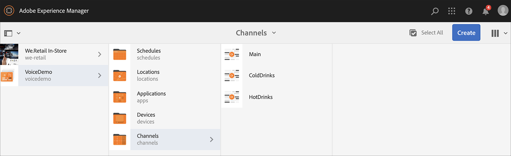

   >[!NOTE]
   >
   >要了解如何创建渠道或向渠道添加内容，请参阅[创建和管理渠道](/help/user-guide/managing-channels.md)

   或者，

   您可以创建三个序列频道&#x200B;**Main**、**ColdInverts**&#x200B;和&#x200B;**HotInverts**，以及一个1x2拆分Screens频道&#x200B;**SplitScreen**，如下图所示。

   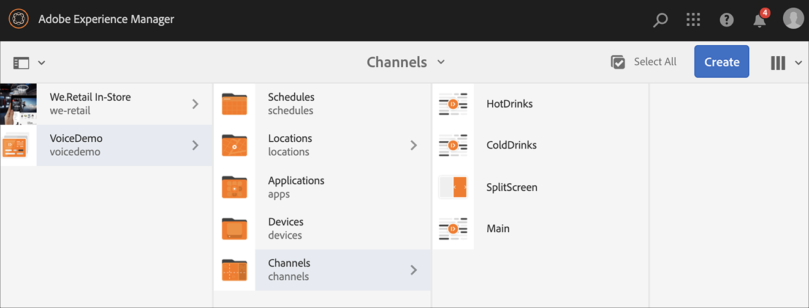

1. 导航到每个渠道并添加内容。 例如，导航到&#x200B;**VoiceDemo** > **频道** > **Main**，然后单击该频道。 单击操作栏中的&#x200B;**编辑**，然后根据需要添加内容（图像/视频）。 同样，将内容同时添加到&#x200B;**ColdDrinks**&#x200B;和&#x200B;**HotDrinks**&#x200B;频道。

   渠道现在包含资产（图像），如下图所示。

   **主要**：

   

   **冷饮**：

   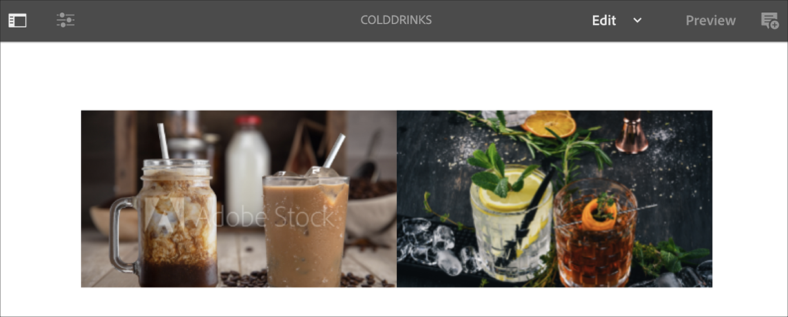

   **热饮**：

   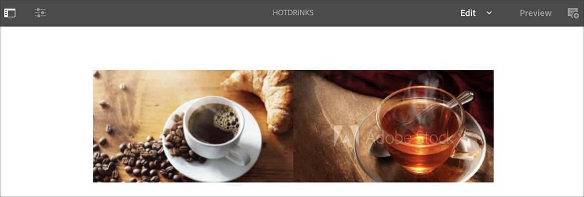

   如果您在项目中添加了拆分Screens渠道，请导航到&#x200B;**拆分屏幕**&#x200B;并拖放两个嵌入的序列。将路径添加到&#x200B;**ColdDroups**&#x200B;和&#x200B;**HotDroups**&#x200B;频道，如下图所示。
   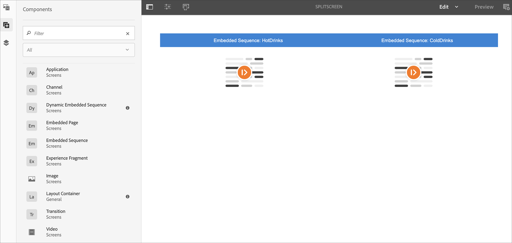

### 为渠道设置标记 {#setting-tags}

将内容添加到渠道后，导航到每个渠道并添加可触发语音识别的相应标记。

请按照以下步骤将标记添加到您的渠道：

1. 导航到每个渠道并添加内容。 例如，导航到&#x200B;**VoiceDemo** > **频道** > **Main**，然后单击该频道。

1. 单击操作栏中的&#x200B;**属性**。

   

1. 导航到&#x200B;**基础知识**&#x200B;选项卡，然后单击&#x200B;**标记**&#x200B;字段中的现有标记或创建一个标记。

   您可以通过键入标记的新名称来创建标记，然后点击`return`键，如下图所示：

   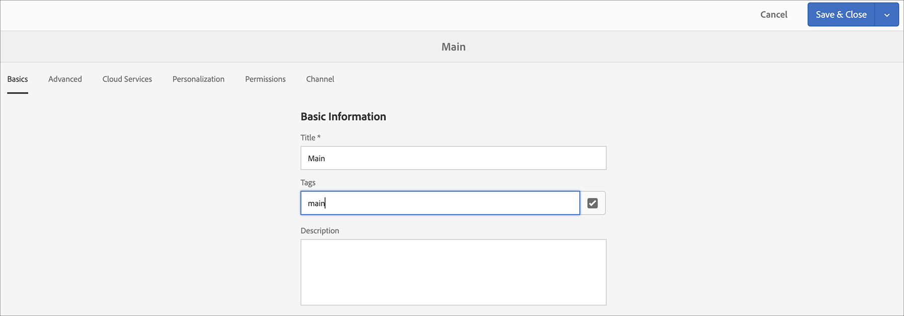

   或者，

   您还可以预先为项目从AEM实例中创建标记，并选择它们。 执行[创建标记](#creating-tags)中说明的步骤后，您可以从位置单击该标记并将其添加到您的渠道中，如下图所示：

   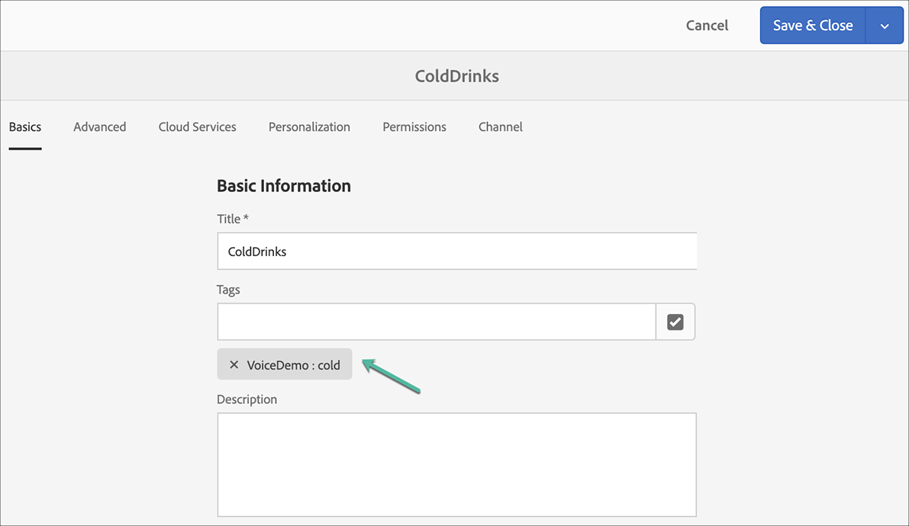

1. 同样，将标题为&#x200B;**hot**&#x200B;的标记添加到&#x200B;**HotDroups**&#x200B;频道。

1. 如果您使用拆分Screens渠道，请将标记（**hot**&#x200B;和&#x200B;**cold**）添加到&#x200B;**SplitScreen**&#x200B;渠道属性，如下图所示。

   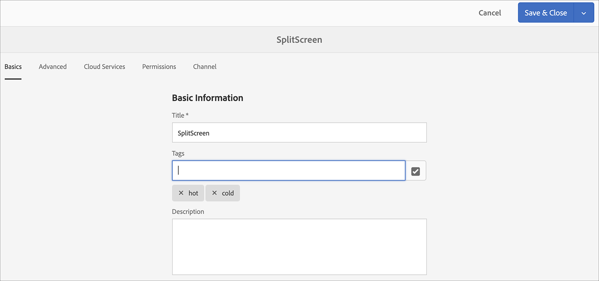

1. 完成后，单击&#x200B;**保存并关闭**。

### 创建标记 {#creating-tags}

请按照以下步骤创建标记：

1. 导航到您的AEM实例。

1. 单击工具图标> **标记**。
   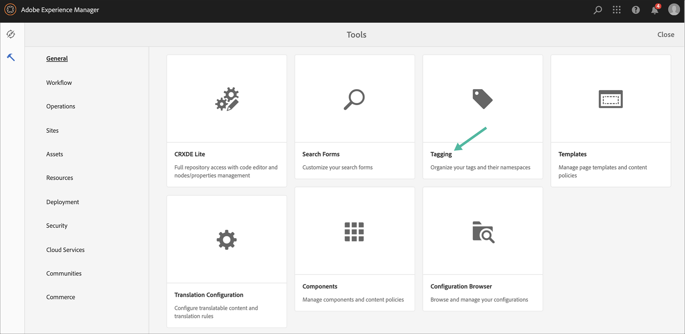

1. 单击&#x200B;**创建** > **创建命名空间**。
   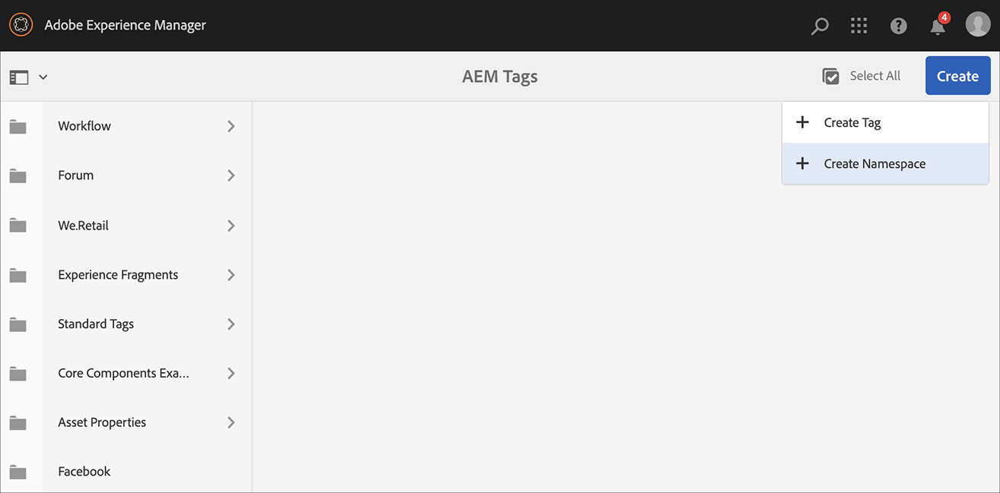

1. 输入项目的名称，例如&#x200B;**VoiceDemo**，然后单击&#x200B;**创建**。

1. 单击&#x200B;**VoiceDemo**&#x200B;项目，然后单击操作栏中的&#x200B;**创建标记**。
   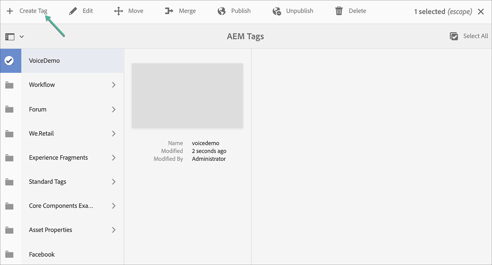

1. 输入标记的名称，然后单击&#x200B;**提交**。
   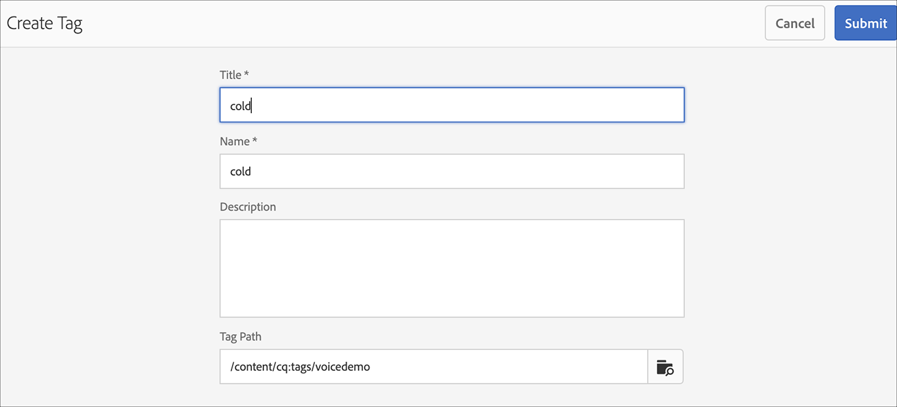

现在，您可以在您的AEM Screens项目中使用这些标记。

### 将渠道分配给显示器并启用语音识别 {#channel-assignment}

1. 在&#x200B;**位置**&#x200B;文件夹中创建显示区，如下图所示。

   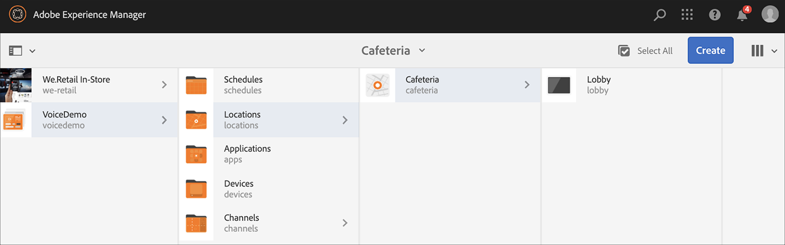

   >[!NOTE]
   >要了解如何将渠道分配给显示，请参阅[创建和管理显示](/help/user-guide/managing-displays.md)。

1. 将频道&#x200B;**Main**、**ColdIndles**&#x200B;和&#x200B;**HotIndles**&#x200B;分配给您的&#x200B;**LobbyDisplay**。 此外，如果您在项目中使用&#x200B;**SplitScreen**&#x200B;渠道，请确保也将其分配给显示区。

   >[!NOTE]
   >如果您已创建分屏渠道，请将&#x200B;**分屏**&#x200B;渠道也分配给您的显示器。

1. 在分配渠道时，为每个渠道设置以下属性。

   | **渠道名称** | **优先级** | **支持的事件** |
   |---|---|---|
   | 主要 | 2 | 初始加载，空闲屏幕，计时器 |
   | 热饮 | 1 | 用户交互 |
   | 冷饮 | 1 | 用户交互 |
   | SplitScreen | 1 | 用户交互 |

   >[!NOTE]
   >
   >要了解如何将渠道分配给显示，请参阅[创建和管理显示](/help/user-guide/managing-displays.md)。

1. 将渠道分配给显示区后，导航到&#x200B;**大厅显示区**，然后单击该显示区。 单击操作栏中的&#x200B;**属性**。

1. 导航到&#x200B;**显示**&#x200B;选项卡，并在&#x200B;**内容**&#x200B;下启用&#x200B;**启用语音**&#x200B;选项。

   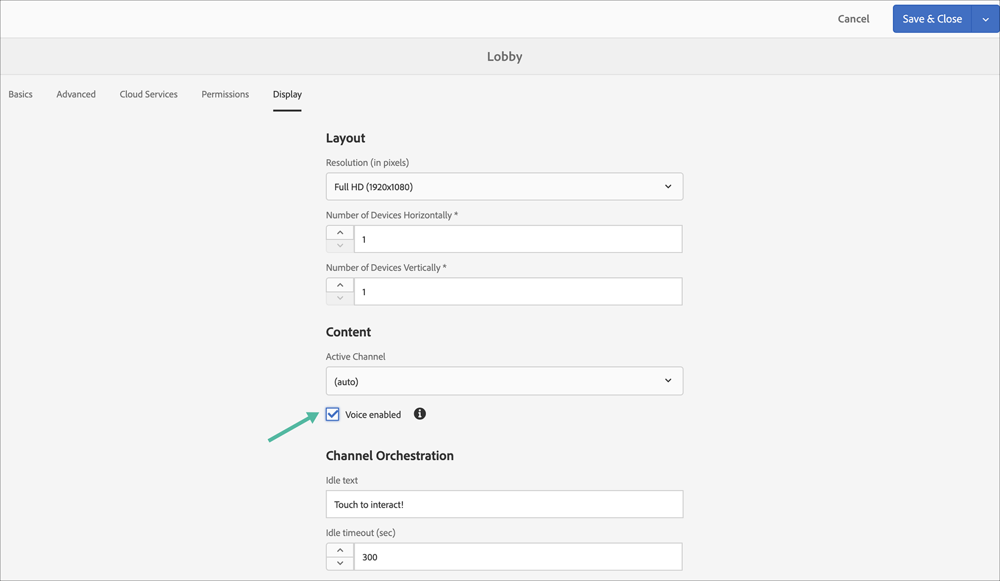

   >[!IMPORTANT]
   >必须从显示器启用语音识别功能。

### 在Chrome播放器中查看内容 {#viewing-content}

完成上述步骤后，您可以注册Chrome设备以查看输出。

>[!NOTE]
>请参阅[设备注册](device-registration.md)。

序列通道&#x200B;**的**&#x200B;所需输出

**Main**&#x200B;频道正在播放其内容。 但是，当您使用关键字&#x200B;**Hot**&#x200B;的单词（如&#x200B;*我想喝热饮*）时，该频道开始播放&#x200B;**HotDrains**&#x200B;频道的内容。

同样，如果您使用带有关键字&#x200B;**cold**&#x200B;的单词，例如&#x200B;*我想要冷饮*，则频道开始播放&#x200B;**ColdInverts**&#x200B;频道的内容。

拆分Screens渠道所需的&#x200B;**输出**

**Main**&#x200B;频道正在播放其内容。 但是，当您同时使用关键字&#x200B;**hot**&#x200B;和&#x200B;**cold**&#x200B;的单词时，例如&#x200B;*我想查看热饮和冷饮的菜单*，该频道播放&#x200B;**SplitScreen**&#x200B;频道的内容。 如果说&#x200B;*返回主菜单*，则它恢复为&#x200B;**Main**&#x200B;频道。
