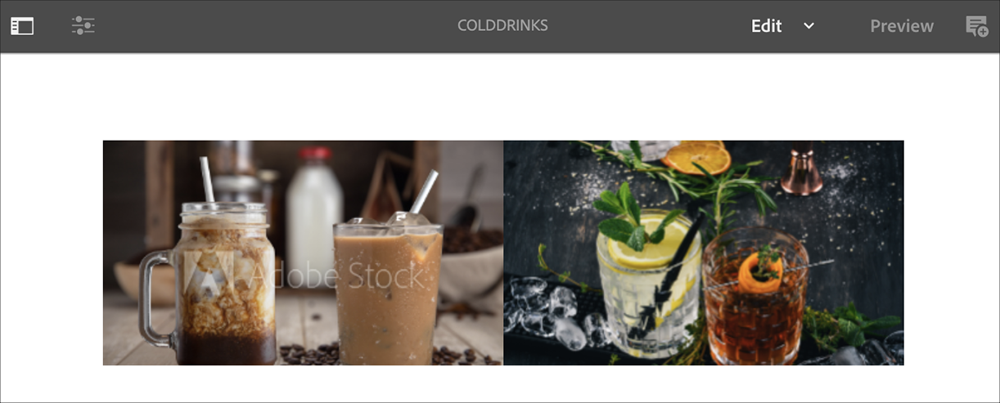

# AEM Screens语音识别 {#voice-recognition}

>[!IMPORTANT]
>
>**重要隐私信息**
>
>使用语音识别功能时，请遵循您所在区域的所有适用法律和道德准则（包括但不限于向最终用户发出提示播放器正在使用语音识别的可见通知）。 Adobe Inc。不会接收、存储或处理任何与语音相关的信息。 AEM Screens播放器使用内置于浏览引擎中的标准Web语音API。 在后台，此API会向Google服务器发送您的语音波形，以便从语音转换为文本，并且此文本由播放器根据配置的关键词进行匹配。
>
>有关更多详细信息，请参阅[Google Privacy White-paper on Web speech API](https://www.google.com/chrome/privacy/whitepaper.html#speech) 。

语音识别特征允许由语音交互驱动的AEM Screens信道中的内容改变。

内容作者可以将显示器配置为启用语音。 此功能旨在允许客户利用语音作为与其显示器进行交互的方法。 一些类似的用例包括在商店中查找产品推荐、在用餐者和餐馆订购菜单。 此功能增加了用户的辅助功能，并可大大增强客户体验。

>[!NOTE]
>播放器硬件必须支持语音输入，如麦克风。

## 实现语音识别 {#implementing}

>[!IMPORTANT]
> 语音识别功能仅在Chrome OS和Windows播放器上可用。

要在AEM Screens项目中实施语音识别，您必须为“显示”启用语音识别，并将每个渠道与唯一标记关联以触发渠道过渡。

以下部分介绍如何在AEM Screens项目中启用和使用语音识别功能。

## 以全屏或分屏渠道开关查看内容 {#sequence-channel}

在使用语音识别功能之前，请确保您有一个项目和一个渠道，且该渠道的内容已针对您的项目进行设置。

1. 以下示例显示名为&#x200B;**VoiceDemo**&#x200B;的演示项目，以及三个序列渠道&#x200B;**Main**、**ColdDricks**&#x200B;和&#x200B;**HotDricks**，如下图所示。

   

   >[!NOTE]
   >
   >要了解如何创建渠道或向渠道添加内容，请参阅[创建和管理渠道](/help/user-guide/managing-channels.md)

   或者，

   您可以创建三个顺序渠道&#x200B;**Main**、**ColdDrinks**&#x200B;和&#x200B;**HotDrinks**，以及一个额外的1x2 Split Screens渠道&#x200B;**SplitScreen**，如下图所示。

   

1. 导航到每个渠道并添加内容。 例如，导航到&#x200B;**VoiceDemo** —> **渠道** —> **主**&#x200B;并选择渠道。 单击操作栏中的&#x200B;**编辑**&#x200B;以打开编辑器并根据需要添加内容（图像/视频）。 同样，向&#x200B;**ColdDrinks**&#x200B;和&#x200B;**HotDrinks**&#x200B;渠道添加内容。

   如下图所示，渠道现在包含资产（图像）。

   **主要**:

   

   **冷饮**:

   

   **热饮**:

   

   如果已将Split Screens渠道添加到项目中，请导航到&#x200B;**SplitScreen**，拖放两个嵌入式序列，并添加到&#x200B;**ColdDricks**&#x200B;和&#x200B;**HotDricks**渠道的路径，如下图所示。
   

### 为渠道设置标记 {#setting-tags}

向渠道添加内容后，您需要导航到每个渠道并添加相应的标记以触发语音识别。

请按照以下步骤向渠道添加标记：

1. 导航到每个渠道并添加内容。 例如，导航到&#x200B;**VoiceDemo** —> **渠道** —> **主**&#x200B;并选择渠道。

1. 单击操作栏中的&#x200B;**属性**。

   

1. 导航到&#x200B;**Basics**&#x200B;选项卡，然后从&#x200B;**Tags**&#x200B;字段中选择一个已有的标记，或创建一个新标记。

   您可以通过为标记键入新名称并点击`return`键来创建新标记，如下图所示：

   

   或者，

   您还可以预先从AEM实例为项目创建标记，并选择这些标记。 按照[创建标记](#creating-tags)中所述的步骤操作后，您可以从位置选择标记并将其添加到渠道，如下图所示：

   

1. 同样，将标题为&#x200B;**hot**&#x200B;的标记添加到&#x200B;**HotDrinks**&#x200B;渠道中。

1. 如果您使用的是Split Screens渠道，请将标记（**hot**&#x200B;和&#x200B;**cold**）添加到&#x200B;**SplitScreen**&#x200B;渠道属性中，如下图所示。

   

1. 完成后，单击&#x200B;**保存并关闭**。

### 创建标记 {#creating-tags}

请按照以下步骤创建标记：

1. 导航到您的AEM实例。

1. 单击“工具”图标 — > **Tagging**。
   

1. 单击&#x200B;**创建** —> **创建命名空间**。
   

1. 输入项目的名称，例如&#x200B;**VoiceDemo**，然后单击&#x200B;**创建**。

1. 选择&#x200B;**VoiceDemo**&#x200B;项目，然后单击操作栏中的&#x200B;**创建标记**。
   

1. 输入标记的名称，然后单击&#x200B;**Submit**。
   

现在，您可以在AEM Screens项目中使用这些标记。

### 为显示器分配频道并启用语音识别 {#channel-assignment}

1. 在&#x200B;**Locations**&#x200B;文件夹中创建显示屏，如下图所示。

   

   >[!NOTE]
   >要了解如何将渠道分配给显示屏，请参阅[创建和管理显示屏](/help/user-guide/managing-displays.md)。

1. 将渠道&#x200B;**Main**、**ColdDricks**&#x200B;和&#x200B;**HotDricks**&#x200B;分配给&#x200B;**LobbyDisplay**。 此外，如果您正在为项目使用&#x200B;**SplitScreen**&#x200B;渠道，请确保将该渠道分配给显示屏。

   >[!NOTE]
   >如果已创建分屏渠道，请将&#x200B;**SplitScreen**&#x200B;渠道分配给显示屏。

1. 在分配渠道时，为每个渠道设置以下属性。

   | **渠道名称** | **优先级** | **支持的事件** |
   |---|---|---|
   | 主要 | 2 | 初始加载、空闲屏幕、计时器 |
   | 热饮 | 1 | 用户交互 |
   | 冷饮 | 1 | 用户交互 |
   | SplitScreen | 1 | 用户交互 |

   >[!NOTE]
   >
   >要了解如何将渠道分配给显示屏，请参阅[创建和管理显示屏](/help/user-guide/managing-displays.md)。

1. 为显示屏分配渠道后，导航到&#x200B;**LobbyDisplay**&#x200B;并选择显示屏。 从操作栏中选择&#x200B;**属性**。

1. 导航到&#x200B;**Display**&#x200B;选项卡，并在&#x200B;**Content**&#x200B;下启用&#x200B;**语音启用**&#x200B;选项。

   

   >[!IMPORTANT]
   >必须从显示器中启用语音识别功能。

### 在Chrome播放器中查看内容 {#viewing-content}

完成上述步骤后，您可以注册Chrome设备以查看输出。

>[!NOTE]
>请参阅[设备注册](device-registration.md)以了解如何在AEM Screens播放器上注册设备。

**序列渠道的所需输出**

**Main**&#x200B;渠道正在播放其内容，但是当您使用关键词&#x200B;**hot**&#x200B;的词语（如&#x200B;*）时，我想要热饮*，渠道开始播放&#x200B;**HotDrips**&#x200B;渠道的内容。

同样，如果您使用关键字&#x200B;**cold**&#x200B;的单词（如&#x200B;*），我希望获得某个cold*，则渠道会开始播放&#x200B;**ColdDricks**&#x200B;渠道的内容。

**分屏渠道的所需输出**

**Main**&#x200B;渠道正在播放其内容，但是当您将关键词&#x200B;**hot**&#x200B;和&#x200B;**cold**&#x200B;一起使用时，如&#x200B;*我想看热饮和冷饮的菜单*，渠道开始播放&#x200B;**SplitScreen**&#x200B;渠道的内容。 如果您说&#x200B;*返回主菜单*，则它会切换回主通道。
