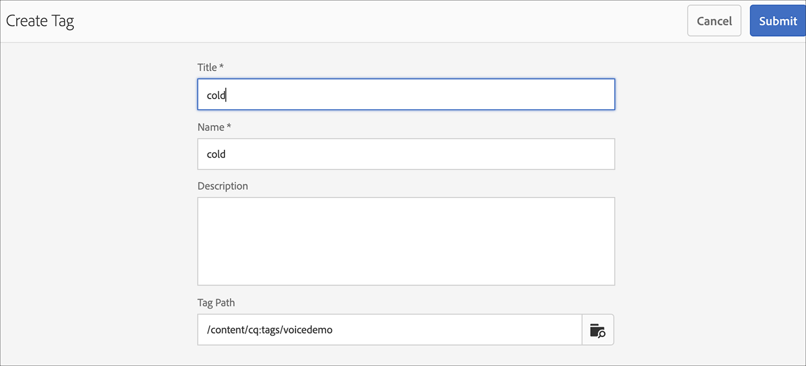

# AEM Screens中的语音识别 {#voice-recognition}

>[!IMPORTANT]
>
>**重要隐私信息**
>
>使用语音识别功能时，请遵循您所在地区的所有适用法律和道德准则（包括但不限于向最终用户提供播放器正在使用语音识别的可见通知）。 Adobe Inc不接收、存储或处理任何语音相关信息。 AEM Screens播放器使用浏览引擎中内置的标准Web语音API。 在幕后，此API会将语音的波形发送到Google的服务器以进行从语音到文本的转换，播放器会根据配置的关键字匹配此文本。
>
>请参阅 [关于Web语音API的Google隐私白皮书](https://www.google.com/chrome/privacy/whitepaper.html#speech) 了解更多详细信息。

语音识别功能允许由语音交互驱动的AEM Screens频道中的内容改变。

内容作者可以将显示配置为启用语音。 此功能的目的是允许客户将语音用作与其显示器进行交互的方法。 一些类似的用例包括在商店中查找产品推荐，在用餐者和餐厅点菜单项。 此功能提高了用户的辅助功能，可以极大地增强客户体验。

>[!NOTE]
>播放器硬件必须支持语音输入，如麦克风。

## 实施语音识别 {#implementing}

>[!IMPORTANT]
> 语音识别功能仅在Chrome OS和Windows播放器上可用。

要在AEM Screens项目中实施语音识别，您必须为显示屏启用语音识别，并将每个渠道与唯一标记关联以触发渠道过渡。

以下部分介绍如何在AEM Screens项目中启用和使用语音识别功能。

## 在全屏或分屏渠道开关中查看内容 {#sequence-channel}

在使用语音识别功能之前，请确保您有一个项目和一个渠道，其中包含为项目设置的内容。

1. 以下示例展示了名为的演示项目 **VoiceDemo** 和三个序列通道 **主要**， **冷饮**、和 **热饮**，如下图所示。

   

   >[!NOTE]
   >
   >要了解如何创建渠道或向渠道添加内容，请参阅 [创建和管理渠道](/help/user-guide/managing-channels.md)

   或者,

   您可以创建三个序列通道 **主要**， **冷饮**、和 **热饮**&#x200B;和一个额外的1x2分屏渠道 **SplitScreen** 如下图所示。

   

1. 导航到每个渠道并添加内容。 例如，导航到 **VoiceDemo** —> **渠道** —> **主要** 并选择渠道。 单击 **编辑** 以打开编辑器，并根据需要添加内容（图像/视频）。 同样，将内容添加到两者 **冷饮** 和 **热饮** 渠道。

   渠道现在包含资产（图像），如下图所示。

   **主要**:

   

   **冷饮**：

   

   **热饮**：

   

   如果您在项目中添加了拆分屏幕渠道，请导航到 **SplitScreen** 和拖放两个嵌入序列并向这两个序列添加路径 **冷饮** 和 **热饮** 频道，如下图所示。
   

### 为渠道设置标记 {#setting-tags}

将内容添加到渠道后，您需要导航到每个渠道并添加可触发语音识别的相应标记。

请按照以下步骤将标记添加到您的渠道：

1. 导航到每个渠道并添加内容。 例如，导航到 **VoiceDemo** —> **渠道** —> **主要** 并选择渠道。

1. 单击 **属性** 操作栏中的。

   

1. 导航到 **基础知识** 选项卡，然后从中选择现有标记 **标记** 字段或创建新字段。

   您可以通过键入标记的新名称来创建新标记并点击 `return` 键，如下图所示：

   

   或者,

   您还可以预先为项目从AEM实例中创建标记，并选择这些标记。 按照中所述的步骤操作后， [创建标记](#creating-tags)，则可以从位置中选择标记并将其添加到您的渠道中，如下图所示：

   

1. 同样，添加标题为 **热** 到 **热饮** 渠道。

1. 如果您使用拆分屏幕渠道，请添加两个标记(**热** 和 **冷**)到 **SplitScreen** 通道属性，如下图所示。

   

1. 单击 **保存并关闭** 等你完事了。

### 创建标记 {#creating-tags}

请按照以下步骤创建标记：

1. 导航到您的AEM实例。

1. 单击工具图标 — > **标记**.
   

1. 单击 **创建** —> **创建命名空间**.
   

1. 输入项目的名称，例如， **VoiceDemo** 并单击 **创建**.

1. 选择 **VoiceDemo** 项目并单击 **创建标记** 操作栏中的。
   

1. 输入标记的名称，然后单击 **提交**.
   

现在，您可以在AEM Screens项目中使用这些标记。

### 为显示器分配渠道并启用语音识别 {#channel-assignment}

1. 在中创建一个显示区 **位置** 文件夹，如下图所示。

   

   >[!NOTE]
   >要了解如何将渠道分配给显示，请参阅 [创建和管理显示区](/help/user-guide/managing-displays.md).

1. 分配渠道 **主要**， **冷饮**、和 **热饮** 敬您的 **LobbyDisplay**. 此外，如果您使用 **SplitScreen** 项目频道，请确保将其分配给显示区。

   >[!NOTE]
   >如果已创建分屏渠道，则分配 **SplitScreen** 渠道到您的显示区。

1. 在分配渠道时，为每个渠道设置以下属性。

   | **渠道名称** | **优先级** | **支持的事件** |
   |---|---|---|
   | 主要 | 2 | 初始加载、空闲屏幕、计时器 |
   | 热饮 | 1 | 用户交互 |
   | 冷饮 | 1 | 用户交互 |
   | SplitScreen | 1 | 用户交互 |

   >[!NOTE]
   >
   >要了解如何将渠道分配给显示，请参阅 [创建和管理显示区](/help/user-guide/managing-displays.md).

1. 将渠道分配给显示区后，导航到 **LobbyDisplay** 并选择显示区。 选择 **属性** 操作栏中的。

1. 导航到 **显示** 制表符并启用 **语音已启用** 下的选项 **内容**.

   

   >[!IMPORTANT]
   >必须从显示器启用语音识别功能。

### 在Chrome播放器中查看内容 {#viewing-content}

完成上述步骤后，您可以注册Chrome设备以查看输出。

>[!NOTE]
>请参阅 [设备注册](device-registration.md) 了解如何在AEM Screens播放器上注册设备。

**序列通道的所需输出**

此 **主要** 渠道正在播放其内容，但当您使用具有关键词的单词时 **热** 例如 *我想喝一杯热饮*，频道开始播放 **热饮** 渠道。

同样，如果您使用带有关键字的单词 **冷** 例如 *我想吃点冷饮*，频道开始播放 **冷饮** 渠道。

**分屏渠道的所需输出**

此 **主要** 渠道正在播放其内容，但当您使用具有关键词的单词时 **热** 和 **冷** 一起，例如 *我想看看热饮和冷饮的菜单*，频道开始播放 **SplitScreen** 渠道。 如果你说 *返回主菜单*，它会切换回主通道。
