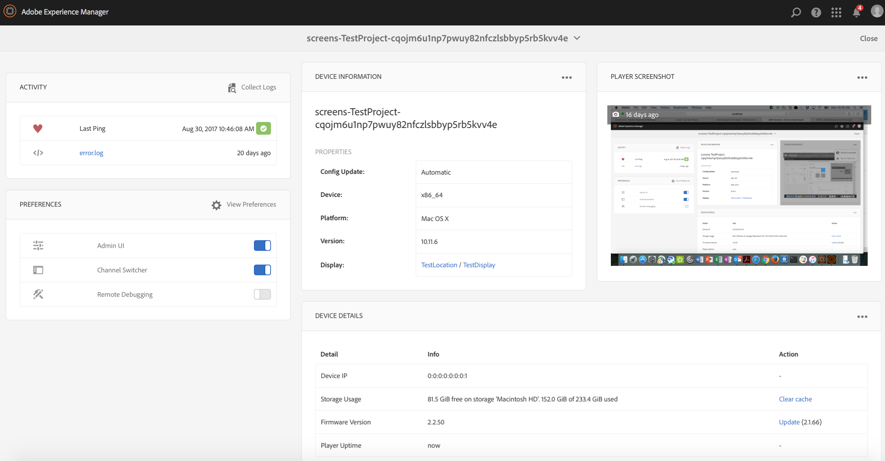

# 使用AEM Screens Player {#working-with-aem-screens-player}

您可以管理AEM Screens播放器上的渠道内容和其他设置。

>[!NOTE]
>
>按住 ***Ctrl+Cmd+F*** 可退出 OS X AEM Screens 播放器的全屏模式。

将渠道分配给显示屏后，AEM Screens 播放器会显示内容。您可以使用管理员 UI 的首选项（在功能板中）或从播放器本身配置播放器的设置。

## 使用设备功能板  {#using-the-device-dashboard}

您可以从设备功能板中配置设备的首选项，设备功能板可通过 AEM 创作实例进行访问。

1. 从您的项目导航到设备功能板，例如&#x200B;***测试项目*** —> ***设备***。

   从操作栏中选择&#x200B;**设备**&#x200B;和&#x200B;**设备管理器**。

   

1. 单击设备以打开设备功能板。

   

1. 检查&#x200B;**PREFERENCES**&#x200B;面板。 您可以通过这两个选项为播放器启用/禁用&#x200B;**管理员UI**&#x200B;和&#x200B;**渠道切换器**。

   

### 管理员 UI {#the-admin-ui}

通过从“首选项”面板启用&#x200B;**管理员UI**，用户可以从Screens播放器打开管理员设置。 此外，如果您从设备功能板禁用此选项，则用户无法从播放器打开管理员 UI。

要从 Screens 播放器查看管理员 UI，请长按左上角打开“管理员”菜单（在 AEM Screens 触屏优化播放器中），或者使用鼠标打开该菜单。播放器会在注册完成并加载渠道后显示相应的信息。

>[!NOTE]
>
>此外，您还可以查看 AEM Screens 播放器应用程序的运行时间，以检查应用程序运行状况。

#### 访问配置菜单选项{#configuration-options}

如果从侧面菜单中选择&#x200B;**Configuration**&#x200B;选项，则可以更新配置，如下图所示：

“配置”菜单允许您修改以下设置：

* 从此对话框中重置&#x200B;**固件**、**首选项**&#x200B;或&#x200B;**至工厂**。

* 在&#x200B;**Max No中指定要为AEM Screens播放器保留的最大日志文件数。 要保留的日志文件**&#x200B;的数据。

* 为Screens播放器启用或禁用&#x200B;**管理员菜单**、**渠道切换器**&#x200B;和&#x200B;**活动UI**。

   如果从&#x200B;**Configuration**&#x200B;菜单中启用了&#x200B;**Activity UI**，则AEM Screens播放器会在播放器的右上角显示&#x200B;*播放器活动通知*，如下图所示。

   

>[!NOTE]
>
>**更新固件**&#x200B;选项仅在cordova（如Android播放器）上可用。

>[!NOTE]
>
>建议在生产部署中禁用&#x200B;**管理员UI**。

#### 访问内容缓存菜单选项{#content-cache-options}

您可以从 AEM Screens 播放器内的管理员 UI 中清除渠道和应用程序缓存。

从侧边栏中选择&#x200B;**内容缓存**&#x200B;可更新缓存。

### 渠道切换程序 {#the-channel-switcher}

通过从“首选项”面板启用&#x200B;**渠道切换器**，用户可以从Screens播放器打开渠道选择/设置。

此外，如果您从设备功能板禁用此选项，则用户无法从 Screens 播放器控制渠道首选项。

您可以从 Screens 播放器切换和控制渠道的设置。

要从播放器查看渠道切换程序，请长按左下角以打开渠道切换程序，以便切换渠道和执行其他功能。

>[!NOTE]
>
>您还可以从 Screens 播放器启用或禁用播放器的管理员菜单和渠道切换程序。
>
>（请参阅下面部分所述的“从 Screens 播放器更改首选项”**）。

### 从 AEM Screens 播放器管理首选项  {#managing-preferences-from-the-aem-screens-player}

您还可以从播放器本身更改管理员 UI 和渠道切换程序的设置。

请按照以下步骤从播放器更改首选项：

1. 长按空闲渠道的左上角以打开管理员面板。
1. 从左侧操作菜单导航到&#x200B;**Configuration**。
1. 启用/禁用&#x200B;**管理员UI**&#x200B;或&#x200B;**渠道切换器**&#x200B;的配置。

## AEM Screens 播放器故障诊断 {#troubleshooting-aem-screens-player}

您可以对与 AEM Screens 播放器（硬件和软件）相关的各种问题进行故障诊断：

| **问题** | **推荐** |
|---|---|
| 播放器存储已满 | 消除不必要的文件 |
| 播放器丢失网络 | 使用Cat-5/Cat-6电缆。 对于wifi，请减少从路由器到播放器设备的距离 |
| AEM Screens播放器崩溃 | 建议使用一个监视程序来确保AEM Screens播放器始终运行 |
| AEM Screens播放器丢失设置 | 检查与AEM服务器的连接 |
| AEM Screens Player在播放器重新启动/重新启动后不会自动启动 | 检查操作系统启动文件夹或初始化过程 |
| AEM Screens播放器显示错误/旧内容 | 检查网络连接 |

### AEM Screens 播放器的更新 {#updates-for-aem-screens-player}

AEM Screens 播放器有两种类型的更新：

| **方法** | **详细信息** | **通过远程** | **自动** | **0停机时间** |
|---|---|---|---|---|
| 固件更新 | 通过远程命令应用于现有已安装的播放器。 更新后，播放器将自动重新加载现有内容。 | 是 | 自定义 | 近 — 1-3秒 |
| 播放器Shell更新 | 这是要在播放器上部署的新可执行文件。 这需要在播放器上远程复制新的二进制文件，然后停止当前运行的版本并启动新版本。这可能需要重新下载包的预加载内容。 | 是（通过远程Shell） | 自定义 | 否 |

## 播放器设备{#hardware-selection-guidelines-for-player-device}的硬件选择指南

以下部分提供了Screens项目的硬件选择指南：

* 始终为PC播放器和显示面板或投影仪提供&#x200B;***Commercial***&#x200B;或&#x200B;***Industrial***&#x200B;等级组件。

* 请始终与提供数字标牌市场的供应商接洽。
* 始终考虑环境因素，如环境温度和相对湿度。
* 请务必查看电源要求和电源调节。
* 仔细审查应用程序所需的性能需求和I/O端口。

下表概述了硬件配置以及AEM Screens项目的典型用例：

<table>
 <tbody>
  <tr>
   <td>播放器配置</td>
   <td>处理器</td>
   <td>内存</td>
   <td>存储固态硬盘</td>
   <td>GPU</td>
   <td>显示器</td>
   <td>I/O</td>
   <td>典型用例</td>
  </tr>
  <tr>
   <td>基本</td>
   <td>双核、i3或入门级四核英特尔®凌动处理器</td>
   <td>
4GB内存
 
2MB高速缓存
 </td>
   <td>
·ChromeOS 32 GB
 
· Windows 128 GB
 </td>
   <td>板载</td>
   <td>1920 x 1080</td>
   <td>DVI， 以太网/无线，  2xUSB</td>
   <td>
    <ul>
     <li>标准全屏循环  </li>
     <li>将日期分开</li>
    </ul> </td>
  </tr>
  <tr>
   <td>标准</td>
   <td>四核，英特尔®酷睿i5处理器</td>
   <td>
8GB内存
 
4MB高速缓存
 </td>
   <td>128吉比特</td>
   <td>板载</td>
   <td>3840x2160(4K)</td>
   <td>DVI、HDMI 以太网/无线，  2xUSB</td>
   <td>
    <ul>
     <li>单源动态内容</li>
     <li>简单交互式</li>
     <li>1-3区域布局</li>
    </ul> </td>
  </tr>
  <tr>
   <td>高级</td>
   <td>四核超线程，英特尔®酷睿i7处理器</td>
   <td>
16GB内存
 
8MB的高速缓存
 </td>
   <td>256 GB</td>
   <td>专用图形GPU</td>
   <td>3840x2160(4K)</td>
   <td>DVI、HDMI 以太网/无线，  4xUSB</td>
   <td>
    <ul>
     <li>4个或更多内容区域，并行视频播放</li>
     <li>多页面交互式</li>
     <li>多源数据触发器</li>
    </ul> </td>
  </tr>
 </tbody>
</table>
